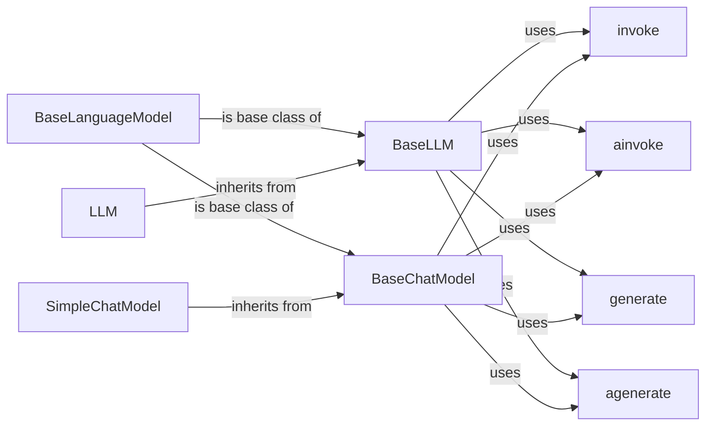

## Component Details

The Language Models component provides a unified interface for interacting with various Large Language Models (LLMs) and Chat Models. It defines abstract base classes (BaseLanguageModel, BaseLLM, BaseChatModel) that provide common methods for prediction, generation, and streaming. Concrete classes like LLM and SimpleChatModel inherit from these base classes and implement the core logic for interacting with specific language models. The component also includes methods for synchronous and asynchronous execution (invoke, ainvoke, generate, agenerate, predict, apredict, stream, astream), enabling flexible and efficient interaction with LLMs.

### BaseLanguageModel
Abstract base class for language models, providing common methods for interacting with different types of language models. It defines methods for prediction, token counting, and setting verbosity. It serves as the foundation for both LLMs and Chat Models, ensuring a consistent interface across different model types.
- **Related Classes/Methods**: `langchain.libs.core.langchain_core.language_models.base.BaseLanguageModel`

### BaseLLM
Base class for LLMs, inheriting from BaseLanguageModel. It provides methods for generating text from prompts, managing cache, and handling different input types. It extends the BaseLanguageModel with LLM-specific functionalities, such as text generation and caching mechanisms.
- **Related Classes/Methods**: `langchain.libs.core.langchain_core.language_models.llms.BaseLLM`

### BaseChatModel
Base class for Chat Models, inheriting from BaseLanguageModel. It provides methods for generating chat-based responses, handling structured output, and managing prompts. It extends the BaseLanguageModel with Chat Model-specific functionalities, such as structured output handling and prompt management.
- **Related Classes/Methods**: `langchain.libs.core.langchain_core.language_models.chat_models.BaseChatModel`

### LLM
Concrete class for Language Models, inheriting from BaseLLM. It implements the core logic for generating text using a language model. It provides a specific implementation for interacting with a language model and generating text-based outputs.
- **Related Classes/Methods**: `langchain.libs.core.langchain_core.language_models.llms.LLM`

### SimpleChatModel
A simple implementation of a chat model, inheriting from BaseChatModel. It provides a basic way to generate chat-based responses. It offers a straightforward implementation for generating chat-based outputs, suitable for simple chat applications.
- **Related Classes/Methods**: `langchain.libs.core.langchain_core.language_models.chat_models.SimpleChatModel`

### invoke
A method present in both BaseLLM and BaseChatModel, used to call the language model with given input and configuration. It serves as the primary entry point for interacting with the language model, allowing users to provide input and receive output.
- **Related Classes/Methods**: `langchain.libs.core.langchain_core.language_models.llms.BaseLLM`, `langchain.libs.core.langchain_core.language_models.chat_models.BaseChatModel`

### ainvoke
An asynchronous version of the invoke method, used to call the language model asynchronously. It enables non-blocking execution, allowing other tasks to be performed while waiting for the language model to respond.
- **Related Classes/Methods**: `langchain.libs.core.langchain_core.language_models.llms.BaseLLM`, `langchain.libs.core.langchain_core.language_models.chat_models.BaseChatModel`

### generate
A method present in both BaseLLM and BaseChatModel, used to generate text or chat responses from prompts. It provides a higher-level interface for generating outputs based on prompts, simplifying the interaction with the language model.
- **Related Classes/Methods**: `langchain.libs.core.langchain_core.language_models.llms.BaseLLM`, `langchain.libs.core.langchain_core.language_models.chat_models.BaseChatModel`

### agenerate
An asynchronous version of the generate method, used to generate text or chat responses asynchronously. It enables non-blocking generation, allowing other tasks to be performed while waiting for the language model to generate the output.
- **Related Classes/Methods**: `langchain.libs.core.langchain_core.language_models.llms.BaseLLM`, `langchain.libs.core.langchain_core.language_models.chat_models.BaseChatModel`
