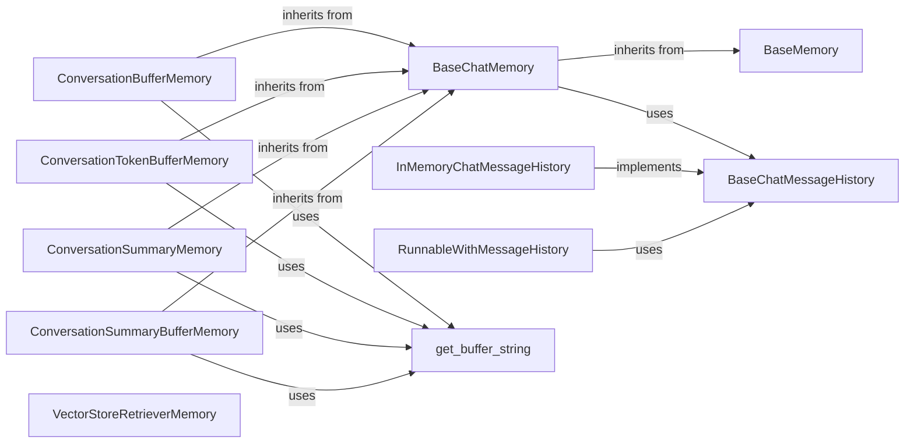

## Component Details

The Memory & State Management subsystem in LangChain is responsible for handling the persistence and retrieval of conversational history and other stateful information within LLM applications. It provides various implementations for storing chat message histories and general storage mechanisms, enabling applications to maintain context across interactions. The core flow involves saving new conversational turns to memory and loading relevant past interactions to inform future responses. Different memory types offer various strategies for managing this history, such as simple buffering, token-limited buffering, summarization, and vector-store-backed retrieval, catering to diverse application needs and resource constraints. The system ensures that LLM applications can maintain coherent and contextually aware conversations.

### BaseMemory
An abstract base class that defines the fundamental interface for all memory implementations in LangChain. It provides methods for loading and saving context, and clearing memory.

**Related Classes/Methods**:

- <a href="https://github.com/langchain-ai/langchain/blob/master/libs/core/langchain_core/memory.py#L28-L115" target="_blank" rel="noopener noreferrer">`langchain_core.memory.BaseMemory` (28:115)</a>

### BaseChatMemory
An abstract base class that defines the fundamental interface for all chat memory implementations in LangChain. It provides methods for saving and loading conversation context, and manages the underlying BaseChatMessageHistory.

**Related Classes/Methods**:

- <a href="https://github.com/langchain-ai/langchain/blob/master/libs/langchain/langchain/memory/chat_memory.py#L25-L98" target="_blank" rel="noopener noreferrer">`langchain.memory.chat_memory.BaseChatMemory` (25:98)</a>

### BaseChatMessageHistory
An abstract base class for storing and retrieving chat messages. It defines the interface for various message history implementations, such as in-memory, file-based, or database-backed.

**Related Classes/Methods**:

- <a href="https://github.com/langchain-ai/langchain/blob/master/libs/core/langchain_core/chat_history.py#L35-L201" target="_blank" rel="noopener noreferrer">`langchain_core.chat_history.BaseChatMessageHistory` (35:201)</a>

### InMemoryChatMessageHistory
A concrete implementation of BaseChatMessageHistory that stores chat messages in a simple in-memory list. It's primarily used for testing and simple, non-persistent chat history.

**Related Classes/Methods**:

- <a href="https://github.com/langchain-ai/langchain/blob/master/libs/core/langchain_core/chat_history.py#L204-L247" target="_blank" rel="noopener noreferrer">`langchain_core.chat_history.InMemoryChatMessageHistory` (204:247)</a>

### ConversationBufferMemory
A basic chat memory that stores all conversation messages in a buffer. It's a straightforward implementation without any summarization or external storage.

**Related Classes/Methods**:

- <a href="https://github.com/langchain-ai/langchain/blob/master/libs/langchain/langchain/memory/buffer.py#L20-L88" target="_blank" rel="noopener noreferrer">`langchain.memory.buffer.ConversationBufferMemory` (20:88)</a>

### ConversationTokenBufferMemory
Extends BaseChatMemory to manage conversation history within a specified token limit. When the limit is exceeded, older messages are pruned from the buffer.

**Related Classes/Methods**:

- <a href="https://github.com/langchain-ai/langchain/blob/master/libs/langchain/langchain/memory/token_buffer.py#L18-L72" target="_blank" rel="noopener noreferrer">`langchain.memory.token_buffer.ConversationTokenBufferMemory` (18:72)</a>

### ConversationSummaryMemory
A memory implementation that continually summarizes the conversation history. The summary is updated after each turn and can be used to provide concise context to a language model.

**Related Classes/Methods**:

- <a href="https://github.com/langchain-ai/langchain/blob/master/libs/langchain/langchain/memory/summary.py#L70-L135" target="_blank" rel="noopener noreferrer">`langchain.memory.summary.ConversationSummaryMemory` (70:135)</a>

### ConversationSummaryBufferMemory
Combines summarization with a token buffer. It summarizes older parts of the conversation while keeping recent interactions in a buffer, ensuring that the context provided to the LLM is always within a token limit.

**Related Classes/Methods**:

- <a href="https://github.com/langchain-ai/langchain/blob/master/libs/langchain/langchain/memory/summary_buffer.py#L19-L139" target="_blank" rel="noopener noreferrer">`langchain.memory.summary_buffer.ConversationSummaryBufferMemory` (19:139)</a>

### VectorStoreRetrieverMemory
A memory component that stores conversation history in a vector store and retrieves relevant parts of past conversations based on the current input. It acts as an interface between memory and a VectorStoreRetriever.

**Related Classes/Methods**:

- <a href="https://github.com/langchain-ai/langchain/blob/master/libs/langchain/langchain/memory/vectorstore.py#L23-L113" target="_blank" rel="noopener noreferrer">`langchain.memory.vectorstore.VectorStoreRetrieverMemory` (23:113)</a>

### RunnableWithMessageHistory
A runnable that wraps another runnable and manages chat message history for it. It handles loading and saving messages to a BaseChatMessageHistory instance, making it easier to integrate history into complex chains.

**Related Classes/Methods**:

- <a href="https://github.com/langchain-ai/langchain/blob/master/libs/core/langchain_core/runnables/history.py#L41-L616" target="_blank" rel="noopener noreferrer">`langchain_core.runnables.history.RunnableWithMessageHistory` (41:616)</a>

### [FAQ](https://github.com/CodeBoarding/GeneratedOnBoardings/tree/main?tab=readme-ov-file#faq)