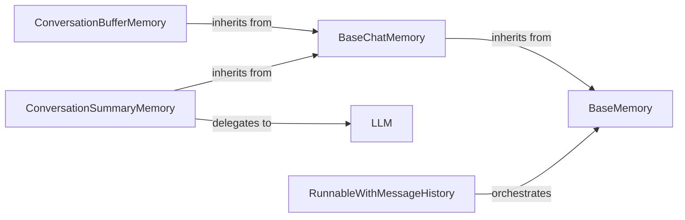

## Details

The LangChain memory subsystem provides a flexible and extensible framework for managing conversational state and historical context within language model applications. At its core, the BaseMemory abstract class establishes a universal interface for memory operations, which is then specialized by BaseChatMemory for chat-centric interactions. Various concrete implementations, such as ConversationBufferMemory for simple buffering and ConversationSummaryMemory for LLM-powered summarization, offer diverse strategies for retaining and retrieving conversational history. The LLM component plays a crucial role in advanced memory techniques like summarization. Finally, RunnableWithMessageHistory acts as an orchestrator, seamlessly integrating memory management into the execution flow of LangChain runnables, ensuring that conversational context is consistently maintained across interactions. This modular design allows developers to choose and combine different memory components to suit the specific requirements of their applications, from basic chat history retention to sophisticated long-term memory solutions.

### BaseMemory
The foundational abstract interface for all memory components. It defines the contract for loading (retrieving) and saving (updating) conversational history or other state information, ensuring a consistent API for all memory implementations.

**Related Classes/Methods**:

- <a href="https://github.com/langchain-ai/langchain/blob/master/libs/core/langchain_core/memory.py#L20-L116" target="_blank" rel="noopener noreferrer">`langchain_core.memory.BaseMemory`:20-116</a>

### BaseChatMemory
A specialized abstract base class for managing chat-specific conversational history. It extends BaseMemory to provide an interface tailored for message-based interactions, often dealing with HumanMessage and AIMessage types.

**Related Classes/Methods**:

- <a href="https://github.com/langchain-ai/langchain/blob/master/libs/langchain/langchain/memory/chat_memory.py#L17-L104" target="_blank" rel="noopener noreferrer">`langchain.memory.chat_memory.BaseChatMemory`:17-104</a>

### ConversationBufferMemory
A concrete implementation that provides a simple, direct buffer for storing the complete, raw sequence of chat messages. It's the most basic form of memory, retaining all interactions.

**Related Classes/Methods**:

- <a href="https://github.com/langchain-ai/langchain/blob/master/libs/langchain/langchain/memory/chat_memory.py#L17-L104" target="_blank" rel="noopener noreferrer">`langchain.memory.chat_memory.BaseChatMemory`:17-104</a>

### ConversationSummaryMemory
Generates and maintains a concise summary of the conversation, typically by leveraging an LLM. This allows for maintaining long-term context without exceeding token limits by summarizing older parts of the conversation.

**Related Classes/Methods**:

- <a href="https://github.com/langchain-ai/langchain/blob/master/libs/langchain/langchain/memory/chat_memory.py#L17-L104" target="_blank" rel="noopener noreferrer">`langchain.memory.chat_memory.BaseChatMemory`:17-104</a>

### LLM
Represents the abstract interface for Large Language Models, used by memory components (e.g., ConversationSummaryMemory) for tasks like summarization, enabling more sophisticated memory management beyond simple buffering.

**Related Classes/Methods**: _None_

### RunnableWithMessageHistory
Acts as an orchestrator, integrating memory management directly into the execution flow of LangChain runnables (chains or agents). It ensures that memory is loaded before a runnable executes and saved afterward, providing seamless state management for conversational applications.

**Related Classes/Methods**:

- <a href="https://github.com/langchain-ai/langchain/blob/master/libs/core/langchain_core/memory.py#L20-L116" target="_blank" rel="noopener noreferrer">`langchain_core.memory.BaseMemory`:20-116</a>

### [FAQ](https://github.com/CodeBoarding/GeneratedOnBoardings/tree/main?tab=readme-ov-file#faq)