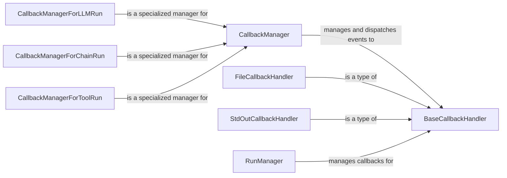

## Component Details

The Monitoring and Improvement (Callbacks & Evaluation) subsystem in Langchain provides a flexible mechanism for intercepting and responding to events during the execution of Langchain applications. It revolves around the concept of callbacks, which are functions that are executed at specific points in the application's lifecycle, such as when a chain starts, when a model generates a token, or when a tool completes. The subsystem also includes evaluation capabilities, allowing developers to assess the performance and quality of their Langchain applications. The core components are CallbackManager, BaseCallbackHandler, and RunManager, which work together to manage and dispatch events to registered handlers. Specialized callback managers exist for different Langchain components like LLMs, Chains, and Tools. File and StdOut callback handlers provide basic logging and monitoring capabilities. This system enables developers to monitor, debug, and improve the behavior of their Langchain applications.

### CallbackManager
The CallbackManager is responsible for managing and dispatching events to registered callback handlers. It maintains a list of handlers and invokes them when specific events occur during the execution of Langchain components. It allows configuring handlers, adding tags, and tracing execution.
- **Related Classes/Methods**: `langchain.libs.core.langchain_core.callbacks.manager`

### BaseCallbackHandler
Base class for callback handlers. Defines the interface for handling different events during the execution of chains, models, and tools. Subclasses must implement methods for handling specific events, such as on_chain_start, on_llm_new_token, and on_tool_end. It provides a common interface for all callback handlers, ensuring that they can be easily registered and used by the CallbackManager.
- **Related Classes/Methods**: `langchain.libs.core.langchain_core.callbacks.base`

### RunManager
The RunManager provides a context for a single run of a Langchain component (LLM, Chain, Tool, etc.). It's responsible for managing the callbacks associated with that run, including start, end, error, and token events. It uses the CallbackManager to dispatch events to registered handlers and provides methods for tracking the execution of the component.
- **Related Classes/Methods**: `langchain.libs.core.langchain_core.callbacks.manager`

### FileCallbackHandler
A callback handler that writes events to a file. Useful for logging and debugging. It inherits from BaseCallbackHandler and overrides the event handling methods to write event information to a specified file.
- **Related Classes/Methods**: `langchain.libs.core.langchain_core.callbacks.file`

### StdOutCallbackHandler
A callback handler that prints events to standard output. Useful for real-time monitoring. It inherits from BaseCallbackHandler and overrides the event handling methods to print event information to the console.
- **Related Classes/Methods**: `langchain.libs.core.langchain_core.callbacks.stdout`

### CallbackManagerForLLMRun
A specialized CallbackManager for LLM runs, providing specific hooks for LLM-related events like new tokens, end, and errors. It inherits from CallbackManager and adds methods for handling LLM-specific events.
- **Related Classes/Methods**: `langchain.libs.core.langchain_core.callbacks.manager`

### CallbackManagerForChainRun
A specialized CallbackManager for Chain runs, providing specific hooks for chain-related events like chain end and errors. It inherits from CallbackManager and adds methods for handling Chain-specific events.
- **Related Classes/Methods**: `langchain.libs.core.langchain_core.callbacks.manager`

### CallbackManagerForToolRun
A specialized CallbackManager for Tool runs, providing specific hooks for tool-related events like tool end and errors. It inherits from CallbackManager and adds methods for handling Tool-specific events.
- **Related Classes/Methods**: `langchain.libs.core.langchain_core.callbacks.manager`
