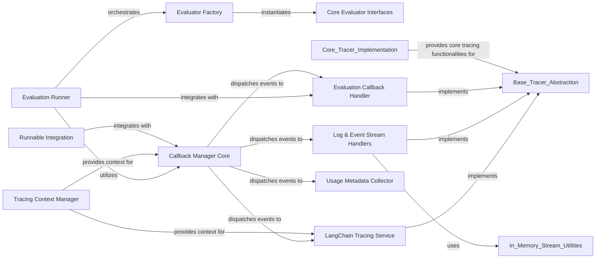

## Component Details

The Observability & Evaluation subsystem in LangChain provides comprehensive mechanisms for monitoring, debugging, testing, and evaluating LangChain applications. It achieves this through a robust callback and tracing system, integration with LangSmith, and a flexible framework for assessing LLM outputs. The core flow involves the Callback Manager dispatching events to various tracers and handlers, which then process and log run information, perform evaluations, and manage tracing context. The Evaluation Runner orchestrates the end-to-end evaluation process, leveraging evaluators defined by core interfaces and managed by an evaluator factory.

### Evaluation Runner
Orchestrates the end-to-end evaluation process for LangChain applications on datasets. It handles input validation, evaluator setup, execution of LLM/chain runs, and aggregation of evaluation results.

**Related Classes/Methods**:

- <a href="https://github.com/langchain-ai/langchain/blob/master/libs/langchain/langchain/smith/evaluation/runner_utils.py#L1033-L1224" target="_blank" rel="noopener noreferrer">`langchain.smith.evaluation.runner_utils._DatasetRunContainer` (1033:1224)</a>
- <a href="https://github.com/langchain-ai/langchain/blob/master/libs/langchain/langchain/smith/evaluation/runner_utils.py#L1333-L1407" target="_blank" rel="noopener noreferrer">`langchain.smith.evaluation.runner_utils.run_on_dataset` (1333:1407)</a>
- <a href="https://github.com/langchain-ai/langchain/blob/master/libs/langchain/langchain/smith/evaluation/runner_utils.py#L1268-L1330" target="_blank" rel="noopener noreferrer">`langchain.smith.evaluation.runner_utils.arun_on_dataset` (1268:1330)</a>

### Evaluator Factory
Provides a centralized mechanism for loading and instantiating various types of evaluators based on their configuration.

**Related Classes/Methods**:

- <a href="https://github.com/langchain-ai/langchain/blob/master/libs/langchain/langchain/smith/evaluation/runner_utils.py#L593-L654" target="_blank" rel="noopener noreferrer">`langchain.smith.evaluation.runner_utils._load_run_evaluators` (593:654)</a>
- <a href="https://github.com/langchain-ai/langchain/blob/master/libs/langchain/langchain/evaluation/schema.py#L21-L72" target="_blank" rel="noopener noreferrer">`langchain.evaluation.schema.EvaluatorType` (21:72)</a>

### Core Evaluator Interfaces
Defines the foundational abstract classes and common methods that all specific evaluator implementations adhere to, ensuring a consistent evaluation API.

**Related Classes/Methods**:

- <a href="https://github.com/langchain-ai/langchain/blob/master/libs/langchain/langchain/evaluation/schema.py#L133-L246" target="_blank" rel="noopener noreferrer">`langchain.evaluation.schema.StringEvaluator` (133:246)</a>
- <a href="https://github.com/langchain-ai/langchain/blob/master/libs/langchain/langchain/evaluation/schema.py#L249-L360" target="_blank" rel="noopener noreferrer">`langchain.evaluation.schema.PairwiseStringEvaluator` (249:360)</a>
- <a href="https://github.com/langchain-ai/langchain/blob/master/libs/langchain/langchain/evaluation/schema.py#L363-L483" target="_blank" rel="noopener noreferrer">`langchain.evaluation.schema.AgentTrajectoryEvaluator` (363:483)</a>
- <a href="https://github.com/langchain-ai/langchain/blob/master/libs/langchain/langchain/evaluation/schema.py#L75-L81" target="_blank" rel="noopener noreferrer">`langchain.evaluation.schema.LLMEvalChain` (75:81)</a>

### Callback Manager Core
The central dispatching mechanism for all callback events within LangChain, routing events to appropriate handlers based on run type and configuration. It supports both synchronous and asynchronous operations.

**Related Classes/Methods**:

- <a href="https://github.com/langchain-ai/langchain/blob/master/libs/core/langchain_core/callbacks/manager.py#L1298-L1634" target="_blank" rel="noopener noreferrer">`langchain_core.callbacks.manager.CallbackManager` (1298:1634)</a>
- <a href="https://github.com/langchain-ai/langchain/blob/master/libs/core/langchain_core/callbacks/manager.py#L1765-L2162" target="_blank" rel="noopener noreferrer">`langchain_core.callbacks.manager.AsyncCallbackManager` (1765:2162)</a>
- <a href="https://github.com/langchain-ai/langchain/blob/master/libs/core/langchain_core/callbacks/manager.py#L244-L325" target="_blank" rel="noopener noreferrer">`langchain_core.callbacks.manager.handle_event` (244:325)</a>
- <a href="https://github.com/langchain-ai/langchain/blob/master/libs/core/langchain_core/callbacks/manager.py#L409-L444" target="_blank" rel="noopener noreferrer">`langchain_core.callbacks.manager.ahandle_event` (409:444)</a>

### LangChain Tracing Service
The primary tracer responsible for sending detailed run information and metadata to the LangSmith platform for persistent storage and analysis.

**Related Classes/Methods**:

- <a href="https://github.com/langchain-ai/langchain/blob/master/libs/core/langchain_core/tracers/langchain.py#L85-L332" target="_blank" rel="noopener noreferrer">`langchain_core.tracers.langchain.LangChainTracer` (85:332)</a>

### Tracing Context Manager
Manages the lifecycle and propagation of tracing-related context, such as run IDs and project names, across different operations.

**Related Classes/Methods**:

- <a href="https://github.com/langchain-ai/langchain/blob/master/libs/core/langchain_core/tracers/context.py#L54-L98" target="_blank" rel="noopener noreferrer">`langchain_core.tracers.context.tracing_v2_enabled` (54:98)</a>
- <a href="https://github.com/langchain-ai/langchain/blob/master/libs/core/langchain_core/tracers/context.py#L121-L145" target="_blank" rel="noopener noreferrer">`langchain_core.tracers.context._get_trace_callbacks` (121:145)</a>

### Log & Event Stream Handlers
Manages the streaming of detailed run logs and incremental updates, and structured events from runs, enabling real-time monitoring and reconstruction of run states.

**Related Classes/Methods**:

- <a href="https://github.com/langchain-ai/langchain/blob/master/libs/core/langchain_core/tracers/log_stream.py#L181-L503" target="_blank" rel="noopener noreferrer">`langchain_core.tracers.log_stream.LogStreamCallbackHandler` (181:503)</a>
- <a href="https://github.com/langchain-ai/langchain/blob/master/libs/core/langchain_core/tracers/log_stream.py#L94-L131" target="_blank" rel="noopener noreferrer">`langchain_core.tracers.log_stream.RunLogPatch` (94:131)</a>
- <a href="https://github.com/langchain-ai/langchain/blob/master/libs/core/langchain_core/tracers/log_stream.py#L134-L175" target="_blank" rel="noopener noreferrer">`langchain_core.tracers.log_stream.RunLog` (134:175)</a>
- <a href="https://github.com/langchain-ai/langchain/blob/master/libs/core/langchain_core/tracers/event_stream.py#L89-L738" target="_blank" rel="noopener noreferrer">`langchain_core.tracers.event_stream._AstreamEventsCallbackHandler` (89:738)</a>

### Evaluation Callback Handler
A specialized callback handler for integrating evaluation logic into the tracing system, submitting evaluation results to LangSmith.

**Related Classes/Methods**:

- <a href="https://github.com/langchain-ai/langchain/blob/master/libs/core/langchain_core/tracers/evaluation.py#L37-L225" target="_blank" rel="noopener noreferrer">`langchain_core.tracers.evaluation.EvaluatorCallbackHandler` (37:225)</a>

### Runnable Integration
Provides the necessary hooks and methods for LangChain's Runnable objects to seamlessly integrate with the tracing and callback system, enabling automatic event emission.

**Related Classes/Methods**:

- <a href="https://github.com/langchain-ai/langchain/blob/master/libs/core/langchain_core/runnables/base.py#L111-L2465" target="_blank" rel="noopener noreferrer">`langchain_core.runnables.base.Runnable` (111:2465)</a>
- <a href="https://github.com/langchain-ai/langchain/blob/master/libs/core/langchain_core/runnables/base.py#L5668-L5867" target="_blank" rel="noopener noreferrer">`langchain_core.runnables.base.RunnableBinding` (5668:5867)</a>
- <a href="https://github.com/langchain-ai/langchain/blob/master/libs/core/langchain_core/runnables/base.py#L5267-L5665" target="_blank" rel="noopener noreferrer">`langchain_core.runnables.base.RunnableBindingBase` (5267:5665)</a>

### Usage Metadata Collector
A callback handler that specifically captures and attaches usage-related metadata (e.g., token counts) to LLM run results.

**Related Classes/Methods**:

- <a href="https://github.com/langchain-ai/langchain/blob/master/libs/core/langchain_core/callbacks/usage.py#L17-L87" target="_blank" rel="noopener noreferrer">`langchain_core.callbacks.usage.UsageMetadataCallbackHandler` (17:87)</a>

### [FAQ](https://github.com/CodeBoarding/GeneratedOnBoardings/tree/main?tab=readme-ov-file#faq)