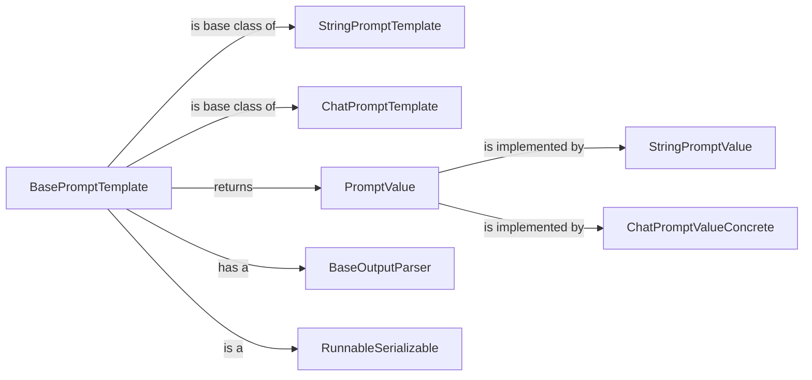

## Component Details

### BasePromptTemplate
Abstract class serving as the foundation for all prompt templates. It defines the core interface for formatting prompts, managing input variables, and handling partial variables. It ensures that all derived prompt templates adhere to a consistent structure and provides common functionalities like validation and serialization. It inherits from `RunnableSerializable` enabling it to be part of a Langchain Runnable sequence.
- **Related Classes/Methods**: `langchain_core.prompts.base.BasePromptTemplate`

### StringPromptTemplate
Concrete class that extends `BasePromptTemplate` and represents a prompt as a string. It takes a template string and a list of input variables, and it formats the template string with the input variables to produce a final prompt string. It is commonly used for simple prompts where the language model expects a text-based input.
- **Related Classes/Methods**: `langchain_core.prompts.prompt.StringPromptTemplate`

### ChatPromptTemplate
Concrete class that extends `BasePromptTemplate` and represents a prompt as a list of chat messages. It takes a list of message templates, each of which can be a string or a `BaseMessagePromptTemplate`, and it formats the message templates with the input variables to produce a final list of chat messages. It is designed for chat-based language models that require structured conversations as input.
- **Related Classes/Methods**: `langchain_core.prompts.chat.ChatPromptTemplate`

### PromptValue
Represents the final formatted prompt value, encapsulating the result of applying a prompt template with specific inputs. It provides a unified interface for accessing the prompt in different formats, such as a string or a list of messages, making it compatible with various language models and downstream tasks. It is the return type of the `BasePromptTemplate.format_prompt()` method.
- **Related Classes/Methods**: `langchain_core.prompt_values.PromptValue`

### StringPromptValue
A concrete implementation of `PromptValue` that represents the prompt as a single string. It is commonly used for simple prompts where the language model expects a text-based input. It is returned when a `StringPromptTemplate` is formatted.
- **Related Classes/Methods**: `langchain_core.prompt_values.StringPromptValue`

### ChatPromptValueConcrete
A concrete implementation of `PromptValue` that represents the prompt as a list of messages. It is designed for chat-based language models that require structured conversations as input. It is returned when a `ChatPromptTemplate` is formatted.
- **Related Classes/Methods**: `langchain_core.prompt_values.ChatPromptValueConcrete`

### BaseOutputParser
Abstract class that defines the interface for parsing the output of a language model. It provides methods for extracting structured information from the raw text generated by the model, enabling seamless integration with downstream tasks and applications. It is used by `BasePromptTemplate` to parse the output of the language model.
- **Related Classes/Methods**: `langchain_core.output_parsers.base.BaseOutputParser`

### RunnableSerializable
Abstract class that defines the interface for runnable and serializable objects. It provides methods for running and serializing objects, enabling seamless integration with other Langchain components and persistence of objects. `BasePromptTemplate` inherits from it.
- **Related Classes/Methods**: `langchain_core.runnables.base.RunnableSerializable`
