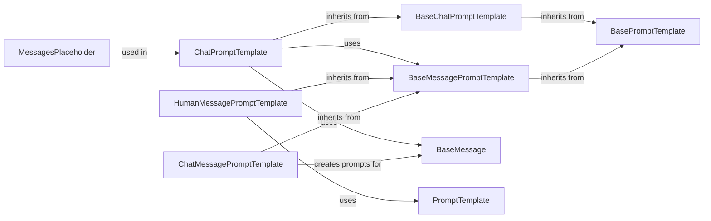

## Component Details

### ChatPromptTemplate
A prompt template specifically designed for chat models. It allows creating prompts from a list of messages, each potentially having its own template. It inherits from `BaseChatPromptTemplate` and uses `MessageLike` objects to construct prompts. It provides methods for formatting messages, partial filling of variables, and combining templates.
- **Related Classes/Methods**: `langchain_core.prompts.chat.ChatPromptTemplate`

### BaseChatPromptTemplate
Abstract class for chat prompt templates. Defines the basic structure and methods for chat prompt templates, such as `format_messages` and `aformat_messages`. It inherits from `BasePromptTemplate`.
- **Related Classes/Methods**: `langchain_core.prompts.chat.BaseChatPromptTemplate`

### BaseMessagePromptTemplate
Abstract class for message prompt templates. Defines the basic structure and methods for message prompt templates.
- **Related Classes/Methods**: `langchain_core.prompts.message.BaseMessagePromptTemplate`

### BaseMessage
Represents a message in a chat conversation. It serves as a base class for more specific message types like HumanMessage, AIMessage, SystemMessage, FunctionMessage and ToolMessage. These messages are the building blocks for constructing chat prompts.
- **Related Classes/Methods**: `langchain_core.messages.base.BaseMessage`

### HumanMessagePromptTemplate
A message prompt template for human messages. It inherits from `BaseMessagePromptTemplate` and is used to create human messages from templates. It uses PromptTemplate to format the content of the human message.
- **Related Classes/Methods**: `langchain_core.prompts.chat.HumanMessagePromptTemplate`

### PromptTemplate
A general-purpose prompt template that takes a template string and a set of input variables to generate a prompt. It is used for formatting prompts by substituting variables into a template string.
- **Related Classes/Methods**: `langchain_core.prompts.prompt.PromptTemplate`

### MessagesPlaceholder
A placeholder for a list of messages in a chat prompt template. It allows including a variable number of messages in a chat prompt, enabling dynamic insertion of message sequences.
- **Related Classes/Methods**: `langchain_core.prompts.chat.MessagesPlaceholder`

### ChatMessagePromptTemplate
A message prompt template for chat messages with a specific role. It inherits from `BaseMessagePromptTemplate` and allows specifying the role of the message (e.g., human, ai, system). It's used to create structured chat messages with defined roles.
- **Related Classes/Methods**: `langchain_core.prompts.chat.ChatMessagePromptTemplate`
