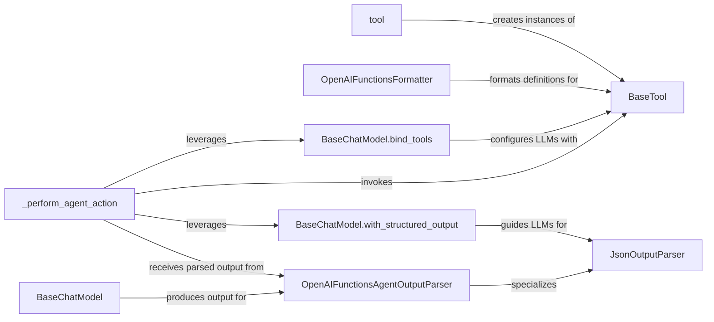

## Details

The agent subsystem facilitates dynamic interaction between Language Models (LLMs) and external tools, forming a robust orchestration pattern. At its foundation, `BaseTool` defines a universal interface for all external functionalities, with the `tool` utility streamlining their creation. For seamless integration with OpenAI models, `OpenAIFunctionsFormatter` translates these tool definitions into the required JSON schema. LLMs, represented by `BaseChatModel`, are empowered to utilize these tools through `bind_tools` and can be directed to produce structured outputs via `with_structured_output`, which are then processed by `JsonOutputParser`. A specialized `OpenAIFunctionsAgentOutputParser` interprets OpenAI's function call outputs, converting them into actionable agent decisions. The central orchestrator, `_perform_agent_action`, drives the agent's execution loop by invoking tools, leveraging LLM capabilities, and processing parsed outputs, thereby enabling intelligent and adaptive behavior.

### BaseTool
The foundational abstract interface for all tools. It standardizes how external functionalities are exposed and interacted with, embodying the "Pluggable Architecture/Adapter Pattern" for diverse integrations.

**Related Classes/Methods**: _None_

### tool
A utility function that simplifies the creation of `BaseTool` instances from standard Python functions, promoting ease of use and rapid tool development.

**Related Classes/Methods**: _None_

### OpenAIFunctionsFormatter
Utility functions that transform `BaseTool` definitions into the specific JSON schema required by OpenAI's function calling API, enabling seamless integration with OpenAI models.

**Related Classes/Methods**: _None_

### JsonOutputParser
A generic parser for transforming raw string outputs (typically from LLMs) that are expected to be in JSON format into structured Python objects. It supports streaming and can validate against Pydantic schemas, making it a core utility for structured data handling.

**Related Classes/Methods**:

- <a href="https://github.com/langchain-ai/langchain/blob/master/libs/core/langchain_core/output_parsers/json.py#L31-L121" target="_blank" rel="noopener noreferrer">`langchain_core.output_parsers.json.jsonoutputparser`:31-121</a>

### OpenAIFunctionsAgentOutputParser
A specialized output parser designed to interpret AI message outputs from OpenAI models, specifically translating tool call instructions or final answers into `AgentAction` or `AgentFinish` objects by parsing the `function_call` parameter. This is crucial for the "Agent-based Architecture/Orchestration Pattern".

**Related Classes/Methods**:

- <a href="https://github.com/langchain-ai/langchain/blob/master/libs/langchain/langchain/agents/output_parsers/openai_functions.py#L17-L99" target="_blank" rel="noopener noreferrer">`langchain.agents.output_parsers.openai_functions.openaifunctionsagentoutputparser`:17-99</a>

### BaseChatModel.bind_tools
A method on chat models that configures the LLM to be aware of and utilize a given set of tools, enabling the LLM to generate tool-use instructions.

**Related Classes/Methods**: _None_

### BaseChatModel.with_structured_output
A method on chat models that instructs the LLM to produce its output in a specific structured format (e.g., JSON), often guided by a Pydantic schema, facilitating reliable parsing.

**Related Classes/Methods**: _None_

### _perform_agent_action
A core method within the agent's execution loop responsible for orchestrating the invocation of tools based on the agent's decision-making process. It acts as the central coordinator for tool execution and integrates output parsing, embodying the "Agent-based Architecture/Orchestration Pattern".

**Related Classes/Methods**: _None_

### [FAQ](https://github.com/CodeBoarding/GeneratedOnBoardings/tree/main?tab=readme-ov-file#faq)