```mermaid
graph LR
    Tooling_External_Interactions["Tooling & External Interactions"]
    langchain_tools_base_Tool_Public_Interface_["langchain.tools.base (Tool Public Interface)"]
    langchain_utilities_python_Utility_Public_Interface_["langchain.utilities.python (Utility Public Interface)"]
    langchain__api_module_import_create_importer_Dynamic_Module_Loader_["langchain._api.module_import.create_importer (Dynamic Module Loader)"]
    langchain_core_tools_Core_Tool_Definitions_["langchain_core.tools (Core Tool Definitions)"]
    langchain_community_utilities_python_PythonREPL_Python_REPL_Tool_Implementation_["langchain_community.utilities.python.PythonREPL (Python REPL Tool Implementation)"]
    LLM_Agents["LLM Agents"]
    External_Services_APIs["External Services/APIs"]
    langchain_core_utils_function_calling_convert_to_openai_tool_LLM_Tool_Conversion_Utility_["langchain_core.utils.function_calling.convert_to_openai_tool (LLM Tool Conversion Utility)"]
    langchain_core_output_parsers_Tool_Output_Parsers_["langchain_core.output_parsers (Tool Output Parsers)"]
    LLM_Agents -- "Requests Tool Use" --> langchain_tools_base_Tool_Public_Interface_
    LLM_Agents -- "Requests Utility Use" --> langchain_utilities_python_Utility_Public_Interface_
    langchain_tools_base_Tool_Public_Interface_ -- "Re-exports/Uses" --> langchain_core_tools_Core_Tool_Definitions_
    langchain_tools_base_Tool_Public_Interface_ -- "Uses" --> langchain_core_utils_function_calling_convert_to_openai_tool_LLM_Tool_Conversion_Utility_
    langchain_tools_base_Tool_Public_Interface_ -- "Uses" --> langchain_core_output_parsers_Tool_Output_Parsers_
    langchain_utilities_python_Utility_Public_Interface_ -- "Dynamically Loads" --> langchain_community_utilities_python_PythonREPL_Python_REPL_Tool_Implementation_
    langchain_utilities_python_Utility_Public_Interface_ -- "Uses" --> langchain__api_module_import_create_importer_Dynamic_Module_Loader_
    langchain__api_module_import_create_importer_Dynamic_Module_Loader_ -- "Facilitates Dynamic Loading" --> langchain_community_utilities_python_PythonREPL_Python_REPL_Tool_Implementation_
    langchain_core_tools_Core_Tool_Definitions_ -- "Implemented by" --> langchain_community_utilities_python_PythonREPL_Python_REPL_Tool_Implementation_
    langchain_community_utilities_python_PythonREPL_Python_REPL_Tool_Implementation_ -- "Interacts with" --> External_Services_APIs
```

## Component Details

This graph illustrates the structure and interactions within the 'Tooling & External Interactions' subsystem of LangChain. It highlights how LLM agents leverage a public interface for tools and utilities, which in turn rely on core definitions, dynamic loading mechanisms, and concrete implementations to interact with external services and process their outputs.

### Tooling & External Interactions
A collection of pre-built tools that extend the capabilities of LLM agents, allowing them to interact with external services, perform calculations, or access information. This component also includes general utility functions that support various operations within the LangChain ecosystem.

**Related Classes/Methods**:

- <a href="https://github.com/langchain-ai/langchain/blob/master/libs/langchain/langchain/tools/base.py#L1-L15" target="_blank" rel="noopener noreferrer">`langchain.tools.base` (1:15)</a>
- <a href="https://github.com/langchain-ai/langchain/blob/master/libs/langchain/langchain/utilities/python.py#L1-L17" target="_blank" rel="noopener noreferrer">`langchain.utilities.python` (1:17)</a>

### langchain.tools.base (Tool Public Interface)
This package serves as the public interface and primary collection point for various pre-built tools within the `langchain` library, re-exporting core tool definitions from `langchain_core.tools` and providing a consistent entry point for tool usage.

**Related Classes/Methods**:

- <a href="https://github.com/langchain-ai/langchain/blob/master/libs/langchain/langchain/tools/base.py#L1-L15" target="_blank" rel="noopener noreferrer">`langchain.tools.base` (1:15)</a>
- <a href="https://github.com/langchain-ai/langchain/blob/master/libs/langchain/langchain/tools/base.py#L3-L3" target="_blank" rel="noopener noreferrer">`langchain.tools.base.BaseTool` (3:3)</a>
- <a href="https://github.com/langchain-ai/langchain/blob/master/libs/langchain/langchain/tools/base.py#L4-L4" target="_blank" rel="noopener noreferrer">`langchain.tools.base.SchemaAnnotationError` (4:4)</a>
- <a href="https://github.com/langchain-ai/langchain/blob/master/libs/langchain/langchain/tools/base.py#L5-L5" target="_blank" rel="noopener noreferrer">`langchain.tools.base.StructuredTool` (5:5)</a>
- <a href="https://github.com/langchain-ai/langchain/blob/master/libs/langchain/langchain/tools/base.py#L6-L6" target="_blank" rel="noopener noreferrer">`langchain.tools.base.Tool` (6:6)</a>
- <a href="https://github.com/langchain-ai/langchain/blob/master/libs/langchain/langchain/tools/base.py#L7-L7" target="_blank" rel="noopener noreferrer">`langchain.tools.base.ToolException` (7:7)</a>
- <a href="https://github.com/langchain-ai/langchain/blob/master/libs/langchain/langchain/tools/base.py#L8-L8" target="_blank" rel="noopener noreferrer">`langchain.tools.base.create_schema_from_function` (8:8)</a>
- <a href="https://github.com/langchain-ai/langchain/blob/master/libs/langchain/langchain/tools/base.py#L9-L9" target="_blank" rel="noopener noreferrer">`langchain.tools.base.tool` (9:9)</a>

### langchain.utilities.python (Utility Public Interface)
This package provides a public interface for general utility functions within the LangChain ecosystem, acting as a facade for dynamically loaded implementations, particularly those moved to `langchain_community`.

**Related Classes/Methods**:

- <a href="https://github.com/langchain-ai/langchain/blob/master/libs/langchain/langchain/utilities/python.py#L1-L17" target="_blank" rel="noopener noreferrer">`langchain.utilities.python` (1:17)</a>
- <a href="https://github.com/langchain-ai/langchain/blob/master/libs/langchain/langchain/utilities/python.py#L17-L19" target="_blank" rel="noopener noreferrer">`langchain.utilities.python.__getattr__` (17:19)</a>

### langchain._api.module_import.create_importer (Dynamic Module Loader)
This internal utility facilitates dynamic loading of modules, ensuring backwards compatibility for components refactored into `langchain_community` or partner libraries.

**Related Classes/Methods**:

- <a href="https://github.com/langchain-ai/langchain/blob/master/libs/langchain/langchain/_api/module_import.py#L15-L148" target="_blank" rel="noopener noreferrer">`langchain._api.module_import.create_importer` (15:148)</a>

### langchain_core.tools (Core Tool Definitions)
This package defines the fundamental abstract base classes and interfaces for all tools within LangChain, including `BaseTool`, `Tool`, and `StructuredTool`, along with utilities for schema creation and tool definition.

**Related Classes/Methods**:

- `langchain_core.tools.BaseTool` (full file reference)
- `langchain_core.tools.Tool` (full file reference)
- `langchain_core.tools.StructuredTool` (full file reference)
- `langchain_core.tools.create_schema_from_function` (full file reference)
- `langchain_core.tools.tool` (full file reference)

### langchain_community.utilities.python.PythonREPL (Python REPL Tool Implementation)
A concrete implementation of a tool that provides Python execution capabilities, residing in the `langchain_community` package.

**Related Classes/Methods**:

- `langchain_community.utilities.python.PythonREPL` (full file reference)

### LLM Agents
These are the intelligent entities that utilize the tools provided by this component to perform actions and gather information to achieve their goals.

**Related Classes/Methods**: _None_

### External Services/APIs
These are the actual external functionalities (e.g., search results, database queries, file system operations) that concrete tool implementations interact with.

**Related Classes/Methods**: _None_

### langchain_core.utils.function_calling.convert_to_openai_tool (LLM Tool Conversion Utility)
This utility converts tool definitions into formats compatible with LLMs, such as the OpenAI function calling schema, enabling LLMs to effectively use defined tools.

**Related Classes/Methods**:

- <a href="https://github.com/langchain-ai/langchain/blob/master/libs/core/langchain_core/utils/function_calling.py#L523-L587" target="_blank" rel="noopener noreferrer">`langchain_core.utils.function_calling.convert_to_openai_tool` (523:587)</a>

### langchain_core.output_parsers (Tool Output Parsers)
This component provides various output parsers, including `PydanticToolsParser` and `JsonOutputParser`, for processing and structuring the results returned by tools or LLMs.

**Related Classes/Methods**:

- <a href="https://github.com/langchain-ai/langchain/blob/master/libs/core/langchain_core/output_parsers/openai_tools.py#L264-L321" target="_blank" rel="noopener noreferrer">`langchain_core.output_parsers.openai_tools.PydanticToolsParser` (264:321)</a>
- <a href="https://github.com/langchain-ai/langchain/blob/master/libs/core/langchain_core/output_parsers/json.py#L37-L127" target="_blank" rel="noopener noreferrer">`langchain_core.output_parsers.json.JsonOutputParser` (37:127)</a>

### [FAQ](https://github.com/CodeBoarding/GeneratedOnBoardings/tree/main?tab=readme-ov-file#faq)