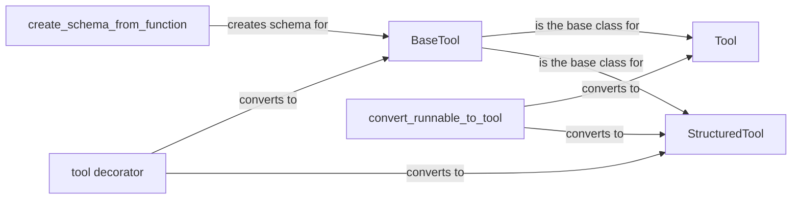

## Component Details

### BaseTool
Abstract base class for all tools in LangChain. It defines the interface that all tools must implement, including methods for running the tool (`_run`), handling asynchronous execution (`_arun`), error handling, and input parsing. It inherits from `RunnableSerializable` to enable seamless integration within LangChain's composable chains and agents. The `BaseTool` ensures a consistent structure and behavior across diverse tool implementations, promoting modularity and extensibility.
- **Related Classes/Methods**: `langchain_core.tools.base`

### Tool
A concrete implementation of `BaseTool` that wraps a single function. It simplifies the creation of tools by directly associating a function with a descriptive name and optional arguments. The `Tool` class is particularly useful for quickly integrating existing Python functions into LangChain workflows, providing a straightforward way to expose their functionality as tools.
- **Related Classes/Methods**: `langchain_core.tools.simple`

### StructuredTool
An extension of `BaseTool` designed for handling structured inputs defined by a Pydantic schema. It leverages the schema to validate and parse the tool's input, ensuring data integrity and type safety. `StructuredTool` is ideal for tools that require complex or specific input formats, as it provides a robust mechanism for managing and processing structured data.
- **Related Classes/Methods**: `langchain_core.tools.structured`

### create_schema_from_function
A utility function that dynamically generates a Pydantic schema from a Python function's signature. It inspects the function's arguments, their types, and docstrings to create a schema that accurately represents the function's input requirements. This function is crucial for automatically generating schemas for tools, reducing boilerplate code and ensuring consistency between the function's signature and the tool's input schema.
- **Related Classes/Methods**: `langchain_core.tools.base`

### tool decorator
A decorator that transforms a Python function or Runnable into a LangChain tool. It automates the process of creating tools by inferring the tool's schema from the function's signature and docstring. The `tool` decorator offers a flexible and concise way to define tools with varying input types and response formats, streamlining the integration of custom functions into LangChain agents and chains.
- **Related Classes/Methods**: `langchain_core.tools.convert`

### convert_runnable_to_tool
A function that converts a LangChain Runnable into a `BaseTool`. This enables the use of any Runnable as a tool, providing a flexible way to integrate different components into agents. It adapts the Runnable's input and output to conform to the `BaseTool` interface, allowing seamless integration within LangChain's tool ecosystem.
- **Related Classes/Methods**: `langchain_core.tools.convert`
