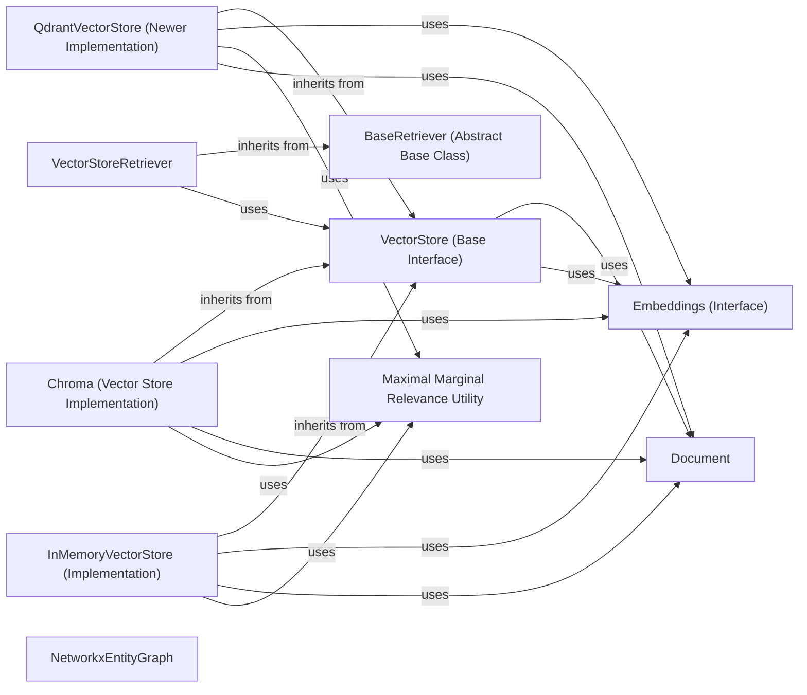

## Component Details

This subsystem manages the storage and retrieval of document embeddings, facilitating efficient similarity search and knowledge base functionalities. It integrates with various vector databases like Qdrant, Chroma, and provides an in-memory option, all adhering to a common `VectorStore` interface. Additionally, it supports interaction with structured data through graph databases like NetworkX, enabling LLMs to query and leverage relational information.

### VectorStore (Base Interface)
The abstract base class that defines the standard interface for all vector store implementations within LangChain. It provides core functionalities such as adding and deleting texts/documents, retrieving documents by ID, and performing various similarity search operations (e.g., similarity, similarity with score, maximal marginal relevance). It also includes methods for handling relevance scoring and converting the vector store into a retriever.

**Related Classes/Methods**:

- <a href="https://github.com/langchain-ai/langchain/blob/master/libs/core/langchain_core/vectorstores/base.py#L59-L999" target="_blank" rel="noopener noreferrer">`langchain_core.vectorstores.base.VectorStore` (59:999)</a>
- <a href="https://github.com/langchain-ai/langchain/blob/master/libs/core/langchain_core/vectorstores/base.py#L62-L115" target="_blank" rel="noopener noreferrer">`langchain_core.vectorstores.base.VectorStore.add_texts` (62:115)</a>
- <a href="https://github.com/langchain-ai/langchain/blob/master/libs/core/langchain_core/vectorstores/base.py#L168-L192" target="_blank" rel="noopener noreferrer">`langchain_core.vectorstores.base.VectorStore.aget_by_ids` (168:192)</a>
- <a href="https://github.com/langchain-ai/langchain/blob/master/libs/core/langchain_core/vectorstores/base.py#L194-L207" target="_blank" rel="noopener noreferrer">`langchain_core.vectorstores.base.VectorStore.adelete` (194:207)</a>
- <a href="https://github.com/langchain-ai/langchain/blob/master/libs/core/langchain_core/vectorstores/base.py#L209-L260" target="_blank" rel="noopener noreferrer">`langchain_core.vectorstores.base.VectorStore.aadd_texts` (209:260)</a>
- <a href="https://github.com/langchain-ai/langchain/blob/master/libs/core/langchain_core/vectorstores/base.py#L262-L293" target="_blank" rel="noopener noreferrer">`langchain_core.vectorstores.base.VectorStore.add_documents` (262:293)</a>
- <a href="https://github.com/langchain-ai/langchain/blob/master/libs/core/langchain_core/vectorstores/base.py#L295-L324" target="_blank" rel="noopener noreferrer">`langchain_core.vectorstores.base.VectorStore.aadd_documents` (295:324)</a>
- <a href="https://github.com/langchain-ai/langchain/blob/master/libs/core/langchain_core/vectorstores/base.py#L326-L356" target="_blank" rel="noopener noreferrer">`langchain_core.vectorstores.base.VectorStore.search` (326:356)</a>
- <a href="https://github.com/langchain-ai/langchain/blob/master/libs/core/langchain_core/vectorstores/base.py#L358-L389" target="_blank" rel="noopener noreferrer">`langchain_core.vectorstores.base.VectorStore.asearch` (358:389)</a>
- <a href="https://github.com/langchain-ai/langchain/blob/master/libs/core/langchain_core/vectorstores/base.py#L461-L478" target="_blank" rel="noopener noreferrer">`langchain_core.vectorstores.base.VectorStore.asimilarity_search_with_score` (461:478)</a>
- <a href="https://github.com/langchain-ai/langchain/blob/master/libs/core/langchain_core/vectorstores/base.py#L480-L505" target="_blank" rel="noopener noreferrer">`langchain_core.vectorstores.base.VectorStore._similarity_search_with_relevance_scores` (480:505)</a>
- <a href="https://github.com/langchain-ai/langchain/blob/master/libs/core/langchain_core/vectorstores/base.py#L507-L532" target="_blank" rel="noopener noreferrer">`langchain_core.vectorstores.base.VectorStore._asimilarity_search_with_relevance_scores` (507:532)</a>
- <a href="https://github.com/langchain-ai/langchain/blob/master/libs/core/langchain_core/vectorstores/base.py#L534-L581" target="_blank" rel="noopener noreferrer">`langchain_core.vectorstores.base.VectorStore.similarity_search_with_relevance_scores` (534:581)</a>
- <a href="https://github.com/langchain-ai/langchain/blob/master/libs/core/langchain_core/vectorstores/base.py#L583-L630" target="_blank" rel="noopener noreferrer">`langchain_core.vectorstores.base.VectorStore.asimilarity_search_with_relevance_scores` (583:630)</a>
- <a href="https://github.com/langchain-ai/langchain/blob/master/libs/core/langchain_core/vectorstores/base.py#L632-L648" target="_blank" rel="noopener noreferrer">`langchain_core.vectorstores.base.VectorStore.asimilarity_search` (632:648)</a>
- <a href="https://github.com/langchain-ai/langchain/blob/master/libs/core/langchain_core/vectorstores/base.py#L665-L683" target="_blank" rel="noopener noreferrer">`langchain_core.vectorstores.base.VectorStore.asimilarity_search_by_vector` (665:683)</a>
- <a href="https://github.com/langchain-ai/langchain/blob/master/libs/core/langchain_core/vectorstores/base.py#L714-L752" target="_blank" rel="noopener noreferrer">`langchain_core.vectorstores.base.VectorStore.amax_marginal_relevance_search` (714:752)</a>
- <a href="https://github.com/langchain-ai/langchain/blob/master/libs/core/langchain_core/vectorstores/base.py#L783-L818" target="_blank" rel="noopener noreferrer">`langchain_core.vectorstores.base.VectorStore.amax_marginal_relevance_search_by_vector` (783:818)</a>
- <a href="https://github.com/langchain-ai/langchain/blob/master/libs/core/langchain_core/vectorstores/base.py#L821-L848" target="_blank" rel="noopener noreferrer">`langchain_core.vectorstores.base.VectorStore.from_documents` (821:848)</a>
- <a href="https://github.com/langchain-ai/langchain/blob/master/libs/core/langchain_core/vectorstores/base.py#L851-L878" target="_blank" rel="noopener noreferrer">`langchain_core.vectorstores.base.VectorStore.afrom_documents` (851:878)</a>
- <a href="https://github.com/langchain-ai/langchain/blob/master/libs/core/langchain_core/vectorstores/base.py#L906-L932" target="_blank" rel="noopener noreferrer">`langchain_core.vectorstores.base.VectorStore.afrom_texts` (906:932)</a>
- <a href="https://github.com/langchain-ai/langchain/blob/master/libs/core/langchain_core/vectorstores/base.py#L941-L999" target="_blank" rel="noopener noreferrer">`langchain_core.vectorstores.base.VectorStore.as_retriever` (941:999)</a>

### VectorStoreRetriever
A concrete implementation of a retriever that leverages a VectorStore instance to retrieve relevant documents based on a given query. It supports various search types, including similarity, similarity with a score threshold, and maximal marginal relevance (MMR), allowing for flexible document retrieval strategies.

**Related Classes/Methods**:

- <a href="https://github.com/langchain-ai/langchain/blob/master/libs/core/langchain_core/vectorstores/base.py#L1002-L1145" target="_blank" rel="noopener noreferrer">`langchain_core.vectorstores.base.VectorStoreRetriever` (1002:1145)</a>
- <a href="https://github.com/langchain-ai/langchain/blob/master/libs/core/langchain_core/vectorstores/base.py#L1053-L1071" target="_blank" rel="noopener noreferrer">`langchain_core.vectorstores.base.VectorStoreRetriever._get_ls_params` (1053:1071)</a>

### QdrantVectorStore (Newer Implementation)
A newer implementation of a Qdrant vector store, likely intended to supersede the older 'Qdrant' class. It provides similar functionalities for interacting with Qdrant, potentially with updated patterns or features.

**Related Classes/Methods**:

- <a href="https://github.com/langchain-ai/langchain/blob/master/libs/partners/qdrant/langchain_qdrant/qdrant.py#L35-L1203" target="_blank" rel="noopener noreferrer">`langchain.libs.partners.qdrant.langchain_qdrant.qdrant.QdrantVectorStore` (35:1203)</a>
- <a href="https://github.com/langchain-ai/langchain/blob/master/libs/partners/qdrant/langchain_qdrant/qdrant.py#L176-L226" target="_blank" rel="noopener noreferrer">`langchain.libs.partners.qdrant.langchain_qdrant.qdrant.QdrantVectorStore:__init__` (176:226)</a>
- <a href="https://github.com/langchain-ai/langchain/blob/master/libs/partners/qdrant/langchain_qdrant/qdrant.py#L271-L356" target="_blank" rel="noopener noreferrer">`langchain.libs.partners.qdrant.langchain_qdrant.qdrant.QdrantVectorStore:from_texts` (271:356)</a>
- <a href="https://github.com/langchain-ai/langchain/blob/master/libs/partners/qdrant/langchain_qdrant/qdrant.py#L359-L419" target="_blank" rel="noopener noreferrer">`langchain.libs.partners.qdrant.langchain_qdrant.qdrant.QdrantVectorStore:from_existing_collection` (359:419)</a>
- <a href="https://github.com/langchain-ai/langchain/blob/master/libs/partners/qdrant/langchain_qdrant/qdrant.py#L421-L443" target="_blank" rel="noopener noreferrer">`langchain.libs.partners.qdrant.langchain_qdrant.qdrant.QdrantVectorStore:add_texts` (421:443)</a>
- <a href="https://github.com/langchain-ai/langchain/blob/master/libs/partners/qdrant/langchain_qdrant/qdrant.py#L445-L473" target="_blank" rel="noopener noreferrer">`langchain.libs.partners.qdrant.langchain_qdrant.qdrant.QdrantVectorStore:similarity_search` (445:473)</a>
- <a href="https://github.com/langchain-ai/langchain/blob/master/libs/partners/qdrant/langchain_qdrant/qdrant.py#L475-L563" target="_blank" rel="noopener noreferrer">`langchain.libs.partners.qdrant.langchain_qdrant.qdrant.QdrantVectorStore:similarity_search_with_score` (475:563)</a>
- <a href="https://github.com/langchain-ai/langchain/blob/master/libs/partners/qdrant/langchain_qdrant/qdrant.py#L565-L616" target="_blank" rel="noopener noreferrer">`langchain.libs.partners.qdrant.langchain_qdrant.qdrant.QdrantVectorStore:similarity_search_with_score_by_vector` (565:616)</a>
- <a href="https://github.com/langchain-ai/langchain/blob/master/libs/partners/qdrant/langchain_qdrant/qdrant.py#L618-L644" target="_blank" rel="noopener noreferrer">`langchain.libs.partners.qdrant.langchain_qdrant.qdrant.QdrantVectorStore:similarity_search_by_vector` (618:644)</a>
- <a href="https://github.com/langchain-ai/langchain/blob/master/libs/partners/qdrant/langchain_qdrant/qdrant.py#L646-L686" target="_blank" rel="noopener noreferrer">`langchain.libs.partners.qdrant.langchain_qdrant.qdrant.QdrantVectorStore:max_marginal_relevance_search` (646:686)</a>
- <a href="https://github.com/langchain-ai/langchain/blob/master/libs/partners/qdrant/langchain_qdrant/qdrant.py#L688-L719" target="_blank" rel="noopener noreferrer">`langchain.libs.partners.qdrant.langchain_qdrant.qdrant.QdrantVectorStore:max_marginal_relevance_search_by_vector` (688:719)</a>
- <a href="https://github.com/langchain-ai/langchain/blob/master/libs/partners/qdrant/langchain_qdrant/qdrant.py#L721-L775" target="_blank" rel="noopener noreferrer">`langchain.libs.partners.qdrant.langchain_qdrant.qdrant.QdrantVectorStore:max_marginal_relevance_search_with_score_by_vector` (721:775)</a>
- <a href="https://github.com/langchain-ai/langchain/blob/master/libs/partners/qdrant/langchain_qdrant/qdrant.py#L797-L808" target="_blank" rel="noopener noreferrer">`langchain.libs.partners.qdrant.langchain_qdrant.qdrant.QdrantVectorStore:get_by_ids` (797:808)</a>
- <a href="https://github.com/langchain-ai/langchain/blob/master/libs/partners/qdrant/langchain_qdrant/qdrant.py#L811-L910" target="_blank" rel="noopener noreferrer">`langchain.libs.partners.qdrant.langchain_qdrant.qdrant.QdrantVectorStore:construct_instance` (811:910)</a>
- <a href="https://github.com/langchain-ai/langchain/blob/master/libs/partners/qdrant/langchain_qdrant/qdrant.py#L939-L952" target="_blank" rel="noopener noreferrer">`langchain.libs.partners.qdrant.langchain_qdrant.qdrant.QdrantVectorStore:_document_from_point` (939:952)</a>
- <a href="https://github.com/langchain-ai/langchain/blob/master/libs/partners/qdrant/langchain_qdrant/qdrant.py#L954-L986" target="_blank" rel="noopener noreferrer">`langchain.libs.partners.qdrant.langchain_qdrant.qdrant.QdrantVectorStore:_generate_batches` (954:986)</a>
- <a href="https://github.com/langchain-ai/langchain/blob/master/libs/partners/qdrant/langchain_qdrant/qdrant.py#L1064-L1090" target="_blank" rel="noopener noreferrer">`langchain.libs.partners.qdrant.langchain_qdrant.qdrant.QdrantVectorStore:_validate_collection_config` (1064:1090)</a>
- <a href="https://github.com/langchain-ai/langchain/blob/master/libs/partners/qdrant/langchain_qdrant/qdrant.py#L1093-L1157" target="_blank" rel="noopener noreferrer">`langchain.libs.partners.qdrant.langchain_qdrant.qdrant.QdrantVectorStore:_validate_collection_for_dense` (1093:1157)</a>
- <a href="https://github.com/langchain-ai/langchain/blob/master/libs/partners/qdrant/langchain_qdrant/qdrant.py#L1160-L1178" target="_blank" rel="noopener noreferrer">`langchain.libs.partners.qdrant.langchain_qdrant.qdrant.QdrantVectorStore:_validate_collection_for_sparse` (1160:1178)</a>

### Chroma (Vector Store Implementation)
A specialized implementation of the VectorStore interface for interacting with the Chroma vector database. It provides functionalities for adding and querying documents, including support for image-based similarity searches and maximal marginal relevance (MMR) for diverse retrieval.

**Related Classes/Methods**:

- <a href="https://github.com/langchain-ai/langchain/blob/master/libs/partners/chroma/langchain_chroma/vectorstores.py#L144-L1254" target="_blank" rel="noopener noreferrer">`langchain.libs.partners.chroma.langchain_chroma.vectorstores.Chroma` (144:1254)</a>
- <a href="https://github.com/langchain-ai/langchain/blob/master/libs/partners/chroma/langchain_chroma/vectorstores.py#L279-L340" target="_blank" rel="noopener noreferrer">`langchain.libs.partners.chroma.langchain_chroma.vectorstores.Chroma:__init__` (279:340)</a>
- `langchain.libs.partners.chroma.langchain_chroma.vectorstores.Chroma:__query_collection__` (full file reference)
- <a href="https://github.com/langchain-ai/langchain/blob/master/libs/partners/chroma/langchain_chroma/vectorstores.py#L407-L495" target="_blank" rel="noopener noreferrer">`langchain.libs.partners.chroma.langchain_chroma.vectorstores.Chroma:add_images` (407:495)</a>
- <a href="https://github.com/langchain-ai/langchain/blob/master/libs/partners/chroma/langchain_chroma/vectorstores.py#L585-L606" target="_blank" rel="noopener noreferrer">`langchain.libs.partners.chroma.langchain_chroma.vectorstores.Chroma:similarity_search` (585:606)</a>
- <a href="https://github.com/langchain-ai/langchain/blob/master/libs/partners/chroma/langchain_chroma/vectorstores.py#L608-L636" target="_blank" rel="noopener noreferrer">`langchain.libs.partners.chroma.langchain_chroma.vectorstores.Chroma:similarity_search_by_vector` (608:636)</a>
- <a href="https://github.com/langchain-ai/langchain/blob/master/libs/partners/chroma/langchain_chroma/vectorstores.py#L638-L667" target="_blank" rel="noopener noreferrer">`langchain.libs.partners.chroma.langchain_chroma.vectorstores.Chroma:similarity_search_by_vector_with_relevance_scores` (638:667)</a>
- <a href="https://github.com/langchain-ai/langchain/blob/master/libs/partners/chroma/langchain_chroma/vectorstores.py#L669-L709" target="_blank" rel="noopener noreferrer">`langchain.libs.partners.chroma.langchain_chroma.vectorstores.Chroma:similarity_search_with_score` (669:709)</a>
- <a href="https://github.com/langchain-ai/langchain/blob/master/libs/partners/chroma/langchain_chroma/vectorstores.py#L711-L754" target="_blank" rel="noopener noreferrer">`langchain.libs.partners.chroma.langchain_chroma.vectorstores.Chroma:similarity_search_with_vectors` (711:754)</a>
- <a href="https://github.com/langchain-ai/langchain/blob/master/libs/partners/chroma/langchain_chroma/vectorstores.py#L794-L836" target="_blank" rel="noopener noreferrer">`langchain.libs.partners.chroma.langchain_chroma.vectorstores.Chroma:similarity_search_by_image` (794:836)</a>
- <a href="https://github.com/langchain-ai/langchain/blob/master/libs/partners/chroma/langchain_chroma/vectorstores.py#L838-L880" target="_blank" rel="noopener noreferrer">`langchain.libs.partners.chroma.langchain_chroma.vectorstores.Chroma:similarity_search_by_image_with_relevance_score` (838:880)</a>
- <a href="https://github.com/langchain-ai/langchain/blob/master/libs/partners/chroma/langchain_chroma/vectorstores.py#L882-L932" target="_blank" rel="noopener noreferrer">`langchain.libs.partners.chroma.langchain_chroma.vectorstores.Chroma:max_marginal_relevance_search_by_vector` (882:932)</a>
- <a href="https://github.com/langchain-ai/langchain/blob/master/libs/partners/chroma/langchain_chroma/vectorstores.py#L934-L981" target="_blank" rel="noopener noreferrer">`langchain.libs.partners.chroma.langchain_chroma.vectorstores.Chroma:max_marginal_relevance_search` (934:981)</a>
- <a href="https://github.com/langchain-ai/langchain/blob/master/libs/partners/chroma/langchain_chroma/vectorstores.py#L988-L994" target="_blank" rel="noopener noreferrer">`langchain.libs.partners.chroma.langchain_chroma.vectorstores.Chroma:reset_collection` (988:994)</a>
- <a href="https://github.com/langchain-ai/langchain/blob/master/libs/partners/chroma/langchain_chroma/vectorstores.py#L1037-L1067" target="_blank" rel="noopener noreferrer">`langchain.libs.partners.chroma.langchain_chroma.vectorstores.Chroma:get_by_ids` (1037:1067)</a>
- <a href="https://github.com/langchain-ai/langchain/blob/master/libs/partners/chroma/langchain_chroma/vectorstores.py#L1069-L1076" target="_blank" rel="noopener noreferrer">`langchain.libs.partners.chroma.langchain_chroma.vectorstores.Chroma:update_document` (1069:1076)</a>
- <a href="https://github.com/langchain-ai/langchain/blob/master/libs/partners/chroma/langchain_chroma/vectorstores.py#L1126-L1194" target="_blank" rel="noopener noreferrer">`langchain.libs.partners.chroma.langchain_chroma.vectorstores.Chroma:from_texts` (1126:1194)</a>
- <a href="https://github.com/langchain-ai/langchain/blob/master/libs/partners/chroma/langchain_chroma/vectorstores.py#L1197-L1245" target="_blank" rel="noopener noreferrer">`langchain.libs.partners.chroma.langchain_chroma.vectorstores.Chroma:from_documents` (1197:1245)</a>

### InMemoryVectorStore (Implementation)
A straightforward in-memory implementation of the VectorStore interface. It stores documents and their corresponding embeddings directly in memory, providing a simple and fast solution for vector search without external database dependencies. Similarity searches are performed using cosine similarity.

**Related Classes/Methods**:

- <a href="https://github.com/langchain-ai/langchain/blob/master/libs/core/langchain_core/vectorstores/in_memory.py#L31-L615" target="_blank" rel="noopener noreferrer">`langchain.libs.core.langchain_core.vectorstores.in_memory.InMemoryVectorStore` (31:615)</a>
- <a href="https://github.com/langchain-ai/langchain/blob/master/libs/core/langchain_core/vectorstores/in_memory.py#L183-L184" target="_blank" rel="noopener noreferrer">`langchain.libs.core.langchain_core.vectorstores.in_memory.InMemoryVectorStore:adelete` (183:184)</a>
- <a href="https://github.com/langchain-ai/langchain/blob/master/libs/core/langchain_core/vectorstores/in_memory.py#L257-L278" target="_blank" rel="noopener noreferrer">`langchain.libs.core.langchain_core.vectorstores.in_memory.InMemoryVectorStore:get_by_ids` (257:278)</a>
- <a href="https://github.com/langchain-ai/langchain/blob/master/libs/core/langchain_core/vectorstores/in_memory.py#L288-L311" target="_blank" rel="noopener noreferrer">`langchain.libs.core.langchain_core.vectorstores.in_memory.InMemoryVectorStore:upsert` (288:311)</a>
- <a href="https://github.com/langchain-ai/langchain/blob/master/libs/core/langchain_core/vectorstores/in_memory.py#L321-L348" target="_blank" rel="noopener noreferrer">`langchain.libs.core.langchain_core.vectorstores.in_memory.InMemoryVectorStore:aupsert` (321:348)</a>
- <a href="https://github.com/langchain-ai/langchain/blob/master/libs/core/langchain_core/vectorstores/in_memory.py#L351-L360" target="_blank" rel="noopener noreferrer">`langchain.libs.core.langchain_core.vectorstores.in_memory.InMemoryVectorStore:aget_by_ids` (351:360)</a>
- <a href="https://github.com/langchain-ai/langchain/blob/master/libs/core/langchain_core/vectorstores/in_memory.py#L362-L399" target="_blank" rel="noopener noreferrer">`langchain.libs.core.langchain_core.vectorstores.in_memory.InMemoryVectorStore:_similarity_search_with_score_by_vector` (362:399)</a>
- <a href="https://github.com/langchain-ai/langchain/blob/master/libs/core/langchain_core/vectorstores/in_memory.py#L401-L423" target="_blank" rel="noopener noreferrer">`langchain.libs.core.langchain_core.vectorstores.in_memory.InMemoryVectorStore:similarity_search_with_score_by_vector` (401:423)</a>
- <a href="https://github.com/langchain-ai/langchain/blob/master/libs/core/langchain_core/vectorstores/in_memory.py#L426-L437" target="_blank" rel="noopener noreferrer">`langchain.libs.core.langchain_core.vectorstores.in_memory.InMemoryVectorStore:similarity_search_with_score` (426:437)</a>
- <a href="https://github.com/langchain-ai/langchain/blob/master/libs/core/langchain_core/vectorstores/in_memory.py#L440-L448" target="_blank" rel="noopener noreferrer">`langchain.libs.core.langchain_core.vectorstores.in_memory.InMemoryVectorStore:asimilarity_search_with_score` (440:448)</a>
- <a href="https://github.com/langchain-ai/langchain/blob/master/libs/core/langchain_core/vectorstores/in_memory.py#L451-L462" target="_blank" rel="noopener noreferrer">`langchain.libs.core.langchain_core.vectorstores.in_memory.InMemoryVectorStore:similarity_search_by_vector` (451:462)</a>
- <a href="https://github.com/langchain-ai/langchain/blob/master/libs/core/langchain_core/vectorstores/in_memory.py#L465-L468" target="_blank" rel="noopener noreferrer">`langchain.libs.core.langchain_core.vectorstores.in_memory.InMemoryVectorStore:asimilarity_search_by_vector` (465:468)</a>
- <a href="https://github.com/langchain-ai/langchain/blob/master/libs/core/langchain_core/vectorstores/in_memory.py#L471-L474" target="_blank" rel="noopener noreferrer">`langchain.libs.core.langchain_core.vectorstores.in_memory.InMemoryVectorStore:similarity_search` (471:474)</a>
- <a href="https://github.com/langchain-ai/langchain/blob/master/libs/core/langchain_core/vectorstores/in_memory.py#L477-L483" target="_blank" rel="noopener noreferrer">`langchain.libs.core.langchain_core.vectorstores.in_memory.InMemoryVectorStore:asimilarity_search` (477:483)</a>
- <a href="https://github.com/langchain-ai/langchain/blob/master/libs/core/langchain_core/vectorstores/in_memory.py#L486-L517" target="_blank" rel="noopener noreferrer">`langchain.libs.core.langchain_core.vectorstores.in_memory.InMemoryVectorStore:max_marginal_relevance_search_by_vector` (486:517)</a>
- <a href="https://github.com/langchain-ai/langchain/blob/master/libs/core/langchain_core/vectorstores/in_memory.py#L520-L535" target="_blank" rel="noopener noreferrer">`langchain.libs.core.langchain_core.vectorstores.in_memory.InMemoryVectorStore:max_marginal_relevance_search` (520:535)</a>
- <a href="https://github.com/langchain-ai/langchain/blob/master/libs/core/langchain_core/vectorstores/in_memory.py#L538-L553" target="_blank" rel="noopener noreferrer">`langchain.libs.core.langchain_core.vectorstores.in_memory.InMemoryVectorStore:amax_marginal_relevance_search` (538:553)</a>
- <a href="https://github.com/langchain-ai/langchain/blob/master/libs/core/langchain_core/vectorstores/in_memory.py#L557-L568" target="_blank" rel="noopener noreferrer">`langchain.libs.core.langchain_core.vectorstores.in_memory.InMemoryVectorStore:from_texts` (557:568)</a>
- <a href="https://github.com/langchain-ai/langchain/blob/master/libs/core/langchain_core/vectorstores/in_memory.py#L572-L583" target="_blank" rel="noopener noreferrer">`langchain.libs.core.langchain_core.vectorstores.in_memory.InMemoryVectorStore:afrom_texts` (572:583)</a>
- <a href="https://github.com/langchain-ai/langchain/blob/master/libs/core/langchain_core/vectorstores/in_memory.py#L586-L604" target="_blank" rel="noopener noreferrer">`langchain.libs.core.langchain_core.vectorstores.in_memory.InMemoryVectorStore:load` (586:604)</a>
- <a href="https://github.com/langchain-ai/langchain/blob/master/libs/core/langchain_core/vectorstores/in_memory.py#L606-L615" target="_blank" rel="noopener noreferrer">`langchain.libs.core.langchain_core.vectorstores.in_memory.InMemoryVectorStore:dump` (606:615)</a>

### Document
A fundamental data structure used across LangChain to represent a piece of text content. Each document can have associated metadata, providing additional context or attributes for the text. Documents are the primary units stored and retrieved by vector stores.

**Related Classes/Methods**:

- <a href="https://github.com/langchain-ai/langchain/blob/master/libs/core/langchain_core/documents/base.py#L255-L305" target="_blank" rel="noopener noreferrer">`langchain_core.documents.base.Document` (255:305)</a>

### Embeddings (Interface)
An abstract base class that defines the contract for all embedding models. Implementations of this interface are responsible for transforming raw text into numerical vector representations (embeddings), which are crucial for performing similarity searches in vector stores.

**Related Classes/Methods**:

- <a href="https://github.com/langchain-ai/langchain/blob/master/libs/core/langchain_core/embeddings/embeddings.py#L8-L78" target="_blank" rel="noopener noreferrer">`langchain_core.embeddings.Embeddings` (8:78)</a>

### BaseRetriever (Abstract Base Class)
The abstract base class for all retriever implementations in LangChain. It defines the fundamental interface for retrieving documents based on a query, serving as a common contract for various retrieval strategies.

**Related Classes/Methods**:

- <a href="https://github.com/langchain-ai/langchain/blob/master/libs/core/langchain_core/retrievers.py#L68-L455" target="_blank" rel="noopener noreferrer">`langchain_core.retrievers.BaseRetriever` (68:455)</a>

### NetworkxEntityGraph
Represents a knowledge graph using NetworkX, capable of storing and querying entities and their relationships as triples. It provides methods for adding triples and converting the graph to a NetworkX graph object.

**Related Classes/Methods**:

- `langchain_community.graphs.NetworkxEntityGraph` (full file reference)

### Maximal Marginal Relevance Utility
A utility function that implements the Maximal Marginal Relevance (MMR) algorithm. This algorithm is used to select a subset of documents that are both relevant to a given query and diverse among themselves, helping to reduce redundancy in search results.

**Related Classes/Methods**:

- <a href="https://github.com/langchain-ai/langchain/blob/master/libs/partners/qdrant/langchain_qdrant/_utils.py#L8-L39" target="_blank" rel="noopener noreferrer">`langchain_qdrant._utils.maximal_marginal_relevance` (8:39)</a>
- <a href="https://github.com/langchain-ai/langchain/blob/master/libs/partners/chroma/langchain_chroma/vectorstores.py#L97-L141" target="_blank" rel="noopener noreferrer">`langchain.libs.partners.chroma.langchain_chroma.vectorstores.maximal_marginal_relevance` (97:141)</a>
- <a href="https://github.com/langchain-ai/langchain/blob/master/libs/core/langchain_core/vectorstores/utils.py#L75-L128" target="_blank" rel="noopener noreferrer">`langchain.libs.core.langchain_core.vectorstores.utils.maximal_marginal_relevance` (75:128)</a>

### [FAQ](https://github.com/CodeBoarding/GeneratedOnBoardings/tree/main?tab=readme-ov-file#faq)