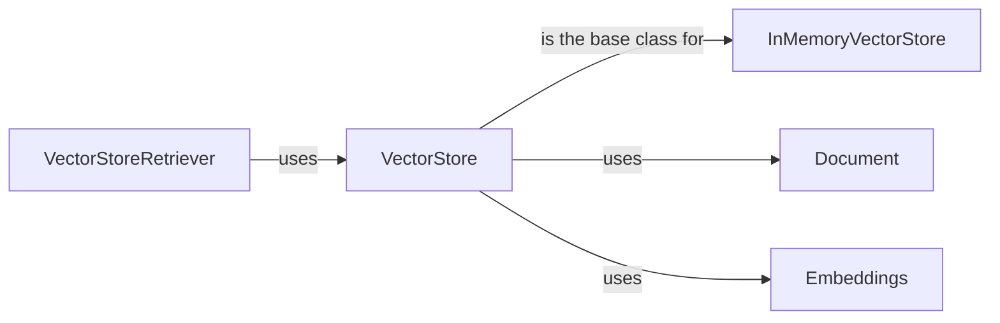

## Component Details

### VectorStore
The VectorStore is an abstract class that serves as the foundation for all vector store implementations within Langchain. It defines the core interface for interacting with vector databases, providing methods for adding and searching vectors. These methods include adding texts, documents, and embeddings, as well as performing similarity searches to retrieve relevant information based on semantic similarity. It acts as a high-level interface for interacting with different vector database implementations.
- **Related Classes/Methods**: `langchain_core.vectorstores.base.VectorStore`

### Document
The Document class represents a single piece of text along with its associated metadata. It is a fundamental data structure used throughout Langchain to represent documents that are processed and stored in vector stores. Each Document instance contains the text content and a dictionary of metadata that provides additional context and information about the document.
- **Related Classes/Methods**: `langchain_core.documents.base.Document`

### Embeddings
The Embeddings interface defines the methods for embedding documents and queries. It provides an abstraction for different embedding models, allowing Langchain to work with various embedding techniques. The interface specifies methods for embedding both single documents and batches of documents, enabling the creation of vector representations of text data.
- **Related Classes/Methods**: `langchain_core.embeddings.embeddings.Embeddings`

### VectorStoreRetriever
The VectorStoreRetriever is a retriever that uses a VectorStore to retrieve documents. It encapsulates a vector store and provides a convenient way to perform similarity searches. It inherits from the BaseRetriever class and implements the _get_relevant_documents method to retrieve documents from the vector store based on a query.
- **Related Classes/Methods**: `langchain_core.vectorstores.base.VectorStoreRetriever`

### InMemoryVectorStore
The InMemoryVectorStore is a simple, in-memory implementation of a vector store. It is useful for testing and development purposes, as it does not require an external database. It stores vectors and their corresponding texts in memory, allowing for fast similarity searches. It inherits from the VectorStore class and implements the add_texts and similarity_search methods.
- **Related Classes/Methods**: `langchain_core.vectorstores.in_memory.InMemoryVectorStore`
