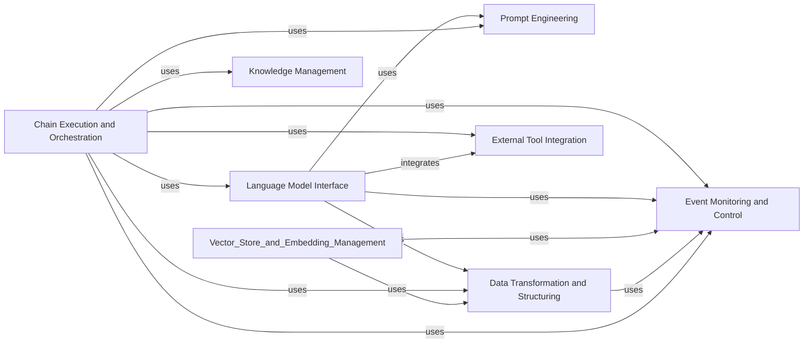

## Component Details

### Language Model Interface
This component provides a unified interface for interacting with various language models, including LLMs and ChatModels. It handles tasks such as generating text from prompts, managing model configurations, and streaming responses. It abstracts away the specific details of each language model provider, allowing the rest of the application to interact with language models in a consistent way.
- **Related Classes/Methods**: `langchain_core.language_models.base`, `langchain_core.language_models.llms`, `langchain_core.language_models.chat_models`

### Prompt Engineering
This component is responsible for creating, managing, and formatting prompts that are fed into language models. It includes tools for constructing prompts from templates, incorporating few-shot examples, and creating specialized chat prompts. It ensures that the prompts are well-structured and optimized for the specific language model being used.
- **Related Classes/Methods**: `langchain_core.prompts.base`, `langchain_core.prompts.prompt`, `langchain_core.prompts.chat`

### Data Transformation and Structuring
This component focuses on taking the raw output from language models and transforming it into structured data that can be easily used by other parts of the application. It includes parsers for various formats, such as JSON and lists, and provides mechanisms for handling parsing errors and retrying parsing attempts. It ensures that the output from language models is reliable and consistent.
- **Related Classes/Methods**: `langchain_core.output_parsers.base`, `langchain_core.output_parsers.json`, `langchain_core.output_parsers.list`, `langchain_core.documents.base`, `langchain_core.document_loaders.base`, `langchain_core.document_transformers`

### Knowledge Management
This component provides tools for loading, transforming, and managing documents. It includes document loaders for various file formats and data sources, as well as text splitters for breaking documents into smaller chunks. It also includes document transformers for tasks such as translation and summarization. It serves as the foundation for working with unstructured data in the Langchain framework. It also provides an abstraction for vector stores, which are used to store and retrieve embeddings of documents. It includes implementations for in-memory vector stores and interfaces for connecting to external vector databases. It also manages the creation and retrieval of embeddings using different embedding models. It enables efficient similarity search and retrieval of documents based on their semantic content.
- **Related Classes/Methods**: `langchain_core.vectorstores.base`, `langchain_core.vectorstores.in_memory`, `langchain_core.embeddings.embeddings`

### External Tool Integration
This component provides an abstraction for tools that can be used by language models to interact with the outside world. It includes base classes for tools and toolkits, as well as tools for interacting with external services, such as search engines and APIs. It allows language models to perform actions and access information beyond their internal knowledge.
- **Related Classes/Methods**: `langchain_core.tools.base`, `langchain_core.tools.convert`, `langchain_core.tools.retriever`

### Chain Execution and Orchestration
This component provides a standard interface for chains, models, and tools, enabling them to be composed together into complex workflows. It includes base classes for runnables and runnable sequences, as well as tools for configuring and executing runnables. It allows developers to create sophisticated applications by combining different Langchain components.
- **Related Classes/Methods**: `langchain_core.runnables.base`, `langchain_core.runnables.chain`, `langchain_core.runnables.config`

### Event Monitoring and Control
This component provides a way to hook into the execution of language model chains and other components. It includes base classes for callback handlers and callback managers, as well as implementations for logging and tracing. It enables developers to monitor and debug Langchain applications, as well as to implement custom logic that is triggered by specific events.
- **Related Classes/Methods**: `langchain_core.callbacks.base`, `langchain_core.callbacks.manager`