```mermaid
graph LR
    LangChain_Core_Runnables["LangChain Core & Runnables"]
    Language_Model_Interfaces["Language Model Interfaces"]
    Agentic_Systems["Agentic Systems"]
    Chains_Workflows["Chains & Workflows"]
    Memory_State_Management["Memory & State Management"]
    Tooling_External_Interactions["Tooling & External Interactions"]
    Data_Ingestion_Transformation["Data Ingestion & Transformation"]
    Vector_Graph_Databases["Vector & Graph Databases"]
    Observability_Evaluation["Observability & Evaluation"]
    Development_CLI_Utilities["Development & CLI Utilities"]
    LangChain_Core_Runnables -- "provides abstractions for" --> Language_Model_Interfaces
    LangChain_Core_Runnables -- "provides abstractions for" --> Agentic_Systems
    LangChain_Core_Runnables -- "provides abstractions for" --> Chains_Workflows
    LangChain_Core_Runnables -- "provides abstractions for" --> Memory_State_Management
    LangChain_Core_Runnables -- "provides abstractions for" --> Tooling_External_Interactions
    LangChain_Core_Runnables -- "provides abstractions for" --> Data_Ingestion_Transformation
    LangChain_Core_Runnables -- "provides abstractions for" --> Vector_Graph_Databases
    LangChain_Core_Runnables -- "provides abstractions for" --> Observability_Evaluation
    Agentic_Systems -- "utilizes" --> Language_Model_Interfaces
    Agentic_Systems -- "utilizes" --> Tooling_External_Interactions
    Agentic_Systems -- "utilizes" --> Memory_State_Management
    Chains_Workflows -- "utilizes" --> Language_Model_Interfaces
    Chains_Workflows -- "utilizes" --> Data_Ingestion_Transformation
    Memory_State_Management -- "utilizes" --> Vector_Graph_Databases
    Memory_State_Management -- "utilizes" --> Data_Ingestion_Transformation
    Vector_Graph_Databases -- "utilizes" --> Language_Model_Interfaces
    Vector_Graph_Databases -- "utilizes" --> Memory_State_Management
    Observability_Evaluation -- "monitors" --> LangChain_Core_Runnables
    Observability_Evaluation -- "monitors" --> Language_Model_Interfaces
    Observability_Evaluation -- "monitors" --> Agentic_Systems
    Observability_Evaluation -- "monitors" --> Chains_Workflows
    Development_CLI_Utilities -- "supports" --> LangChain_Core_Runnables
    Development_CLI_Utilities -- "supports" --> Language_Model_Interfaces
    Development_CLI_Utilities -- "supports" --> Agentic_Systems
    Development_CLI_Utilities -- "supports" --> Chains_Workflows
    click LangChain_Core_Runnables href "https://github.com/CodeBoarding/GeneratedOnBoardings/blob/main/langchain/LangChain Core & Runnables.md" "Details"
    click Language_Model_Interfaces href "https://github.com/CodeBoarding/GeneratedOnBoardings/blob/main/langchain/Language Model Interfaces.md" "Details"
    click Agentic_Systems href "https://github.com/CodeBoarding/GeneratedOnBoardings/blob/main/langchain/Agentic Systems.md" "Details"
    click Chains_Workflows href "https://github.com/CodeBoarding/GeneratedOnBoardings/blob/main/langchain/Chains & Workflows.md" "Details"
    click Memory_State_Management href "https://github.com/CodeBoarding/GeneratedOnBoardings/blob/main/langchain/Memory & State Management.md" "Details"
    click Tooling_External_Interactions href "https://github.com/CodeBoarding/GeneratedOnBoardings/blob/main/langchain/Tooling & External Interactions.md" "Details"
    click Data_Ingestion_Transformation href "https://github.com/CodeBoarding/GeneratedOnBoardings/blob/main/langchain/Data Ingestion & Transformation.md" "Details"
    click Vector_Graph_Databases href "https://github.com/CodeBoarding/GeneratedOnBoardings/blob/main/langchain/Vector & Graph Databases.md" "Details"
    click Observability_Evaluation href "https://github.com/CodeBoarding/GeneratedOnBoardings/blob/main/langchain/Observability & Evaluation.md" "Details"
    click Development_CLI_Utilities href "https://github.com/CodeBoarding/GeneratedOnBoardings/blob/main/langchain/Development & CLI Utilities.md" "Details"
```

## Component Details

The LangChain architecture is designed to facilitate the development of applications powered by large language models. At its core, `LangChain Core & Runnables` provides fundamental abstractions and a unified interface for composing components. Building upon this foundation, `Language Model Interfaces` enable interaction with various AI models, while `Agentic Systems` and `Chains & Workflows` orchestrate complex LLM-driven logic. `Memory & State Management` maintains conversational context, and `Tooling & External Interactions` extends capabilities to external services. `Data Ingestion & Transformation` prepares data for LLMs, which is then stored and retrieved by `Vector & Graph Databases`. `Observability & Evaluation` provides monitoring and performance analysis, and `Development & CLI Utilities` support the overall development lifecycle.

### LangChain Core & Runnables
The foundational library providing core abstractions, data models (messages, documents, outputs), base classes for runnables, callbacks, exceptions, and essential utilities. It also includes the fundamental building blocks for composing and orchestrating LangChain components, enabling a unified interface for invoking, streaming, and batching operations.

**Related Classes/Methods**:

- `langchain_core.runnables.base` (full file reference)
- `langchain_core.messages.base` (full file reference)
- `langchain_core.documents.base` (full file reference)
- `langchain_core.callbacks.base` (full file reference)

### Language Model Interfaces
Provides standardized interfaces and integrations for various Large Language Model (LLM), chat-optimized Large Language Model, and Embedding Model providers. This component abstracts the complexities of interacting with different AI models, allowing other LangChain components to use them interchangeably.

**Related Classes/Methods**:

- `langchain.llms.base` (full file reference)
- `langchain.chat_models.base` (full file reference)
- `langchain.embeddings.base` (full file reference)

### Agentic Systems
Implements the core logic for intelligent agents, enabling them to reason, plan, and execute actions using a set of tools. This component orchestrates the interaction between LLMs, tools, and memory to achieve complex goals.

**Related Classes/Methods**:

- `langchain.agents.agent` (full file reference)

### Chains & Workflows
Provides a structured way to combine LLMs and other components into multi-step workflows. These chains can range from simple LLM calls to complex conversational retrieval systems, enabling the creation of sophisticated applications by linking various operations.

**Related Classes/Methods**:

- `langchain.chains.base` (full file reference)

### Memory & State Management
Handles the persistence and retrieval of conversational history and other stateful information within LLM applications. This includes various chat message histories and general storage mechanisms, allowing applications to maintain context across interactions.

**Related Classes/Methods**:

- `langchain.memory.base` (full file reference)
- `langchain.storage.in_memory` (full file reference)

### Tooling & External Interactions
A collection of pre-built tools that extend the capabilities of LLM agents, allowing them to interact with external services, perform calculations, or access information. This component also includes general utility functions that support various operations within the LangChain ecosystem.

**Related Classes/Methods**:

- `langchain.tools.base` (full file reference)
- `langchain.utilities.python` (full file reference)

### Data Ingestion & Transformation
Encompasses modules for ingesting data from diverse sources (Document Loaders), transforming and processing documents (Document Transformers), and splitting large texts into smaller chunks (Text Splitters). This component is crucial for preparing unstructured data for use with LLMs.

**Related Classes/Methods**:

- `langchain.document_loaders.base` (full file reference)
- `langchain.document_transformers.html2text` (full file reference)
- `langchain_text_splitters.base` (full file reference)

### Vector & Graph Databases
Manages the storage and retrieval of document embeddings, enabling efficient similarity search and knowledge base functionalities. This component also includes integrations with various graph databases, allowing LLMs to interact with and query structured data.

**Related Classes/Methods**:

- `langchain.vectorstores.base` (full file reference)
- `langchain.graphs.networkx_graph` (full file reference)

### Observability & Evaluation
Provides mechanisms to monitor and interact with the execution flow of LangChain applications through callbacks and tracers. It also facilitates integration with LangSmith for debugging, testing, and monitoring, and offers a framework for evaluating the quality and performance of LLM outputs.

**Related Classes/Methods**:

- `langchain.callbacks.base` (full file reference)
- `langchain_core.tracers.base` (full file reference)
- `langchain.smith.evaluation.runner_utils` (full file reference)
- `langchain.evaluation.schema` (full file reference)

### Development & CLI Utilities
Contains command-line interface (CLI) utilities for various LangChain-related tasks, such as generating migrations or serving applications. This component also includes modules and scripts specifically for generating API reference documentation and standardized test suites, supporting the development and quality assurance of the LangChain library.

**Related Classes/Methods**:

- `langchain_cli.cli` (full file reference)
- `langchain.libs.standard-tests.langchain_tests.base` (full file reference)

### [FAQ](https://github.com/CodeBoarding/GeneratedOnBoardings/tree/main?tab=readme-ov-file#faq)