```mermaid
graph LR
    Input_Data_Preparation["Input & Data Preparation"]
    Knowledge_Base_Retrieval["Knowledge Base & Retrieval"]
    LLM_Core_Prompting["LLM Core & Prompting"]
    Workflow_Agent_Orchestration["Workflow & Agent Orchestration"]
    Tool_Output_Processing["Tool & Output Processing"]
    Memory_State_Management["Memory & State Management"]
    Evaluation["Evaluation"]
    Input_Data_Preparation -- "sends processed documents to" --> Knowledge_Base_Retrieval
    Knowledge_Base_Retrieval -- "provides context to" --> LLM_Core_Prompting
    LLM_Core_Prompting -- "passes raw responses to" --> Tool_Output_Processing
    Tool_Output_Processing -- "guides" --> Workflow_Agent_Orchestration
    Workflow_Agent_Orchestration -- "initiates calls to" --> LLM_Core_Prompting
    Workflow_Agent_Orchestration -- "invokes" --> Tool_Output_Processing
    Workflow_Agent_Orchestration -- "accesses and updates" --> Memory_State_Management
    Workflow_Agent_Orchestration -- "queries" --> Knowledge_Base_Retrieval
    Memory_State_Management -- "utilizes" --> Knowledge_Base_Retrieval
    Evaluation -- "assesses performance of" --> LLM_Core_Prompting
    Evaluation -- "assesses performance of" --> Workflow_Agent_Orchestration
    Evaluation -- "assesses performance of" --> Tool_Output_Processing
    click Input_Data_Preparation href "https://github.com/CodeBoarding/GeneratedOnBoardings/blob/main/langchain/Input_Data_Preparation.md" "Details"
    click Knowledge_Base_Retrieval href "https://github.com/CodeBoarding/GeneratedOnBoardings/blob/main/langchain/Knowledge_Base_Retrieval.md" "Details"
    click LLM_Core_Prompting href "https://github.com/CodeBoarding/GeneratedOnBoardings/blob/main/langchain/LLM_Core_Prompting.md" "Details"
    click Tool_Output_Processing href "https://github.com/CodeBoarding/GeneratedOnBoardings/blob/main/langchain/Tool_Output_Processing.md" "Details"
    click Memory_State_Management href "https://github.com/CodeBoarding/GeneratedOnBoardings/blob/main/langchain/Memory_State_Management.md" "Details"
```

## Details

The LangChain architecture is a modular framework for building sophisticated AI applications, emphasizing a pipeline-driven approach. It orchestrates a flow that begins with Input & Data Preparation, feeding into a Knowledge Base & Retrieval system for contextual information. This context, along with user prompts, is processed by the LLM Core & Prompting component, which interacts with various Large Language Models. The LLM's raw output is then handled by Tool & Output Processing for structuring and external interactions. The central Workflow & Agent Orchestration component dynamically manages the application's logic, composing chains and agents that leverage LLMs, tools, and Memory & State Management for persistent context. This design promotes extensibility, allowing developers to swap out different implementations of components (e.g., LLM providers, vector stores) without altering the overall application logic, while Evaluation provides continuous performance assessment.

### Input & Data Preparation [[Expand]](./Input_Data_Preparation.md)
Manages initial user input and the ingestion, loading, and transformation of raw data into a usable format for the system.

**Related Classes/Methods**:

- <a href="https://github.com/langchain-ai/langchain/blob/master/libs/core/langchain_core/document_loaders/base.py" target="_blank" rel="noopener noreferrer">`langchain_core.document_loaders.base`</a>
- <a href="https://github.com/langchain-ai/langchain/blob/master/libs/text-splitters/langchain_text_splitters/character.py" target="_blank" rel="noopener noreferrer">`langchain_text_splitters.character`</a>

### Knowledge Base & Retrieval [[Expand]](./Knowledge_Base_Retrieval.md)
Responsible for converting data into embeddings, storing and managing them in vector stores, and efficiently retrieving relevant information to provide context.

**Related Classes/Methods**:

- <a href="https://github.com/langchain-ai/langchain/blob/master/libs/langchain_v1/langchain/embeddings/base.py" target="_blank" rel="noopener noreferrer">`langchain.embeddings.base`</a>
- <a href="https://github.com/langchain-ai/langchain/blob/master/libs/partners/qdrant/langchain_qdrant/vectorstores.py" target="_blank" rel="noopener noreferrer">`langchain_qdrant.vectorstores`</a>
- <a href="https://github.com/langchain-ai/langchain/blob/master/libs/langchain/langchain/retrievers/multi_query.py" target="_blank" rel="noopener noreferrer">`langchain.retrievers.multi_query`</a>
- <a href="https://github.com/langchain-ai/langchain/blob/master/libs/core/langchain_core/indexing/api.py" target="_blank" rel="noopener noreferrer">`langchain_core.indexing.api`</a>

### LLM Core & Prompting [[Expand]](./LLM_Core_Prompting.md)
Handles all interactions with Large Language Models, including model initialization, prompt construction, and generating responses. It abstracts away provider-specific details.

**Related Classes/Methods**:

- <a href="https://github.com/langchain-ai/langchain/blob/master/libs/langchain_v1/langchain/chat_models/base.py" target="_blank" rel="noopener noreferrer">`langchain.chat_models.base`</a>
- <a href="https://github.com/langchain-ai/langchain/blob/master/libs/core/langchain_core/language_models/chat_models.py" target="_blank" rel="noopener noreferrer">`langchain_core.language_models.chat_models`</a>
- <a href="https://github.com/langchain-ai/langchain/blob/master/libs/core/langchain_core/prompts/chat.py" target="_blank" rel="noopener noreferrer">`langchain_core.prompts.chat`</a>

### Workflow & Agent Orchestration
The central control unit that defines and executes complex multi-step workflows, including sequential chains, composable runnables, and intelligent agents capable of dynamic decision-making.

**Related Classes/Methods**:

- <a href="https://github.com/langchain-ai/langchain/blob/master/libs/langchain/langchain/chains/base.py" target="_blank" rel="noopener noreferrer">`langchain.chains.base`</a>
- <a href="https://github.com/langchain-ai/langchain/blob/master/libs/core/langchain_core/runnables/base.py" target="_blank" rel="noopener noreferrer">`langchain_core.runnables.base`</a>
- <a href="https://github.com/langchain-ai/langchain/blob/master/libs/langchain/langchain/agents/agent.py" target="_blank" rel="noopener noreferrer">`langchain.agents.agent`</a>
- <a href="https://github.com/langchain-ai/langchain/blob/master/libs/langchain/langchain/agents/agent_iterator.py" target="_blank" rel="noopener noreferrer">`langchain.agents.agent_iterator`</a>

### Tool & Output Processing [[Expand]](./Tool_Output_Processing.md)
Manages the definition and execution of external tools used by agents and chains, and processes raw LLM outputs into structured, actionable formats.

**Related Classes/Methods**:

- <a href="https://github.com/langchain-ai/langchain/blob/master/libs/core/langchain_core/tools/base.py" target="_blank" rel="noopener noreferrer">`langchain_core.tools.base`</a>
- <a href="https://github.com/langchain-ai/langchain/blob/master/libs/core/langchain_core/output_parsers/json.py" target="_blank" rel="noopener noreferrer">`langchain_core.output_parsers.json`</a>
- <a href="https://github.com/langchain-ai/langchain/blob/master/libs/langchain/langchain/agents/output_parsers/openai_functions.py" target="_blank" rel="noopener noreferrer">`langchain.agents.output_parsers.openai_functions`</a>

### Memory & State Management [[Expand]](./Memory_State_Management.md)
Provides mechanisms for storing and retrieving conversational history and other relevant state information, enabling continuity across interactions.

**Related Classes/Methods**:

- <a href="https://github.com/langchain-ai/langchain/blob/master/libs/langchain/langchain/memory/chat_memory.py" target="_blank" rel="noopener noreferrer">`langchain.memory.chat_memory`</a>
- <a href="https://github.com/langchain-ai/langchain/blob/master/libs/langchain/langchain/memory/token_buffer.py" target="_blank" rel="noopener noreferrer">`langchain.memory.token_buffer`</a>

### Evaluation
Provides tools and frameworks for assessing the performance and quality of LLMs, chains, and agents against defined criteria or datasets.

**Related Classes/Methods**:

- <a href="https://github.com/langchain-ai/langchain/blob/master/libs/langchain/langchain/smith/evaluation/runner_utils.py" target="_blank" rel="noopener noreferrer">`langchain.smith.evaluation.runner_utils`</a>
- <a href="https://github.com/langchain-ai/langchain/blob/master/libs/langchain/langchain/evaluation/schema.py" target="_blank" rel="noopener noreferrer">`langchain.evaluation.schema`</a>

### [FAQ](https://github.com/CodeBoarding/GeneratedOnBoardings/tree/main?tab=readme-ov-file#faq)