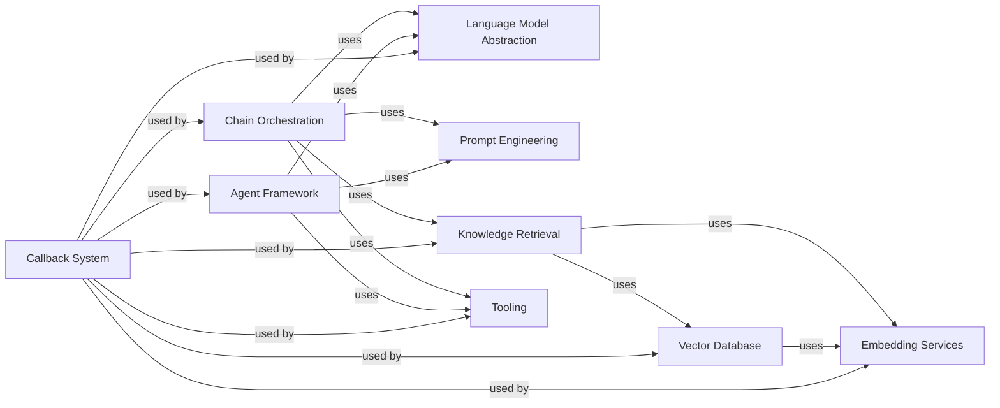

## Component Details

### Language Model Abstraction
This component provides a unified interface for interacting with various language models (LLMs and ChatModels). It handles prompting, generation, and streaming, abstracting away the specifics of each model. It serves as the core for generating responses and interacting with external LLM services.
- **Related Classes/Methods**: `langchain_core.language_models.base`, `langchain_core.language_models.llms`, `langchain_core.language_models.chat_models`

### Prompt Engineering
This component focuses on the creation, formatting, and management of prompts for language models. It includes tools for constructing prompts from strings, messages, and examples, ensuring that the input to the language model is well-structured and effective. It plays a crucial role in guiding the language model to produce the desired output.
- **Related Classes/Methods**: `langchain_core.prompts.base`, `langchain_core.prompts.prompt`, `langchain_core.prompts.chat`

### Chain Orchestration
This component defines sequences of calls to language models or other utilities to accomplish complex tasks. Chains manage the flow of data through a series of operations, such as question answering, summarization, or data transformation. It acts as the central coordinator for executing multi-step processes involving language models.
- **Related Classes/Methods**: `langchain.chains.base`, `langchain.chains.llm`, `langchain.chains.retrieval_qa`

### Knowledge Retrieval
This component is responsible for fetching relevant documents or data from various sources based on a query. Retrievers connect the language model to external knowledge sources, enabling it to access and incorporate information from vector stores, web APIs, and other data repositories. It provides the language model with the context needed to answer questions or perform tasks effectively.
- **Related Classes/Methods**: `langchain_core.retrievers.BaseRetriever`, `langchain.retrievers.self_query.base`, `langchain.retrievers.ensemble.EnsembleRetriever`

### Vector Database
This component stores and searches embeddings of documents, providing efficient similarity search capabilities for retrieving relevant information. Vector stores enable the language model to quickly find and access information that is semantically similar to a given query. It serves as the memory component for retrieving relevant knowledge.
- **Related Classes/Methods**: `langchain_core.vectorstores.base`, `langchain_core.vectorstores.in_memory`, `langchain.vectorstores.chroma`

### Embedding Services
This component creates numerical representations of text or other data, capturing semantic meaning. Embeddings are used to represent the meaning of text in a way that can be easily compared and searched. It transforms raw text into a format suitable for similarity search and other downstream tasks.
- **Related Classes/Methods**: `langchain_core.embeddings.embeddings`, `langchain_core.embeddings.fake`, `langchain_openai.embeddings.base`

### Tooling
This component provides a standard interface for tools that agents can use to interact with the outside world. Tools enable the language model to perform actions such as searching the web, accessing files, and interacting with APIs. It extends the capabilities of the language model beyond text generation, allowing it to perform real-world tasks.
- **Related Classes/Methods**: `langchain_core.tools.base`, `langchain_core.tools.convert`, `langchain.tools.python.tool`

### Agent Framework
This component uses language models to decide which actions to take, orchestrating the interaction between the language model and external tools. Agents plan, execute actions, and parse outputs to achieve a specific goal. It acts as the brain of the system, making decisions and coordinating the execution of tasks.
- **Related Classes/Methods**: `langchain_core.agents.AgentAction`, `langchain_core.agents.AgentFinish`, `langchain.agents.agent.Agent`, `langchain.agents.agent.AgentExecutor`

### Callback System
This component monitors and manages the execution of language model chains and agents, providing a standard interface for logging, tracing, and streaming output. Callbacks enable developers to track the progress of tasks, debug issues, and provide real-time feedback to users. It provides observability and control over the execution of language model workflows.
- **Related Classes/Methods**: `langchain_core.callbacks.base`, `langchain_core.callbacks.manager`, `langchain_core.callbacks.stdout`