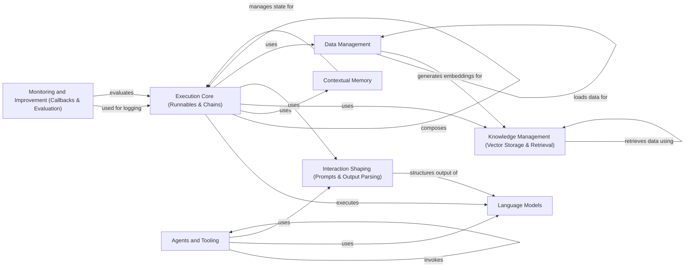

## Component Details

Langchain is a framework for building applications powered by large language models. The core flow involves composing chains of operations, including calls to LLMs, data transformations, and interactions with external tools. Data is loaded, split, and embedded to create vector representations, which are then stored and retrieved to provide context for LLM calls. Prompts are used to guide the behavior of LLMs, and output parsers structure the output into usable formats. Agents can be created to interact with the environment and achieve specific goals. Callbacks and evaluation metrics are used to monitor and improve the performance of applications.

### Execution Core (Runnables & Chains)
This component forms the backbone of Langchain applications, defining the execution flow and orchestrating various operations. Runnables are composable units of work, while Chains are sequences of Runnables that enable complex workflows. It manages the interaction between different components, including Language Models, Data Handling, and Memory, to achieve the desired application logic.
- **Related Classes/Methods**: `langchain.libs.core.langchain_core.runnables.base`, `langchain.libs.core.langchain_core.runnables.chain`, `langchain.libs.langchain.chains.base`, `langchain.libs.langchain.chains.llm`

### Language Models
This component provides the interface for interacting with various Large Language Models (LLMs). It encapsulates the logic for calling LLMs and parsing their responses, enabling Langchain applications to leverage the power of these models for tasks such as text generation, completion, and summarization. It acts as the brain of the system, providing the raw intelligence that powers Langchain applications.
- **Related Classes/Methods**: `langchain.libs.core.langchain_core.language_models.llms`, `langchain.libs.core.langchain_core.language_models.chat_models`, `langchain.libs.langchain.llms`, `langchain.libs.langchain.chat_models`

### Data Management
This component handles the ingestion, processing, and representation of data within Langchain applications. It includes Document Loaders for fetching data from various sources, Text Splitters for breaking data into manageable chunks, and Embeddings for generating vector representations. This component is responsible for preparing data for use in downstream components, such as Vector Storage & Retrieval and Language Models.
- **Related Classes/Methods**: `langchain.libs.core.langchain_core.document_loaders.base`, `langchain.libs.langchain.document_loaders`, `langchain.libs.text_splitters.langchain_text_splitters.base`, `langchain.libs.core.langchain_core.embeddings.embeddings`, `langchain.libs.langchain.embeddings`

### Knowledge Management (Vector Storage & Retrieval)
This component provides the ability to store and retrieve vector embeddings of data, enabling Langchain applications to access and utilize external knowledge. Vector Stores provide efficient storage and retrieval of embeddings, while Retrievers fetch relevant information based on queries. This component acts as the memory of the system, providing access to knowledge and context for LLM calls.
- **Related Classes/Methods**: `langchain.libs.core.langchain_core.vectorstores.base`, `langchain.libs.langchain.vectorstores`, `langchain.libs.core.langchain_core.retrievers.BaseRetriever`, `langchain.libs.langchain.retrievers`

### Interaction Shaping (Prompts & Output Parsing)
This component focuses on shaping the interaction with Language Models by creating and structuring prompts, as well as parsing the output of those models into usable formats. Prompts guide the behavior of LLMs, while Output Parsers ensure that the output can be easily consumed by downstream components. This component acts as the voice and ears of the system, enabling effective communication with LLMs.
- **Related Classes/Methods**: `langchain.libs.core.langchain_core.prompts.base`, `langchain.libs.core.langchain_core.prompts.chat`, `langchain.libs.core.langchain_core.output_parsers.base`, `langchain.libs.langchain.output_parsers`

### Contextual Memory
This component provides mechanisms for storing and retrieving stateful information across multiple interactions with a language model. It maintains context and enables conversational agents by remembering past interactions. This component acts as the long-term memory of the system, enabling more natural and engaging conversations.
- **Related Classes/Methods**: `langchain.libs.langchain.memory.chat_memory`, `langchain.libs.langchain.memory.buffer`

### Agents and Tooling
This component provides a framework for building autonomous agents that can interact with their environment to achieve specific goals. Agents use Tools to access external APIs and services, enabling Langchain applications to perform a wide range of tasks. This component acts as the hands and feet of the system, enabling Langchain applications to act and interact with the world.
- **Related Classes/Methods**: `langchain.libs.langchain.agents.agent`, `langchain.libs.langchain.tools`, `langchain.libs.core.langchain_core.tools.base`

### Monitoring and Improvement (Callbacks & Evaluation)
This component provides mechanisms for intercepting and responding to events during the execution of Langchain applications, as well as evaluating the performance of those applications. Callbacks enable logging, tracing, and monitoring, while Evaluation provides metrics for assessing quality and effectiveness. This component acts as the conscience of the system, enabling developers to monitor and improve the performance of Langchain applications.
- **Related Classes/Methods**: `langchain.libs.core.langchain_core.callbacks.base`, `langchain.libs.langchain.callbacks`, `langchain.libs.langchain.evaluation.schema`