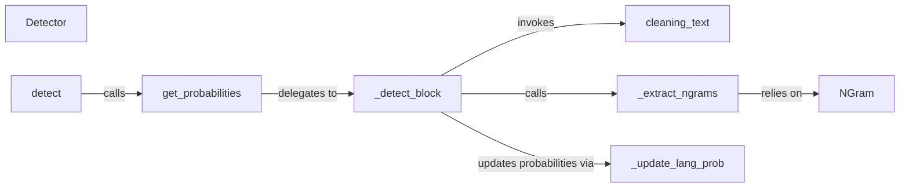

## Details

The `Core Detection Engine` operates as a pipeline: 1. External calls initiate detection via the `detect` function. 2. `detect` delegates to `get_probabilities` to manage the overall process of calculating language likelihoods. 3. `get_probabilities` orchestrates the core analysis by repeatedly calling `_detect_block` for segments of the input text. 4. `_detect_block` performs the detailed work for each text segment: It first cleans the text using `cleaning_text`. Then, it extracts features (n-grams) using `_extract_ngrams`, which in turn leverages the `langdetect.utils.ngram.NGram` class and `add_char` utility for character handling. Finally, it updates language probabilities based on the extracted n-grams using `_update_lang_prob`. 5. After all text blocks are processed, `get_probabilities` sorts the final results using `_sort_probability` to present the most probable languages. The `Detector` class acts as the overarching container and state manager for this entire process, maintaining the context and state throughout the detection lifecycle. The flow is highly sequential and data-driven, with text being transformed and probabilities being refined at each step.

### Detector
The central orchestrator and state manager for the language detection process. It holds the internal state and coordinates the overall detection flow.

**Related Classes/Methods**:

- <a href="https://github.com/Mimino666/langdetect/blob/master/langdetect/detector.py#L13-L249" target="_blank" rel="noopener noreferrer">`langdetect.detector.Detector`:13-249</a>

### detect
Provides the high-level public API for users to initiate language detection on a given text, serving as the primary external interface.

**Related Classes/Methods**:

- <a href="https://github.com/Mimino666/langdetect/blob/master/langdetect/detector.py#L132-L139" target="_blank" rel="noopener noreferrer">`langdetect.detector.detect`:132-139</a>

### get_probabilities
Manages the overall calculation and retrieval of language probabilities, orchestrating detailed text analysis and result sorting.

**Related Classes/Methods**:

- <a href="https://github.com/Mimino666/langdetect/blob/master/langdetect/detector.py#L141-L144" target="_blank" rel="noopener noreferrer">`langdetect.detector.get_probabilities`:141-144</a>

### _detect_block
The core algorithmic component responsible for detailed, block-by-block text analysis, coordinating text cleaning, n-gram extraction, and probability updates.

**Related Classes/Methods**:

- <a href="https://github.com/Mimino666/langdetect/blob/master/langdetect/detector.py#L146-L171" target="_blank" rel="noopener noreferrer">`langdetect.detector._detect_block`:146-171</a>

### cleaning_text
Preprocesses the input text by removing irrelevant characters or applying normalization rules before n-gram extraction.

**Related Classes/Methods**:

- <a href="https://github.com/Mimino666/langdetect/blob/master/langdetect/detector.py#L114-L130" target="_blank" rel="noopener noreferrer">`langdetect.detector.cleaning_text`:114-130</a>

### _extract_ngrams
Generates n-grams from processed text, which are fundamental features for language identification.

**Related Classes/Methods**:

- <a href="https://github.com/Mimino666/langdetect/blob/master/langdetect/detector.py#L182-L199" target="_blank" rel="noopener noreferrer">`langdetect.detector._extract_ngrams`:182-199</a>

### _update_lang_prob
Adjusts and refines language probability scores based on extracted n-grams and pre-loaded language profiles.

**Related Classes/Methods**:

- <a href="https://github.com/Mimino666/langdetect/blob/master/langdetect/detector.py#L201-L213" target="_blank" rel="noopener noreferrer">`langdetect.detector._update_lang_prob`:201-213</a>

### NGram
Provides core utility functionalities for n-gram generation and text normalization, supporting the main detection components.

**Related Classes/Methods**:

- <a href="https://github.com/Mimino666/langdetect/blob/master/langdetect/utils/ngram.py#L23-L258" target="_blank" rel="noopener noreferrer">`langdetect.utils.ngram.NGram`:23-258</a>

### [FAQ](https://github.com/CodeBoarding/GeneratedOnBoardings/tree/main?tab=readme-ov-file#faq)