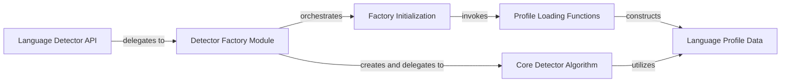

## Details

The `Language Detector API` subsystem is the core of the `langdetect` library, providing the public interface for language identification. It encompasses the mechanisms for initializing the system, managing language profiles, and executing the language detection algorithm.

### Language Detector API [[Expand]](./Language_Detector_API.md)
The primary public interface for the `langdetect` library, providing high-level functions (`detect`, `detect_langs`) for users to perform language detection. It acts as a facade, abstracting the underlying complexities of `Detector` instance management and profile loading.

**Related Classes/Methods**:

- <a href="https://github.com/Mimino666/langdetect/blob/master/langdetect/detector_factory.py#L126-L130" target="_blank" rel="noopener noreferrer">`langdetect.detector_factory.detect`:126-130</a>
- <a href="https://github.com/Mimino666/langdetect/blob/master/langdetect/detector_factory.py#L133-L137" target="_blank" rel="noopener noreferrer">`langdetect.detector_factory.detect_langs`:133-137</a>

### Detector Factory Module
Manages the lifecycle of `Detector` instances and language profiles. It orchestrates the initialization process, creates `Detector` objects, and delegates detection tasks. It embodies the Factory pattern for `Detector` objects.

**Related Classes/Methods**:

- <a href="https://github.com/Mimino666/langdetect/blob/master/langdetect/detector_factory.py#L15-L114" target="_blank" rel="noopener noreferrer">`langdetect.detector_factory.DetectorFactory`:15-114</a>

### Factory Initialization
Responsible for the initial setup of the `DetectorFactory`, primarily by loading all necessary language profiles into memory. This ensures the system is ready for detection operations and is implicitly called by public API methods.

**Related Classes/Methods**:

- <a href="https://github.com/Mimino666/langdetect/blob/master/langdetect/detector_factory.py#L120-L124" target="_blank" rel="noopener noreferrer">`langdetect.detector_factory.init_factory`:120-124</a>

### Profile Loading Functions
Handles the parsing and loading of language model data (statistical information) from various sources (e.g., JSON files) into `LangProfile` objects. These functions are internal to the factory's setup process.

**Related Classes/Methods**:

- <a href="https://github.com/Mimino666/langdetect/blob/master/langdetect/detector_factory.py#L35-L64" target="_blank" rel="noopener noreferrer">`langdetect.detector_factory.load_profile`:35-64</a>
- <a href="https://github.com/Mimino666/langdetect/blob/master/langdetect/detector_factory.py#L66-L78" target="_blank" rel="noopener noreferrer">`langdetect.detector_factory.load_json_profile`:66-78</a>

### Core Detector Algorithm
Encapsulates the core language detection algorithm. It processes input text, applies statistical models based on loaded profiles, and determines the language(s) by calculating probabilities.

**Related Classes/Methods**:

- <a href="https://github.com/Mimino666/langdetect/blob/master/langdetect/detector.py#L13-L249" target="_blank" rel="noopener noreferrer">`langdetect.detector.Detector`:13-249</a>

### Language Profile Data
Represents a loaded language model profile, containing the statistical data (e.g., n-gram frequencies, character counts) essential for the `Detector` to perform language identification. It's the structured representation of the language models.

**Related Classes/Methods**:

- <a href="https://github.com/Mimino666/langdetect/blob/master/langdetect/utils/lang_profile.py#L10-L70" target="_blank" rel="noopener noreferrer">`langdetect.utils.lang_profile.LangProfile`:10-70</a>

### [FAQ](https://github.com/CodeBoarding/GeneratedOnBoardings/tree/main?tab=readme-ov-file#faq)