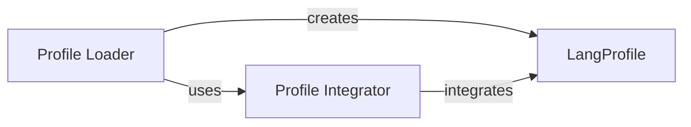

## Details

The `Language Profile Store` subsystem is responsible for managing the statistical language profiles (n-gram frequencies) used by the language detection algorithm, handling their storage, retrieval, and optimization.

### LangProfile
The fundamental data model that encapsulates and manages the statistical n-gram data defining a language's profile. It serves as the core storage for all profile-related information, including n-gram frequencies. It also provides internal methods (`update`, `add`) for modifying its data.

**Related Classes/Methods**:

- <a href="https://github.com/Mimino666/langdetect/blob/master/langdetect/utils/lang_profile.py#L10-L70" target="_blank" rel="noopener noreferrer">`langdetect.utils.lang_profile.LangProfile`:10-70</a>

### Profile Loader
This component is responsible for orchestrating the process of loading language profiles from external data sources (e.g., JSON files). It parses the raw data and constructs `LangProfile` objects. `load_json_profile` is a specialized variant for JSON-formatted profiles.

**Related Classes/Methods**:

- <a href="https://github.com/Mimino666/langdetect/blob/master/langdetect/detector_factory.py#L35-L64" target="_blank" rel="noopener noreferrer">`langdetect.detector_factory.load_profile`:35-64</a>
- <a href="https://github.com/Mimino666/langdetect/blob/master/langdetect/detector_factory.py#L66-L78" target="_blank" rel="noopener noreferrer">`langdetect.detector_factory.load_json_profile`:66-78</a>

### Profile Integrator
This component handles the integration of a fully constructed `LangProfile` object into the `DetectorFactory`'s internal collection. It makes the loaded profile accessible for subsequent language detection operations, effectively bridging the loaded profiles with the core detection logic.

**Related Classes/Methods**:

- <a href="https://github.com/Mimino666/langdetect/blob/master/langdetect/detector_factory.py#L80-L92" target="_blank" rel="noopener noreferrer">`langdetect.detector_factory.add_profile`:80-92</a>

### [FAQ](https://github.com/CodeBoarding/GeneratedOnBoardings/tree/main?tab=readme-ov-file#faq)