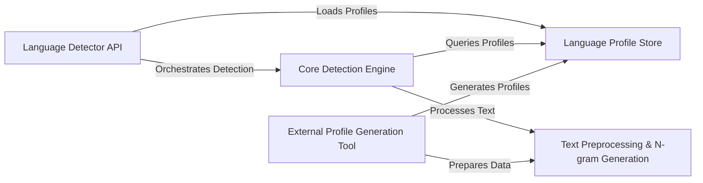

## Details

The `langdetect` library's architecture is centered around a `Language Detector API` that serves as the primary entry point. This API orchestrates the language detection process by loading necessary `Language Profile Store` data and delegating core detection tasks to the `Core Detection Engine`. The `Core Detection Engine` is responsible for the actual language identification, which involves processing input text using the `Text Preprocessing & N-gram Generation` utility to extract linguistic features and querying the `Language Profile Store` for statistical language models. An `External Profile Generation Tool` (a conceptual Java-based component) is responsible for initially populating the `Language Profile Store` by utilizing the `Text Preprocessing & N-gram Generation` component to prepare raw text data for profile creation. This clear separation of concerns facilitates efficient language detection and allows for external management of language profile generation.

### Language Detector API [[Expand]](./Language_Detector_API.md)
The public-facing interface for the `langdetect` library, responsible for system initialization, profile loading, and orchestrating the language detection process.

**Related Classes/Methods**:

- <a href="https://github.com/Mimino666/langdetect/blob/master/langdetect/detector_factory.py" target="_blank" rel="noopener noreferrer">`langdetect.detector_factory`</a>

### Core Detection Engine [[Expand]](./Core_Detection_Engine.md)
Encapsulates the primary algorithms for language identification, processing text, extracting features, and calculating language probabilities.

**Related Classes/Methods**:

- <a href="https://github.com/Mimino666/langdetect/blob/master/langdetect/detector.py" target="_blank" rel="noopener noreferrer">`langdetect.detector`</a>

### Language Profile Store [[Expand]](./Language_Profile_Store.md)
Manages the statistical language profiles (n-gram frequencies) essential for the detection algorithm, handling their storage, retrieval, and optimization.

**Related Classes/Methods**:

- <a href="https://github.com/Mimino666/langdetect/blob/master/langdetect/utils/lang_profile.py" target="_blank" rel="noopener noreferrer">`langdetect.utils.lang_profile`</a>

### Text Preprocessing & N-gram Generation
A utility component providing functions for text normalization and the generation of n-grams, which are fundamental linguistic features.

**Related Classes/Methods**:

- <a href="https://github.com/Mimino666/langdetect/blob/master/langdetect/utils/ngram.py" target="_blank" rel="noopener noreferrer">`langdetect.utils.ngram`</a>

### External Profile Generation Tool
(Conceptual) An external Java-based tool (`langdetect.jar`) responsible for generating the initial language profiles from large text corpora. It utilizes the `Text Preprocessing & N-gram Generation` component to prepare data before generating profiles, which are then consumed by the `Language Profile Store`. As an external Java application, no direct Python source code reference is available within this project's context.

**Related Classes/Methods**: _None_

### [FAQ](https://github.com/CodeBoarding/GeneratedOnBoardings/tree/main?tab=readme-ov-file#faq)