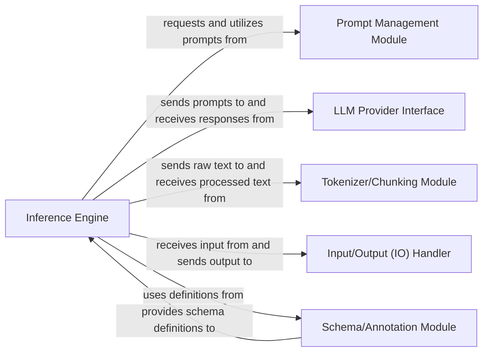

## Details

The `langextract` subsystem is centered around the `Inference Engine`, which orchestrates the entire information extraction process. It begins by receiving raw input from the `Input/Output (IO) Handler`, which also manages the final output. Before interacting with Large Language Models, the `Inference Engine` sends raw text to the `Tokenizer/Chunking Module` for preprocessing, receiving tokenized and chunked text in return. For LLM interactions, the `Inference Engine` requests and utilizes prompts from the `Prompt Management Module` and then sends these prompts to the `LLM Provider Interface`, which abstracts various LLM services and returns their responses. Throughout this process, the `Inference Engine` relies on the `Schema/Annotation Module` for defining the structure and validation rules of the extracted information. This modular design ensures flexibility in integrating different LLMs, managing prompts, and handling diverse input/output formats.

### Inference Engine
Orchestrates the entire information extraction pipeline. It manages the data flow from input, applies necessary preprocessing like chunking and tokenization, interacts with various LLM providers through the LLM Provider Interface using prompts from the Prompt Management Module, and processes the LLM responses to extract and structure information according to schemas defined by the Schema/Annotation Module. It is responsible for coordinating multi-pass extractions and ensuring the overall flow of the extraction process.

**Related Classes/Methods**:

- <a href="git@github.com:google/langextract.git/blob/main/temp/a7bbff27d4b2451ea81454955289cfda/langextract/inference.py#L1-L10000" target="_blank" rel="noopener noreferrer">`langextract.inference`:1-10000</a>

### Schema/Annotation Module
Defines the structure, schemas, and validation rules for the information to be extracted. It guides the extraction process by providing the target data model and ensures the integrity and consistency of the extracted data.

**Related Classes/Methods**:

- <a href="git@github.com:google/langextract.git/blob/main/temp/a7bbff27d4b2451ea81454955289cfda/langextract/annotation.py#L1-L10000" target="_blank" rel="noopener noreferrer">`langextract.annotation`:1-10000</a>

### Prompt Management Module
Manages and provides prompts for LLM interactions. It abstracts the complexity of prompt engineering, allowing the Inference Engine to request prompts based on the extraction task, ensuring consistent and effective communication with language models.

**Related Classes/Methods**:

- <a href="git@github.com:google/langextract.git/blob/main/temp/a7bbff27d4b2451ea81454955289cfda/langextract/prompting.py#L1-L10000" target="_blank" rel="noopener noreferrer">`langextract.prompting`:1-10000</a>

### LLM Provider Interface
Provides an abstract and unified interface for interacting with various Large Language Model (LLM) providers (e.g., Google Gemini, OpenAI, Ollama). This component enables the system to be LLM-agnostic, facilitating easy integration of new models without altering core extraction logic.

**Related Classes/Methods**:

- <a href="git@github.com:google/langextract.git/blob/main/temp/a7bbff27d4b2451ea81454955289cfda/langextract/providers#L1-L10000" target="_blank" rel="noopener noreferrer">`langextract.providers`:1-10000</a>

### Tokenizer/Chunking Module
Handles the preprocessing of raw input text, including tokenization and chunking. This prepares the data into manageable segments suitable for efficient and context-aware processing by Large Language Models, optimizing performance and adherence to LLM input limits.

**Related Classes/Methods**:

- <a href="git@github.com:google/langextract.git/blob/main/temp/a7bbff27d4b2451ea81454955289cfda/langextract/tokenizer.py#L1-L10000" target="_blank" rel="noopener noreferrer">`langextract.tokenizer`:1-10000</a>
- <a href="git@github.com:google/langextract.git/blob/main/temp/a7bbff27d4b2451ea81454955289cfda/langextract/chunking.py#L1-L10000" target="_blank" rel="noopener noreferrer">`langextract.chunking`:1-10000</a>

### Input/Output (IO) Handler
Manages the ingestion of raw input data from various sources (e.g., files, streams) and the serialization/output of extracted and structured information into desired formats (e.g., JSONL, HTML). It acts as the system's gateway for data flow.

**Related Classes/Methods**:

- <a href="git@github.com:google/langextract.git/blob/main/temp/a7bbff27d4b2451ea81454955289cfda/langextract/io.py#L1-L10000" target="_blank" rel="noopener noreferrer">`langextract.io`:1-10000</a>

### [FAQ](https://github.com/CodeBoarding/GeneratedOnBoardings/tree/main?tab=readme-ov-file#faq)