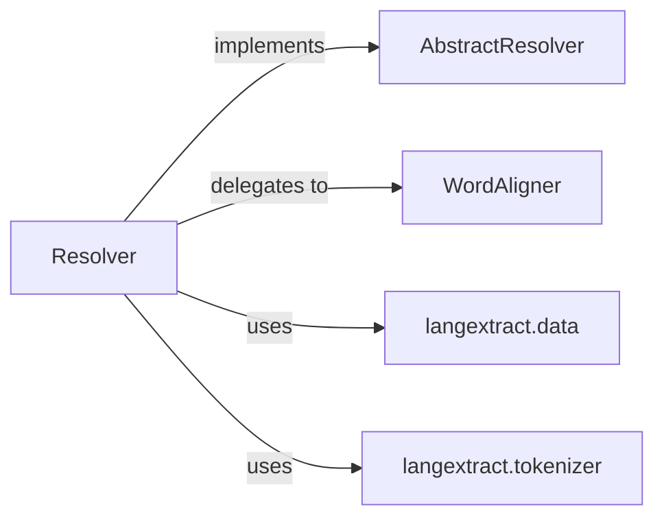

## Details

One paragraph explaining the functionality which is represented by this graph. What the main flow is and what is its purpose.

### AbstractResolver
This component defines the contract for any class responsible for parsing LLM output and aligning extractions. It establishes the `resolve` and `align` methods as the fundamental operations for this subsystem, ensuring extensibility and adherence to a common interface.

**Related Classes/Methods**:

- <a href="git@github.com:google/langextract.git/blob/main/temp/a7bbff27d4b2451ea81454955289cfda/langextract/resolver.py" target="_blank" rel="noopener noreferrer">`langextract.resolver.AbstractResolver:resolve`</a>
- <a href="git@github.com:google/langextract.git/blob/main/temp/a7bbff27d4b2451ea81454955289cfda/langextract/resolver.py" target="_blank" rel="noopener noreferrer">`langextract.resolver.AbstractResolver:align`</a>

### Resolver
The concrete implementation of `AbstractResolver`, this component is responsible for parsing LLM-generated YAML or JSON into `data.Extraction` objects. It orchestrates the entire resolution and alignment process, handling parsing logic, error management, and the ordering of extracted information. It acts as the primary orchestrator within this subsystem.

**Related Classes/Methods**:

- <a href="git@github.com:google/langextract.git/blob/main/temp/a7bbff27d4b2451ea81454955289cfda/langextract/data.py#L44-L106" target="_blank" rel="noopener noreferrer">`langextract.data.Extraction`:44-106</a>

### WordAligner
A specialized utility component focused on the precise alignment of extracted text spans with the original source text. It employs string comparison algorithms to identify exact, partial, or fuzzy matches, calculating token and character offsets. This component handles the granular details of text alignment.

**Related Classes/Methods**:

- <a href="git@github.com:google/langextract.git/blob/main/temp/a7bbff27d4b2451ea81454955289cfda/langextract/resolver.py#L520-L882" target="_blank" rel="noopener noreferrer">`langextract.resolver.WordAligner`:520-882</a>

### langextract.data
Module responsible for defining data structures, such as `Extraction` objects, used across the system.

**Related Classes/Methods**: _None_

### langextract.tokenizer
Module responsible for tokenizing text for processing and alignment.

**Related Classes/Methods**: _None_

### [FAQ](https://github.com/CodeBoarding/GeneratedOnBoardings/tree/main?tab=readme-ov-file#faq)