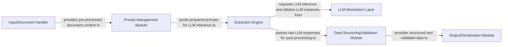

## Details

The `langextract` subsystem is designed for efficient information extraction using Large Language Models. The process begins with the **Input/Document Handler**, which is responsible for ingesting various document formats and preparing them for processing. The prepared content is then passed to the **Prompt Management Module**, which dynamically constructs and formats prompts tailored for the LLM, incorporating document content and extraction requirements. These prompts are then sent to the **Extraction Engine**, the core orchestrator of LLM interactions. The Extraction Engine communicates with different LLM providers through the **LLM Abstraction Layer**, ensuring a unified interface regardless of the underlying LLM. After receiving raw responses from the LLM, the Extraction Engine forwards them to the **Data Structuring/Validation Module**. This module transforms the unstructured LLM output into a predefined structured format and validates it against expected schemas. Finally, the **Output/Serialization Module** handles the serialization of the validated, structured data into various output formats and manages its persistence or delivery. This modular design ensures clear separation of concerns, flexibility in LLM integration, and robust data handling throughout the extraction pipeline.

### Input/Document Handler
Responsible for ingesting raw documents (e.g., JSONL, HTML) and preparing them for the extraction process, potentially converting them into a standardized internal representation suitable for prompt generation.

**Related Classes/Methods**:

- <a href="git@github.com:google/langextract.git/blob/main/temp/a7bbff27d4b2451ea81454955289cfda/langextract/io.py#L39-L79" target="_blank" rel="noopener noreferrer">`langextract.io.Dataset`:39-79</a>
- <a href="git@github.com:google/langextract.git/blob/main/temp/a7bbff27d4b2451ea81454955289cfda/langextract/io.py#L137-L185" target="_blank" rel="noopener noreferrer">`langextract.io.load_annotated_documents_jsonl`:137-185</a>
- <a href="git@github.com:google/langextract.git/blob/main/temp/a7bbff27d4b2451ea81454955289cfda/langextract/io.py#L232-L318" target="_blank" rel="noopener noreferrer">`langextract.io.download_text_from_url`:232-318</a>

### Prompt Management Module
Manages the creation, templating, and preparation of specific prompts tailored for the LLM based on the input document content and the desired information extraction task.

**Related Classes/Methods**:

- <a href="git@github.com:google/langextract.git/blob/main/temp/a7bbff27d4b2451ea81454955289cfda/langextract/prompting.py#L38-L48" target="_blank" rel="noopener noreferrer">`langextract.prompting.PromptTemplateStructured`:38-48</a>
- <a href="git@github.com:google/langextract.git/blob/main/temp/a7bbff27d4b2451ea81454955289cfda/langextract/prompting.py#L83-L166" target="_blank" rel="noopener noreferrer">`langextract.prompting.QAPromptGenerator`:83-166</a>

### LLM Abstraction Layer
Provides a unified, abstract interface for interacting with various LLM providers (e.g., Google Gemini, OpenAI, Ollama). It handles the registration, management, and instantiation of different LLM backends, abstracting away their specific API differences. This enables LLM-agnostic core logic.

**Related Classes/Methods**:

- <a href="git@github.com:google/langextract.git/blob/main/temp/a7bbff27d4b2451ea81454955289cfda/langextract/providers/registry.py" target="_blank" rel="noopener noreferrer">`langextract.providers.registry`</a>
- <a href="git@github.com:google/langextract.git/blob/main/temp/a7bbff27d4b2451ea81454955289cfda/langextract/providers/gemini.py" target="_blank" rel="noopener noreferrer">`langextract.providers.gemini`</a>
- <a href="git@github.com:google/langextract.git/blob/main/temp/a7bbff27d4b2451ea81454955289cfda/langextract/providers/openai.py" target="_blank" rel="noopener noreferrer">`langextract.providers.openai`</a>
- <a href="git@github.com:google/langextract.git/blob/main/temp/a7bbff27d4b2451ea81454955289cfda/langextract/providers/ollama.py" target="_blank" rel="noopener noreferrer">`langextract.providers.ollama`</a>
- <a href="git@github.com:google/langextract.git/blob/main/temp/a7bbff27d4b2451ea81454955289cfda/langextract/factory.py" target="_blank" rel="noopener noreferrer">`langextract.factory`</a>

### Extraction Engine
Orchestrates the core interaction with LLMs for information extraction. It is responsible for sending prepared prompts to the LLM via the LLM Abstraction Layer, managing the responses, and handling the overall extraction logic, including any retry mechanisms or error handling related to LLM communication.

**Related Classes/Methods**:

- <a href="git@github.com:google/langextract.git/blob/main/temp/a7bbff27d4b2451ea81454955289cfda/langextract/inference.py" target="_blank" rel="noopener noreferrer">`langextract.inference`</a>

### Data Structuring/Validation Module
Responsible for taking the raw, unstructured output from the LLM and transforming it into a predefined structured format (e.g., JSON). It also performs validation to ensure the extracted data conforms to expected schemas and quality standards.

**Related Classes/Methods**:

- <a href="git@github.com:google/langextract.git/blob/main/temp/a7bbff27d4b2451ea81454955289cfda/langextract/schema.py#L49-L59" target="_blank" rel="noopener noreferrer">`langextract.schema.BaseSchema`:49-59</a>
- <a href="git@github.com:google/langextract.git/blob/main/temp/a7bbff27d4b2451ea81454955289cfda/langextract/schema.py#L62-L158" target="_blank" rel="noopener noreferrer">`langextract.schema.GeminiSchema`:62-158</a>

### Output/Serialization Module
Handles the final serialization of the structured and validated extracted data into various output formats (e.g., JSONL, CSV) and manages its persistence or delivery.

**Related Classes/Methods**:

- <a href="git@github.com:google/langextract.git/blob/main/temp/a7bbff27d4b2451ea81454955289cfda/langextract/io.py#L82-L134" target="_blank" rel="noopener noreferrer">`langextract.io.save_annotated_documents`:82-134</a>

### [FAQ](https://github.com/CodeBoarding/GeneratedOnBoardings/tree/main?tab=readme-ov-file#faq)