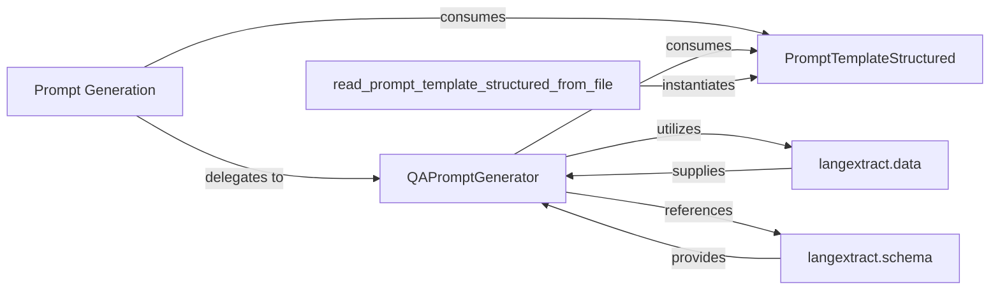

## Details

The `Prompt Generation` subsystem is a critical part of `langextract`, focusing on constructing well-formed prompts for Large Language Models. It leverages a modular design, separating prompt definition from prompt rendering and external configuration.

### Prompt Generation [[Expand]](./Prompt_Generation.md)
The overarching subsystem responsible for constructing structured prompts for LLMs by integrating predefined templates, few-shot examples, and the specified extraction schema. It acts as the orchestrator for the prompt creation workflow.

**Related Classes/Methods**:

- <a href="git@github.com:google/langextract.git/blob/main/temp/a7bbff27d4b2451ea81454955289cfda/langextract/prompting.py" target="_blank" rel="noopener noreferrer">`langextract.prompting`</a>

### PromptTemplateStructured
A dataclass that serves as the blueprint for a structured prompt. It encapsulates the LLM's overall instructions (description) and a collection of `ExampleData` objects for few-shot learning, ensuring a consistent and type-hinted model for prompt definitions.

**Related Classes/Methods**:

- <a href="git@github.com:google/langextract.git/blob/main/temp/a7bbff27d4b2451ea81454955289cfda/langextract/prompting.py#L38-L48" target="_blank" rel="noopener noreferrer">`langextract.prompting.PromptTemplateStructured`:38-48</a>

### QAPromptGenerator
The primary class responsible for rendering the final text-based prompt string that will be sent to the LLM. It takes a `PromptTemplateStructured` object and formats it, including the serialization of examples and adherence to specified output formats (e.g., JSON/YAML fencing).

**Related Classes/Methods**:

- <a href="git@github.com:google/langextract.git/blob/main/temp/a7bbff27d4b2451ea81454955289cfda/langextract/prompting.py#L83-L166" target="_blank" rel="noopener noreferrer">`langextract.prompting.QAPromptGenerator`:83-166</a>

### read_prompt_template_structured_from_file
A utility function designed to load `PromptTemplateStructured` objects from external files, supporting both YAML and JSON formats. This promotes configurability, reusability, and separation of concerns for prompt templates.

**Related Classes/Methods**:

- <a href="git@github.com:google/langextract.git/blob/main/temp/a7bbff27d4b2451ea81454955289cfda/langextract/prompting.py#L51-L80" target="_blank" rel="noopener noreferrer">`langextract.prompting.read_prompt_template_structured_from_file`:51-80</a>

### langextract.data
This module contains core data structures, most notably `ExampleData`, which is essential for defining and structuring the few-shot examples included within the prompts. It provides the necessary data models for prompt content.

**Related Classes/Methods**:

- <a href="git@github.com:google/langextract.git/blob/main/temp/a7bbff27d4b2451ea81454955289cfda/langextract/data.py" target="_blank" rel="noopener noreferrer">`langextract.data`</a>

### langextract.schema
This module defines schema-related constants, such as `EXTRACTIONS_KEY`, which are crucial for specifying the expected output structure from the LLM. These definitions guide the `QAPromptGenerator` in constructing prompts that elicit structured responses.

**Related Classes/Methods**:

- <a href="git@github.com:google/langextract.git/blob/main/temp/a7bbff27d4b2451ea81454955289cfda/langextract/schema.py" target="_blank" rel="noopener noreferrer">`langextract.schema`</a>

### [FAQ](https://github.com/CodeBoarding/GeneratedOnBoardings/tree/main?tab=readme-ov-file#faq)