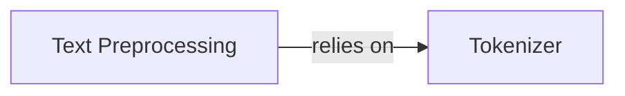

## Details

The Text Preprocessing subsystem is responsible for preparing raw text content for consumption by Large Language Models (LLMs). Its primary boundary encompasses functionalities related to text division, sizing, and tokenization.

### Text Preprocessing [[Expand]](./Text_Preprocessing.md)
Prepares raw text content for LLM consumption by dividing large input documents into smaller, manageable chunks to comply with LLM context window limitations. It relies on tokenization for accurate sizing of these chunks.

**Related Classes/Methods**:

- <a href="git@github.com:google/langextract.git/blob/main/temp/a7bbff27d4b2451ea81454955289cfda/langextract/chunking.py" target="_blank" rel="noopener noreferrer">`Text Preprocessing`</a>

### Tokenizer
Handles the process of converting raw text into tokens and provides functionality for counting these tokens. This is crucial for accurately determining the size of text segments before they are fed into LLMs.

**Related Classes/Methods**:

- <a href="git@github.com:google/langextract.git/blob/main/temp/a7bbff27d4b2451ea81454955289cfda/langextract/tokenizer.py" target="_blank" rel="noopener noreferrer">`Tokenizer`</a>

### [FAQ](https://github.com/CodeBoarding/GeneratedOnBoardings/tree/main?tab=readme-ov-file#faq)