```mermaid
graph LR
    Data_I_O["Data I/O"]
    Text_Preprocessing["Text Preprocessing"]
    Schema_Definition["Schema Definition"]
    Prompt_Generation["Prompt Generation"]
    LLM_Integration_Layer["LLM Integration Layer"]
    Extraction_Resolution_Alignment["Extraction Resolution & Alignment"]
    Extraction_Orchestration["Extraction Orchestration"]
    Visualization["Visualization"]
    Data_I_O -- "provides raw documents to" --> Text_Preprocessing
    Text_Preprocessing -- "supplies text chunks to" --> Prompt_Generation
    Schema_Definition -- "guides prompt construction within" --> Prompt_Generation
    Prompt_Generation -- "sends formatted prompts to" --> LLM_Integration_Layer
    LLM_Integration_Layer -- "returns raw LLM output to" --> Extraction_Resolution_Alignment
    Schema_Definition -- "guides parsing and validation within" --> Extraction_Resolution_Alignment
    Extraction_Resolution_Alignment -- "provides structured and aligned extractions to" --> Extraction_Orchestration
    Extraction_Orchestration -- "requests and utilizes LLM instances from" --> LLM_Integration_Layer
    Extraction_Orchestration -- "delivers final annotated documents to" --> Data_I_O
    Extraction_Orchestration -- "sends annotated documents to" --> Visualization
    click Text_Preprocessing href "https://github.com/CodeBoarding/GeneratedOnBoardings/blob/main/langextract/Text_Preprocessing.md" "Details"
    click Prompt_Generation href "https://github.com/CodeBoarding/GeneratedOnBoardings/blob/main/langextract/Prompt_Generation.md" "Details"
    click LLM_Integration_Layer href "https://github.com/CodeBoarding/GeneratedOnBoardings/blob/main/langextract/LLM_Integration_Layer.md" "Details"
    click Extraction_Resolution_Alignment href "https://github.com/CodeBoarding/GeneratedOnBoardings/blob/main/langextract/Extraction_Resolution_Alignment.md" "Details"
    click Extraction_Orchestration href "https://github.com/CodeBoarding/GeneratedOnBoardings/blob/main/langextract/Extraction_Orchestration.md" "Details"
```

## Details

The `langextract` architecture is structured as a flexible, LLM-agnostic pipeline for information extraction. It orchestrates a clear data flow, starting with Data I/O for document ingestion, followed by Text Preprocessing to prepare content. Schema Definition provides the blueprint for extraction, guiding Prompt Generation and Extraction Resolution & Alignment. The LLM Integration Layer serves as a pluggable interface for various LLMs, facilitating the core inference step. Extraction Orchestration acts as the central control, managing the end-to-end process from chunking to final structured output. Results are then either persisted via Data I/O or presented through Visualization. This modular design ensures clear component boundaries, enabling easy extension and adaptation to new LLMs or extraction tasks, making it ideal for visual representation as a sequential data flow diagram with feedback loops.

### Data I/O
Manages the loading of raw input documents and the saving of processed, annotated data.

**Related Classes/Methods**:

- <a href="git@github.com:google/langextract.git/blob/main/temp/a7bbff27d4b2451ea81454955289cfda/langextract/io.py" target="_blank" rel="noopener noreferrer">`langextract/io.py`</a>

### Text Preprocessing [[Expand]](./Text_Preprocessing.md)
Prepares raw text content for LLM consumption through tokenization, segmentation, and chunking.

**Related Classes/Methods**:

- <a href="git@github.com:google/langextract.git/blob/main/temp/a7bbff27d4b2451ea81454955289cfda/langextract/chunking.py" target="_blank" rel="noopener noreferrer">`langextract/chunking.py`</a>

### Schema Definition
Defines the expected structure of the extracted information, guiding both prompt generation and post-processing.

**Related Classes/Methods**:

- <a href="git@github.com:google/langextract.git/blob/main/temp/a7bbff27d4b2451ea81454955289cfda/langextract/schema.py" target="_blank" rel="noopener noreferrer">`langextract/schema.py`</a>

### Prompt Generation [[Expand]](./Prompt_Generation.md)
Constructs structured prompts for LLMs based on preprocessed text chunks and the defined extraction schema.

**Related Classes/Methods**:

- <a href="git@github.com:google/langextract.git/blob/main/temp/a7bbff27d4b2451ea81454955289cfda/langextract/prompting.py" target="_blank" rel="noopener noreferrer">`langextract/prompting.py`</a>

### LLM Integration Layer [[Expand]](./LLM_Integration_Layer.md)
Provides a unified, abstract interface for interacting with various LLM providers, handling model instantiation and inference calls.

**Related Classes/Methods**:

- <a href="git@github.com:google/langextract.git/blob/main/temp/a7bbff27d4b2451ea81454955289cfda/langextract/factory.py" target="_blank" rel="noopener noreferrer">`langextract/factory.py`</a>
- <a href="git@github.com:google/langextract.git/blob/main/temp/a7bbff27d4b2451ea81454955289cfda/langextract/inference.py" target="_blank" rel="noopener noreferrer">`langextract/inference.py`</a>

### Extraction Resolution & Alignment [[Expand]](./Extraction_Resolution_Alignment.md)
Parses raw LLM text output into structured data and aligns extracted spans back to their original positions.

**Related Classes/Methods**:

- <a href="git@github.com:google/langextract.git/blob/main/temp/a7bbff27d4b2451ea81454955289cfda/langextract/resolver.py" target="_blank" rel="noopener noreferrer">`langextract/resolver.py`</a>

### Extraction Orchestration [[Expand]](./Extraction_Orchestration.md)
Coordinates the entire extraction pipeline, managing data flow, LLM invocations, and multi-pass extractions.

**Related Classes/Methods**:

- <a href="git@github.com:google/langextract.git/blob/main/temp/a7bbff27d4b2451ea81454955289cfda/langextract/__init__.py" target="_blank" rel="noopener noreferrer">`langextract/__init__.py`</a>
- <a href="git@github.com:google/langextract.git/blob/main/temp/a7bbff27d4b2451ea81454955289cfda/langextract/annotation.py" target="_blank" rel="noopener noreferrer">`langextract/annotation.py`</a>

### Visualization
Renders the final annotated documents into a human-readable and interactive format for review and presentation.

**Related Classes/Methods**:

- <a href="git@github.com:google/langextract.git/blob/main/temp/a7bbff27d4b2451ea81454955289cfda/langextract/visualization.py" target="_blank" rel="noopener noreferrer">`langextract/visualization.py`</a>

### [FAQ](https://github.com/CodeBoarding/GeneratedOnBoardings/tree/main?tab=readme-ov-file#faq)