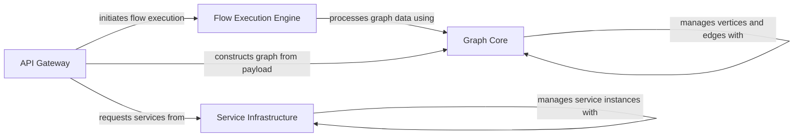

## Component Details

This graph represents the core components of the Langflow backend responsible for handling external API requests, executing Langflow graphs, managing graph structures, and providing foundational services. The API Gateway serves as the entry point, directing requests for flow execution and component management. The Flow Execution Engine orchestrates the actual running of Langflow graphs, relying on the Graph Core for graph manipulation and the Service Infrastructure for essential services like dependency injection and concurrency management.

### API Gateway
Exposes various REST and WebSocket endpoints for external interaction with the Langflow backend, enabling flow execution, component management, and data retrieval. It validates inputs, orchestrates the flow processing, and manages streaming responses.

**Related Classes/Methods**:

- <a href="https://github.com/langflow-ai/langflow/blob/master/src/backend/base/langflow/api/v1/endpoints.py#L109-L162" target="_blank" rel="noopener noreferrer">`langflow.api.v1.endpoints.simple_run_flow` (109:162)</a>
- <a href="https://github.com/langflow-ai/langflow/blob/master/src/backend/base/langflow/api/v1/endpoints.py#L77-L106" target="_blank" rel="noopener noreferrer">`langflow.api.v1.endpoints.validate_input_and_tweaks` (77:106)</a>
- <a href="https://github.com/langflow-ai/langflow/blob/master/src/backend/base/langflow/api/v1/endpoints.py#L165-L184" target="_blank" rel="noopener noreferrer">`langflow.api.v1.endpoints.simple_run_flow_task` (165:184)</a>
- <a href="https://github.com/langflow-ai/langflow/blob/master/src/backend/base/langflow/api/v1/endpoints.py#L187-L219" target="_blank" rel="noopener noreferrer">`langflow.api.v1.endpoints.consume_and_yield` (187:219)</a>
- <a href="https://github.com/langflow-ai/langflow/blob/master/src/backend/base/langflow/api/v1/endpoints.py#L222-L267" target="_blank" rel="noopener noreferrer">`langflow.api.v1.endpoints.run_flow_generator` (222:267)</a>
- <a href="https://github.com/langflow-ai/langflow/blob/master/src/backend/base/langflow/api/v1/endpoints.py#L271-L388" target="_blank" rel="noopener noreferrer">`langflow.api.v1.endpoints.simplified_run_flow` (271:388)</a>
- <a href="https://github.com/langflow-ai/langflow/blob/master/src/backend/base/langflow/api/v1/endpoints.py#L392-L463" target="_blank" rel="noopener noreferrer">`langflow.api.v1.endpoints.webhook_run_flow` (392:463)</a>
- <a href="https://github.com/langflow-ai/langflow/blob/master/src/backend/base/langflow/api/v1/endpoints.py#L471-L586" target="_blank" rel="noopener noreferrer">`langflow.api.v1.endpoints.experimental_run_flow` (471:586)</a>
- <a href="https://github.com/langflow-ai/langflow/blob/master/src/backend/base/langflow/api/v1/endpoints.py#L597-L606" target="_blank" rel="noopener noreferrer">`langflow.api.v1.endpoints.process` (597:606)</a>
- <a href="https://github.com/langflow-ai/langflow/blob/master/src/backend/base/langflow/api/v1/endpoints.py#L610-L618" target="_blank" rel="noopener noreferrer">`langflow.api.v1.endpoints.get_task_status` (610:618)</a>
- <a href="https://github.com/langflow-ai/langflow/blob/master/src/backend/base/langflow/api/v1/endpoints.py#L626-L644" target="_blank" rel="noopener noreferrer">`langflow.api.v1.endpoints.create_upload_file` (626:644)</a>
- <a href="https://github.com/langflow-ai/langflow/blob/master/src/backend/base/langflow/api/v1/endpoints.py#L649-L650" target="_blank" rel="noopener noreferrer">`langflow.api.v1.endpoints.get_version` (649:650)</a>
- <a href="https://github.com/langflow-ai/langflow/blob/master/src/backend/base/langflow/api/v1/endpoints.py#L654-L672" target="_blank" rel="noopener noreferrer">`langflow.api.v1.endpoints.custom_component` (654:672)</a>
- <a href="https://github.com/langflow-ai/langflow/blob/master/src/backend/base/langflow/api/v1/endpoints.py#L676-L745" target="_blank" rel="noopener noreferrer">`langflow.api.v1.endpoints.custom_component_update` (676:745)</a>
- <a href="https://github.com/langflow-ai/langflow/blob/master/src/backend/base/langflow/api/v1/endpoints.py#L749-L758" target="_blank" rel="noopener noreferrer">`langflow.api.v1.endpoints.get_config` (749:758)</a>

### Flow Execution Engine
This component is the core orchestrator for running Langflow graphs. It takes processed flow data, manages the graph execution, handles inputs and outputs, and integrates with various services to complete the flow.

**Related Classes/Methods**:

- <a href="https://github.com/langflow-ai/langflow/blob/master/src/backend/base/langflow/processing/process.py#L169-L201" target="_blank" rel="noopener noreferrer">`langflow.processing.process:process_tweaks` (169:201)</a>
- <a href="https://github.com/langflow-ai/langflow/blob/master/src/backend/base/langflow/processing/process.py#L26-L62" target="_blank" rel="noopener noreferrer">`langflow.processing.process:run_graph_internal` (26:62)</a>
- <a href="https://github.com/langflow-ai/langflow/blob/master/src/backend/base/langflow/processing/process.py#L124-L137" target="_blank" rel="noopener noreferrer">`langflow.src.backend.base.langflow.processing.process:validate_input` (124:137)</a>
- <a href="https://github.com/langflow-ai/langflow/blob/master/src/backend/base/langflow/processing/process.py#L140-L160" target="_blank" rel="noopener noreferrer">`langflow.src.backend.base.langflow.processing.process:apply_tweaks` (140:160)</a>
- <a href="https://github.com/langflow-ai/langflow/blob/master/src/backend/base/langflow/processing/utils.py#L7-L25" target="_blank" rel="noopener noreferrer">`langflow.processing.utils:validate_and_repair_json` (7:25)</a>

### Graph Core
This component provides the fundamental data structures and algorithms for representing and manipulating Langflow graphs. It includes functionalities for building graphs from payloads, managing nodes and edges, handling graph initialization, and performing graph traversals and assertions.

**Related Classes/Methods**:

- <a href="https://github.com/langflow-ai/langflow/blob/master/src/backend/base/langflow/graph/graph/base.py#L1064-L1098" target="_blank" rel="noopener noreferrer">`langflow.graph.graph.base.Graph:from_payload` (1064:1098)</a>
- <a href="https://github.com/langflow-ai/langflow/blob/master/src/backend/base/langflow/graph/graph/base.py#L242-L256" target="_blank" rel="noopener noreferrer">`langflow.src.backend.base.langflow.graph.graph.base.Graph:add_nodes_and_edges` (242:256)</a>
- <a href="https://github.com/langflow-ai/langflow/blob/master/src/backend/base/langflow/graph/graph/base.py#L492-L495" target="_blank" rel="noopener noreferrer">`langflow.src.backend.base.langflow.graph.graph.base.Graph:initialize` (492:495)</a>
- <a href="https://github.com/langflow-ai/langflow/blob/master/src/backend/base/langflow/graph/graph/base.py#L1231-L1246" target="_blank" rel="noopener noreferrer">`langflow.src.backend.base.langflow.graph.graph.base.Graph:_build_graph` (1231:1246)</a>
- <a href="https://github.com/langflow-ai/langflow/blob/master/src/backend/base/langflow/graph/graph/base.py#L904-L915" target="_blank" rel="noopener noreferrer">`langflow.src.backend.base.langflow.graph.graph.base.Graph:build_graph_maps` (904:915)</a>
- <a href="https://github.com/langflow-ai/langflow/blob/master/src/backend/base/langflow/graph/graph/base.py#L1875-L1887" target="_blank" rel="noopener noreferrer">`langflow.src.backend.base.langflow.graph.graph.base.Graph:_build_vertices` (1875:1887)</a>
- <a href="https://github.com/langflow-ai/langflow/blob/master/src/backend/base/langflow/graph/graph/base.py#L1828-L1839" target="_blank" rel="noopener noreferrer">`langflow.src.backend.base.langflow.graph.graph.base.Graph:_build_edges` (1828:1839)</a>
- <a href="https://github.com/langflow-ai/langflow/blob/master/src/backend/base/langflow/graph/graph/base.py#L1252-L1258" target="_blank" rel="noopener noreferrer">`langflow.src.backend.base.langflow.graph.graph.base.Graph:_set_cache_to_vertices_in_cycle` (1252:1258)</a>
- <a href="https://github.com/langflow-ai/langflow/blob/master/src/backend/base/langflow/graph/graph/base.py#L1903-L1913" target="_blank" rel="noopener noreferrer">`langflow.src.backend.base.langflow.graph.graph.base.Graph:assert_streaming_sequence` (1903:1913)</a>
- <a href="https://github.com/langflow-ai/langflow/blob/master/src/backend/base/langflow/graph/graph/base.py#L2130-L2137" target="_blank" rel="noopener noreferrer">`langflow.src.backend.base.langflow.graph.graph.base.Graph.build_adjacency_maps` (2130:2137)</a>
- <a href="https://github.com/langflow-ai/langflow/blob/master/src/backend/base/langflow/graph/graph/base.py#L972-L976" target="_blank" rel="noopener noreferrer">`langflow.src.backend.base.langflow.graph.graph.base.Graph.build_parent_child_map` (972:976)</a>
- <a href="https://github.com/langflow-ai/langflow/blob/master/src/backend/base/langflow/graph/graph/base.py#L1284-L1290" target="_blank" rel="noopener noreferrer">`langflow.src.backend.base.langflow.graph.graph.base.Graph.get_vertex` (1284:1290)</a>
- <a href="https://github.com/langflow-ai/langflow/blob/master/src/backend/base/langflow/graph/graph/base.py#L1889-L1901" target="_blank" rel="noopener noreferrer">`langflow.src.backend.base.langflow.graph.graph.base.Graph._create_vertex` (1889:1901)</a>
- <a href="https://github.com/langflow-ai/langflow/blob/master/src/backend/base/langflow/graph/graph/base.py#L1841-L1855" target="_blank" rel="noopener noreferrer">`langflow.src.backend.base.langflow.graph.graph.base.Graph.build_edge` (1841:1855)</a>
- <a href="https://github.com/langflow-ai/langflow/blob/master/src/backend/base/langflow/graph/graph/base.py#L1786-L1788" target="_blank" rel="noopener noreferrer">`langflow.src.backend.base.langflow.graph.graph.base.Graph.get_successors` (1786:1788)</a>
- `langflow.graph.graph.runnable_vertices_manager:add_to_cycle_vertices` (full file reference)
- <a href="https://github.com/langflow-ai/langflow/blob/master/src/backend/base/langflow/graph/graph/utils.py#L86-L112" target="_blank" rel="noopener noreferrer">`langflow.graph.graph.utils:process_flow` (86:112)</a>
- <a href="https://github.com/langflow-ai/langflow/blob/master/src/backend/base/langflow/graph/graph/utils.py#L54-L83" target="_blank" rel="noopener noreferrer">`langflow.src.backend.base.langflow.graph.graph.utils:ungroup_node` (54:83)</a>
- <a href="https://github.com/langflow-ai/langflow/blob/master/src/backend/base/langflow/graph/graph/utils.py#L42-L45" target="_blank" rel="noopener noreferrer">`langflow.src.backend.base.langflow.graph.graph.utils:add_parent_node_id` (42:45)</a>
- <a href="https://github.com/langflow-ai/langflow/blob/master/src/backend/base/langflow/graph/graph/utils.py#L48-L51" target="_blank" rel="noopener noreferrer">`langflow.src.backend.base.langflow.graph.graph.utils:add_frozen` (48:51)</a>
- <a href="https://github.com/langflow-ai/langflow/blob/master/src/backend/base/langflow/graph/graph/utils.py#L219-L245" target="_blank" rel="noopener noreferrer">`langflow.src.backend.base.langflow.graph.graph.utils:get_updated_edges` (219:245)</a>
- <a href="https://github.com/langflow-ai/langflow/blob/master/src/backend/base/langflow/graph/graph/utils.py#L115-L140" target="_blank" rel="noopener noreferrer">`langflow.src.backend.base.langflow.graph.graph.utils:update_template` (115:140)</a>
- <a href="https://github.com/langflow-ai/langflow/blob/master/src/backend/base/langflow/graph/graph/utils.py#L143-L161" target="_blank" rel="noopener noreferrer">`langflow.src.backend.base.langflow.graph.graph.utils:update_target_handle` (143:161)</a>
- <a href="https://github.com/langflow-ai/langflow/blob/master/src/backend/base/langflow/graph/graph/utils.py#L200-L216" target="_blank" rel="noopener noreferrer">`langflow.src.backend.base.langflow.graph.graph.utils:update_source_handle` (200:216)</a>
- <a href="https://github.com/langflow-ai/langflow/blob/master/src/backend/base/langflow/graph/graph/utils.py#L447-L458" target="_blank" rel="noopener noreferrer">`langflow.graph.graph.utils:find_cycle_vertices` (447:458)</a>

### Service Infrastructure
This component provides foundational services and utilities for the Langflow application, including dependency injection, service registration, and concurrency management. It ensures that various parts of the application can access necessary services in a controlled manner.

**Related Classes/Methods**:

- <a href="https://github.com/langflow-ai/langflow/blob/master/src/backend/base/langflow/services/deps.py#L117-L130" target="_blank" rel="noopener noreferrer">`langflow.services.deps:get_settings_service` (117:130)</a>
- <a href="https://github.com/langflow-ai/langflow/blob/master/src/backend/base/langflow/services/deps.py#L31-L49" target="_blank" rel="noopener noreferrer">`langflow.services.deps:get_service` (31:49)</a>
- <a href="https://github.com/langflow-ai/langflow/blob/master/src/backend/base/langflow/services/manager.py#L30-L35" target="_blank" rel="noopener noreferrer">`langflow.services.manager.ServiceManager.register_factories` (30:35)</a>
- <a href="https://github.com/langflow-ai/langflow/blob/master/src/backend/base/langflow/services/manager.py#L45-L51" target="_blank" rel="noopener noreferrer">`langflow.services.manager.ServiceManager.get` (45:51)</a>
- <a href="https://github.com/langflow-ai/langflow/blob/master/src/backend/base/langflow/services/manager.py#L104-L128" target="_blank" rel="noopener noreferrer">`langflow.src.backend.base.langflow.services.manager:ServiceManager.get_factories` (104:128)</a>
- <a href="https://github.com/langflow-ai/langflow/blob/master/src/backend/base/langflow/services/manager.py#L53-L75" target="_blank" rel="noopener noreferrer">`langflow.src.backend.base.langflow.services.manager:ServiceManager._create_service` (53:75)</a>
- <a href="https://github.com/langflow-ai/langflow/blob/master/src/backend/base/langflow/services/manager.py#L77-L81" target="_blank" rel="noopener noreferrer">`langflow.src.backend.base.langflow.services.manager:ServiceManager._validate_service_creation` (77:81)</a>
- <a href="https://github.com/langflow-ai/langflow/blob/master/src/backend/base/langflow/utils/concurrency.py#L24-L30" target="_blank" rel="noopener noreferrer">`langflow.utils.concurrency.KeyedMemoryLockManager:lock` (24:30)</a>

### [FAQ](https://github.com/CodeBoarding/GeneratedOnBoardings/tree/main?tab=readme-ov-file#faq)