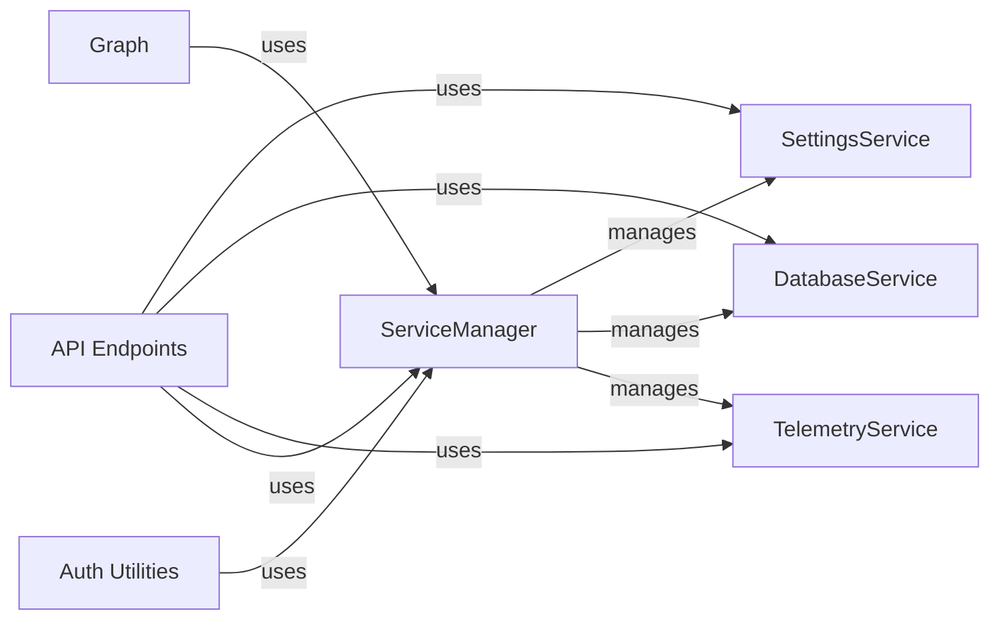

## Component Details

### API Endpoints
This component defines the API endpoints for Langflow, handling tasks such as running flows, managing variables, and retrieving application settings. It uses services like SettingsService, DatabaseService, and TelemetryService to perform these tasks. It also manages user authentication and authorization.
- **Related Classes/Methods**: `langflow.api.v1.endpoints`

### ServiceManager
The ServiceManager is responsible for managing the lifecycle of services within the Langflow application. It handles the registration of service factories, creation of service instances, and retrieval of services. It ensures that only one instance of each service exists and provides a centralized point for accessing and managing services.
- **Related Classes/Methods**: `langflow.services.manager.ServiceManager`

### SettingsService
The SettingsService is responsible for managing the application's settings. It provides access to configuration parameters, environment variables, and other settings required by the application. It also handles the persistence and retrieval of settings, ensuring that the application can be configured and customized as needed.
- **Related Classes/Methods**: `langflow.services.settings.service`

### DatabaseService
The DatabaseService manages the database connection and provides access to database operations. It handles tasks such as initializing the database, creating database sessions, and executing queries. It also ensures that the database is properly configured and maintained.
- **Related Classes/Methods**: `langflow.services.database.service`

### TelemetryService
The TelemetryService collects and reports telemetry data about the Langflow application. It tracks usage metrics, performance data, and other information that can be used to improve the application. It also handles the transmission of telemetry data to external services for analysis and reporting.
- **Related Classes/Methods**: `langflow.services.telemetry.service`

### Auth Utilities
The Auth Utilities module provides utility functions for authentication and authorization within the Langflow application. It includes functions for password hashing, token creation, API key management, and user authentication. It ensures that the application is secure and that only authorized users can access sensitive resources.
- **Related Classes/Methods**: `langflow.services.auth.utils`

### Graph
The Graph class represents the core graph structure used in Langflow. It handles the creation, manipulation, and execution of the graph, including building the graph from a JSON representation, running the graph, and processing nodes. It interacts with various services to perform tasks such as caching, tracing, and chat management.
- **Related Classes/Methods**: `langflow.graph.graph.base.Graph`
