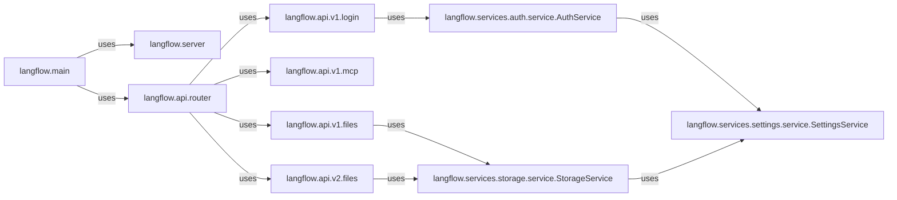

## Component Details

This component acts as the central nervous system for the Langflow application, handling all external interactions, managing the application's operational lifecycle, and enforcing critical security measures. It's designed to be the primary entry point, ensuring that all requests are properly routed, authenticated, and authorized before reaching the core business logic.

### langflow.main
This is the absolute core of the Langflow application. It's responsible for orchestrating the initialization of all services and setting up the FastAPI application, which serves as the API Gateway. Its role is fundamental because it's the very first point of execution, bringing the entire application to life.

**Related Classes/Methods**:

- <a href="https://github.com/langflow-ai/langflow/blob/master/src/backend/base/langflow/main.py#L0-L0" target="_blank" rel="noopener noreferrer">`langflow.main` (0:0)</a>

### langflow.server
This module likely encapsulates the FastAPI application instance and its configuration. It's directly responsible for creating and running the HTTP server that listens for incoming requests. It's fundamental as it provides the actual server infrastructure that the API Gateway operates on.

**Related Classes/Methods**:

- <a href="https://github.com/langflow-ai/langflow/blob/master/src/backend/base/langflow/server.py#L0-L0" target="_blank" rel="noopener noreferrer">`langflow.server` (0:0)</a>

### langflow.api.router
This component is the central dispatcher for all API routes. It aggregates routes from various API versions and modules, directing incoming HTTP requests to the appropriate handlers. It's fundamental for organizing and exposing the application's functionalities through a clean and versioned API.

**Related Classes/Methods**:

- <a href="https://github.com/langflow-ai/langflow/blob/master/src/backend/base/langflow/api/router.py#L0-L0" target="_blank" rel="noopener noreferrer">`langflow.api.router` (0:0)</a>

### langflow.api.v1.login
This component specifically handles user authentication and authorization processes for API version 1, including user registration, login, and token management. It's fundamental for securing the API Gateway by controlling access to its resources.

**Related Classes/Methods**:

- <a href="https://github.com/langflow-ai/langflow/blob/master/src/backend/base/langflow/api/v1/login.py#L0-L0" target="_blank" rel="noopener noreferrer">`langflow.api.v1.login` (0:0)</a>

### langflow.api.v1.mcp
Exposes API endpoints related to the Multi-Component Protocol (MCP) for version 1. This allows external systems to interact with Langflow's component-based architecture, enabling extensibility and integration. It's fundamental for supporting the dynamic nature of Langflow's flows.

**Related Classes/Methods**:

- <a href="https://github.com/langflow-ai/langflow/blob/master/src/backend/base/langflow/api/v1/mcp.py#L0-L0" target="_blank" rel="noopener noreferrer">`langflow.api.v1.mcp` (0:0)</a>

### langflow.api.v1.files
Manages file-related operations (uploads, downloads) for API version 1. This is crucial for handling persistent data and user-uploaded content within the application. It's fundamental for any application that deals with file storage.

**Related Classes/Methods**:

- <a href="https://github.com/langflow-ai/langflow/blob/master/src/backend/base/langflow/api/v1/files.py#L0-L0" target="_blank" rel="noopener noreferrer">`langflow.api.v1.files` (0:0)</a>

### langflow.api.v2.files
Represents a newer iteration of the file management API, potentially offering enhanced features or improved performance over `v1`. Its existence highlights the API Gateway's evolution and commitment to continuous improvement.

**Related Classes/Methods**:

- <a href="https://github.com/langflow-ai/langflow/blob/master/src/backend/base/langflow/api/v2/files.py#L0-L0" target="_blank" rel="noopener noreferrer">`langflow.api.v2.files` (0:0)</a>

### langflow.services.auth.service.AuthService
This service encapsulates the core authentication and authorization logic, including user management, token validation, and permission checks. It's fundamental because it provides the underlying security mechanisms that the API Gateway relies on to protect its endpoints.

**Related Classes/Methods**:

- <a href="https://github.com/langflow-ai/langflow/blob/master/src/backend/base/langflow/services/auth/service.py#L10-L14" target="_blank" rel="noopener noreferrer">`langflow.services.auth.service.AuthService` (10:14)</a>

### langflow.services.settings.service.SettingsService
Manages application-wide settings and configurations, such as feature flags, database connections, and external service credentials. It's fundamental for the API Gateway's adaptability and dynamic behavior, allowing it to be configured without code changes.

**Related Classes/Methods**:

- <a href="https://github.com/langflow-ai/langflow/blob/master/src/backend/base/langflow/services/settings/service.py#L7-L31" target="_blank" rel="noopener noreferrer">`langflow.services.settings.service.SettingsService` (7:31)</a>

### langflow.services.storage.service.StorageService
This service abstracts and handles all file storage operations, regardless of the underlying storage mechanism (e.g., local disk, cloud storage). It's fundamental for the API Gateway's file management capabilities, providing a unified interface for storing and retrieving files.

**Related Classes/Methods**:

- <a href="https://github.com/langflow-ai/langflow/blob/master/src/backend/base/langflow/services/storage/service.py#L14-L46" target="_blank" rel="noopener noreferrer">`langflow.services.storage.service.StorageService` (14:46)</a>

### [FAQ](https://github.com/CodeBoarding/GeneratedOnBoardings/tree/main?tab=readme-ov-file#faq)