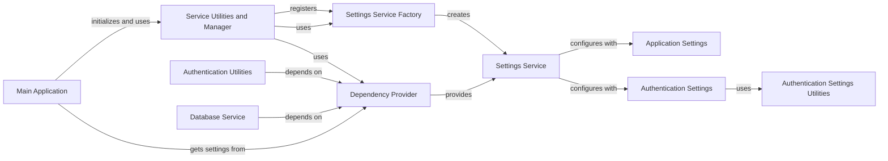

## Component Details

This component overview details the 'Application Configuration' subsystem, which is responsible for managing all application-wide settings, including sensitive information and feature flags. The core of this subsystem is the `Settings Service`, which centralizes the management and provision of these configurations. It relies on `Application Settings` for general application parameters and `Authentication Settings` for security-related configurations. The `Settings Service Factory` is responsible for instantiating and initializing the `Settings Service`, which is then made accessible throughout the application via the `Dependency Provider`. The `Service Utilities and Manager` orchestrates the initialization and management of various services, including the `Settings Service`, during the application's lifecycle. The `Main Application` leverages these settings during its startup and operation. Other components like `Authentication Utilities` and `Database Service` directly depend on the configurations provided by the `Settings Service` for their functionality. `Authentication Settings Utilities` provides support for secure handling of authentication-related secrets.

### Settings Service
Centralized service for managing and providing application-wide settings and configurations, including authentication parameters. It initializes and holds instances of Settings and AuthSettings, and depends on various other core services.

**Related Classes/Methods**:

- <a href="https://github.com/langflow-ai/langflow/blob/master/src/backend/base/langflow/services/settings/service.py#L8-L32" target="_blank" rel="noopener noreferrer">`langflow.services.settings.service.SettingsService` (8:32)</a>
- <a href="https://github.com/langflow-ai/langflow/blob/master/src/backend/base/langflow/services/settings/service.py#L17-L28" target="_blank" rel="noopener noreferrer">`langflow.services.settings.service.SettingsService:initialize` (17:28)</a>
- <a href="https://github.com/langflow-ai/langflow/blob/master/src/backend/base/langflow/services/settings/service.py#L30-L32" target="_blank" rel="noopener noreferrer">`langflow.services.settings.service.SettingsService:set` (30:32)</a>
- <a href="https://github.com/langflow-ai/langflow/blob/master/src/backend/base/langflow/services/settings/auth.py#L14-L110" target="_blank" rel="noopener noreferrer">`langflow.services.settings.auth.AuthSettings` (14:110)</a>
- <a href="https://github.com/langflow-ai/langflow/blob/master/src/backend/base/langflow/services/settings/base.py#L66-L467" target="_blank" rel="noopener noreferrer">`langflow.services.settings.base.Settings` (66:467)</a>
- <a href="https://github.com/langflow-ai/langflow/blob/master/src/backend/base/langflow/services/base.py#L4-L28" target="_blank" rel="noopener noreferrer">`langflow.services.base.Service` (4:28)</a>
- <a href="https://github.com/langflow-ai/langflow/blob/master/src/backend/base/langflow/services/auth/service.py#L11-L15" target="_blank" rel="noopener noreferrer">`langflow.services.auth.service.AuthService` (11:15)</a>
- <a href="https://github.com/langflow-ai/langflow/blob/master/src/backend/base/langflow/services/database/service.py#L38-L482" target="_blank" rel="noopener noreferrer">`langflow.services.database.service.DatabaseService` (38:482)</a>
- <a href="https://github.com/langflow-ai/langflow/blob/master/src/backend/base/langflow/services/state/service.py#L33-L83" target="_blank" rel="noopener noreferrer">`langflow.services.state.service.InMemoryStateService` (33:83)</a>
- <a href="https://github.com/langflow-ai/langflow/blob/master/src/backend/base/langflow/services/storage/service.py#L15-L47" target="_blank" rel="noopener noreferrer">`langflow.services.storage.service.StorageService` (15:47)</a>
- <a href="https://github.com/langflow-ai/langflow/blob/master/src/backend/base/langflow/services/store/service.py#L75-L600" target="_blank" rel="noopener noreferrer">`langflow.services.store.service.StoreService` (75:600)</a>
- <a href="https://github.com/langflow-ai/langflow/blob/master/src/backend/base/langflow/services/task/service.py#L14-L40" target="_blank" rel="noopener noreferrer">`langflow.services.task.service.TaskService` (14:40)</a>
- <a href="https://github.com/langflow-ai/langflow/blob/master/src/backend/base/langflow/services/telemetry/service.py#L29-L167" target="_blank" rel="noopener noreferrer">`langflow.services.telemetry.service.TelemetryService` (29:167)</a>
- <a href="https://github.com/langflow-ai/langflow/blob/master/src/backend/base/langflow/services/tracing/service.py#L104-L431" target="_blank" rel="noopener noreferrer">`langflow.services.tracing.service.TracingService` (104:431)</a>
- <a href="https://github.com/langflow-ai/langflow/blob/master/src/backend/base/langflow/services/variable/kubernetes.py#L26-L204" target="_blank" rel="noopener noreferrer">`langflow.services.variable.kubernetes.KubernetesSecretService` (26:204)</a>
- <a href="https://github.com/langflow-ai/langflow/blob/master/src/backend/base/langflow/services/variable/service.py#L26-L196" target="_blank" rel="noopener noreferrer">`langflow.services.variable.service.DatabaseVariableService` (26:196)</a>

### Application Settings
Defines the fundamental configuration parameters for the Langflow application, such as database URL, cache type, telemetry, and various operational settings. It includes logic for loading settings from environment variables and YAML files, and validates input values.

**Related Classes/Methods**:

- <a href="https://github.com/langflow-ai/langflow/blob/master/src/backend/base/langflow/services/settings/base.py#L66-L467" target="_blank" rel="noopener noreferrer">`langflow.services.settings.base.Settings` (66:467)</a>
- <a href="https://github.com/langflow-ai/langflow/blob/master/src/backend/base/langflow/services/settings/base.py#L265-L269" target="_blank" rel="noopener noreferrer">`langflow.services.settings.base.Settings:set_dev` (265:269)</a>
- <a href="https://github.com/langflow-ai/langflow/blob/master/src/backend/base/langflow/services/settings/base.py#L322-L392" target="_blank" rel="noopener noreferrer">`langflow.services.settings.base.Settings:set_database_url` (322:392)</a>
- <a href="https://github.com/langflow-ai/langflow/blob/master/src/backend/base/langflow/services/settings/base.py#L422-L425" target="_blank" rel="noopener noreferrer">`langflow.services.settings.base.Settings:update_from_yaml` (422:425)</a>
- <a href="https://github.com/langflow-ai/langflow/blob/master/src/backend/base/langflow/services/settings/base.py#L459-L467" target="_blank" rel="noopener noreferrer">`langflow.services.settings.base.Settings:settings_customise_sources` (459:467)</a>
- <a href="https://github.com/langflow-ai/langflow/blob/master/src/backend/base/langflow/services/settings/base.py#L476-L496" target="_blank" rel="noopener noreferrer">`langflow.services.settings.base.load_settings_from_yaml` (476:496)</a>
- <a href="https://github.com/langflow-ai/langflow/blob/master/src/backend/base/langflow/services/settings/base.py#L51-L63" target="_blank" rel="noopener noreferrer">`langflow.services.settings.base.MyCustomSource` (51:63)</a>
- <a href="https://github.com/langflow-ai/langflow/blob/master/src/backend/base/langflow/utils/util_strings.py#L39-L56" target="_blank" rel="noopener noreferrer">`langflow.utils.util_strings.is_valid_database_url` (39:56)</a>
- <a href="https://github.com/langflow-ai/langflow/blob/master/src/backend/base/langflow/utils/version.py#L90-L91" target="_blank" rel="noopener noreferrer">`langflow.utils.version.get_version_info` (90:91)</a>
- <a href="https://github.com/langflow-ai/langflow/blob/master/src/backend/base/langflow/utils/version.py#L56-L63" target="_blank" rel="noopener noreferrer">`langflow.utils.version.is_pre_release` (56:63)</a>

### Authentication Settings
Manages authentication-specific settings, including API keys and JWT secrets, and handles secure storage of sensitive information.

**Related Classes/Methods**:

- <a href="https://github.com/langflow-ai/langflow/blob/master/src/backend/base/langflow/services/settings/auth.py#L14-L110" target="_blank" rel="noopener noreferrer">`langflow.services.settings.auth.AuthSettings` (14:110)</a>
- <a href="https://github.com/langflow-ai/langflow/blob/master/src/backend/base/langflow/services/settings/utils.py#L31-L36" target="_blank" rel="noopener noreferrer">`langflow.services.settings.utils.write_secret_to_file` (31:36)</a>
- <a href="https://github.com/langflow-ai/langflow/blob/master/src/backend/base/langflow/services/settings/utils.py#L39-L40" target="_blank" rel="noopener noreferrer">`langflow.services.settings.utils.read_secret_from_file` (39:40)</a>

### Settings Service Factory
A dedicated factory class responsible for the instantiation and initial configuration of the SettingsService. It ensures that the SettingsService is properly set up before it's made available to other parts of the application.

**Related Classes/Methods**:

- <a href="https://github.com/langflow-ai/langflow/blob/master/src/backend/base/langflow/services/settings/factory.py#L7-L22" target="_blank" rel="noopener noreferrer">`langflow.services.settings.factory.SettingsServiceFactory` (7:22)</a>
- <a href="https://github.com/langflow-ai/langflow/blob/master/src/backend/base/langflow/services/settings/factory.py#L15-L16" target="_blank" rel="noopener noreferrer">`langflow.services.settings.factory.SettingsServiceFactory:__init__` (15:16)</a>
- <a href="https://github.com/langflow-ai/langflow/blob/master/src/backend/base/langflow/services/settings/factory.py#L19-L22" target="_blank" rel="noopener noreferrer">`langflow.services.settings.factory.SettingsServiceFactory:create` (19:22)</a>
- <a href="https://github.com/langflow-ai/langflow/blob/master/src/backend/base/langflow/services/factory.py#L14-L23" target="_blank" rel="noopener noreferrer">`langflow.services.factory.ServiceFactory` (14:23)</a>

### Dependency Provider
A module providing functions to retrieve various service instances, acting as a central dependency injection point. get_settings_service is a key function within this module, making the SettingsService accessible throughout the application.

**Related Classes/Methods**:

- <a href="https://github.com/langflow-ai/langflow/blob/master/src/backend/base/langflow/services/deps.py#L117-L130" target="_blank" rel="noopener noreferrer">`langflow.services.deps.get_settings_service` (117:130)</a>
- <a href="https://github.com/langflow-ai/langflow/blob/master/src/backend/base/langflow/services/deps.py#L31-L49" target="_blank" rel="noopener noreferrer">`langflow.services.deps.get_service` (31:49)</a>

### Service Utilities and Manager
This component encompasses utility functions responsible for initializing various services, including the SettingsService, and the central ServiceManager class which registers and manages service factories throughout the application's lifecycle.

**Related Classes/Methods**:

- <a href="https://github.com/langflow-ai/langflow/blob/master/src/backend/base/langflow/services/manager.py#L21-L128" target="_blank" rel="noopener noreferrer">`langflow.services.manager.ServiceManager` (21:128)</a>
- <a href="https://github.com/langflow-ai/langflow/blob/master/src/backend/base/langflow/services/manager.py#L37-L43" target="_blank" rel="noopener noreferrer">`langflow.services.manager.ServiceManager.register_factory` (37:43)</a>
- <a href="https://github.com/langflow-ai/langflow/blob/master/src/backend/base/langflow/services/utils.py#L147-L151" target="_blank" rel="noopener noreferrer">`langflow.services.utils.initialize_settings_service` (147:151)</a>
- <a href="https://github.com/langflow-ai/langflow/blob/master/src/backend/base/langflow/services/utils.py#L132-L144" target="_blank" rel="noopener noreferrer">`langflow.services.utils.teardown_services` (132:144)</a>
- <a href="https://github.com/langflow-ai/langflow/blob/master/src/backend/base/langflow/services/utils.py#L154-L169" target="_blank" rel="noopener noreferrer">`langflow.services.utils.initialize_session_service` (154:169)</a>
- <a href="https://github.com/langflow-ai/langflow/blob/master/src/backend/base/langflow/services/utils.py#L230-L250" target="_blank" rel="noopener noreferrer">`langflow.services.utils.initialize_services` (230:250)</a>
- <a href="https://github.com/langflow-ai/langflow/blob/master/src/backend/base/langflow/services/deps.py#L31-L49" target="_blank" rel="noopener noreferrer">`langflow.services.deps.get_service` (31:49)</a>
- <a href="https://github.com/langflow-ai/langflow/blob/master/src/backend/base/langflow/services/settings/factory.py#L7-L22" target="_blank" rel="noopener noreferrer">`langflow.services.settings.factory.SettingsServiceFactory` (7:22)</a>

### Main Application
The core module responsible for creating and configuring the FastAPI application instance. It defines the application's lifespan events (startup and shutdown), sets up middleware, and includes all API routers, relying heavily on various services for its operation.

**Related Classes/Methods**:

- <a href="https://github.com/langflow-ai/langflow/blob/master/src/backend/base/langflow/main.py#L206-L323" target="_blank" rel="noopener noreferrer">`langflow.main:create_app` (206:323)</a>
- <a href="https://github.com/langflow-ai/langflow/blob/master/src/backend/base/langflow/main.py#L112-L203" target="_blank" rel="noopener noreferrer">`langflow.main:get_lifespan` (112:203)</a>
- <a href="https://github.com/langflow-ai/langflow/blob/master/src/backend/base/langflow/main.py#L326-L337" target="_blank" rel="noopener noreferrer">`langflow.main:setup_sentry` (326:337)</a>
- <a href="https://github.com/langflow-ai/langflow/blob/master/src/backend/base/langflow/__main__.py#L88-L258" target="_blank" rel="noopener noreferrer">`langflow.__main__:run` (88:258)</a>
- <a href="https://github.com/langflow-ai/langflow/blob/master/src/backend/base/langflow/__main__.py#L568-L615" target="_blank" rel="noopener noreferrer">`langflow.__main__:api_key` (568:615)</a>

### Authentication Utilities
Provides a suite of utility functions for handling user authentication and authorization, including API key validation, JWT token creation and verification, password management, and user retrieval. It relies on the SettingsService for security parameters.

**Related Classes/Methods**:

- <a href="https://github.com/langflow-ai/langflow/blob/master/src/backend/base/langflow/services/auth/utils.py#L37-L86" target="_blank" rel="noopener noreferrer">`langflow.services.auth.utils:api_key_security` (37:86)</a>
- <a href="https://github.com/langflow-ai/langflow/blob/master/src/backend/base/langflow/services/auth/utils.py#L89-L135" target="_blank" rel="noopener noreferrer">`langflow.services.auth.utils:ws_api_key_security` (89:135)</a>
- <a href="https://github.com/langflow-ai/langflow/blob/master/src/backend/base/langflow/services/auth/utils.py#L156-L214" target="_blank" rel="noopener noreferrer">`langflow.services.auth.utils:get_current_user_by_jwt` (156:214)</a>
- <a href="https://github.com/langflow-ai/langflow/blob/master/src/backend/base/langflow/services/auth/utils.py#L257-L259" target="_blank" rel="noopener noreferrer">`langflow.services.auth.utils:verify_password` (257:259)</a>
- <a href="https://github.com/langflow-ai/langflow/blob/master/src/backend/base/langflow/services/auth/utils.py#L262-L264" target="_blank" rel="noopener noreferrer">`langflow.services.auth.utils:get_password_hash` (262:264)</a>
- <a href="https://github.com/langflow-ai/langflow/blob/master/src/backend/base/langflow/services/auth/utils.py#L267-L278" target="_blank" rel="noopener noreferrer">`langflow.services.auth.utils:create_token` (267:278)</a>
- <a href="https://github.com/langflow-ai/langflow/blob/master/src/backend/base/langflow/services/auth/utils.py#L304-L324" target="_blank" rel="noopener noreferrer">`langflow.services.auth.utils:create_user_longterm_token` (304:324)</a>
- <a href="https://github.com/langflow-ai/langflow/blob/master/src/backend/base/langflow/services/auth/utils.py#L344-L367" target="_blank" rel="noopener noreferrer">`langflow.services.auth.utils:create_user_tokens` (344:367)</a>
- <a href="https://github.com/langflow-ai/langflow/blob/master/src/backend/base/langflow/services/auth/utils.py#L370-L400" target="_blank" rel="noopener noreferrer">`langflow.services.auth.utils:create_refresh_token` (370:400)</a>

### Database Service
Manages the application's database interactions, including engine creation, session management, schema health checks, and Alembic migrations. It also handles assigning orphaned flows to a superuser.

**Related Classes/Methods**:

- <a href="https://github.com/langflow-ai/langflow/blob/master/src/backend/base/langflow/services/database/service.py#L38-L482" target="_blank" rel="noopener noreferrer">`langflow.services.database.service.DatabaseService` (38:482)</a>
- <a href="https://github.com/langflow-ai/langflow/blob/master/src/backend/base/langflow/services/database/service.py#L194-L241" target="_blank" rel="noopener noreferrer">`langflow.services.database.service.DatabaseService:assign_orphaned_flows_to_superuser` (194:241)</a>
- <a href="https://github.com/langflow-ai/langflow/blob/master/src/backend/base/langflow/services/database/service.py#L472-L482" target="_blank" rel="noopener noreferrer">`langflow.services.database.service.DatabaseService:teardown` (472:482)</a>

### Authentication Settings Utilities
Provides utility functions for handling secure operations related to authentication settings, such as reading and writing secrets to files.

**Related Classes/Methods**:

- <a href="https://github.com/langflow-ai/langflow/blob/master/src/backend/base/langflow/services/settings/utils.py#L31-L36" target="_blank" rel="noopener noreferrer">`langflow.services.settings.utils.write_secret_to_file` (31:36)</a>
- <a href="https://github.com/langflow-ai/langflow/blob/master/src/backend/base/langflow/services/settings/utils.py#L39-L40" target="_blank" rel="noopener noreferrer">`langflow.services.settings.utils.read_secret_from_file` (39:40)</a>
- <a href="https://github.com/langflow-ai/langflow/blob/master/src/backend/base/langflow/services/settings/utils.py#L7-L28" target="_blank" rel="noopener noreferrer">`langflow.services.settings.utils.set_secure_permissions` (7:28)</a>

### [FAQ](https://github.com/CodeBoarding/GeneratedOnBoardings/tree/main?tab=readme-ov-file#faq)