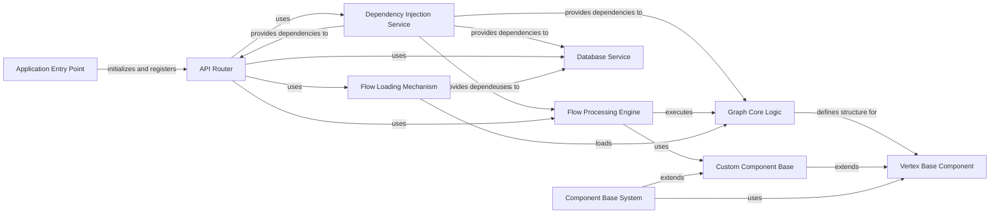

## Component Details

This architecture overview focuses on the core components of Langflow, detailing how the application initializes, manages dependencies, handles API requests, processes computational graphs, and interacts with the database. It highlights the foundational elements for defining and executing components within the Langflow environment.

### Component Base System
Provides the foundational classes and utilities for defining, building, and managing all types of components within Langflow, including input/output handling and state management.

**Related Classes/Methods**:

- <a href="https://github.com/langflow-ai/langflow/blob/master/src/backend/base/langflow/custom/custom_component/component.py#L94-L1597" target="_blank" rel="noopener noreferrer">`langflow.custom.custom_component.component.Component` (94:1597)</a>
- <a href="https://github.com/langflow-ai/langflow/blob/master/src/backend/base/langflow/custom/custom_component/custom_component.py#L35-L567" target="_blank" rel="noopener noreferrer">`langflow.custom.custom_component.custom_component.CustomComponent` (35:567)</a>
- <a href="https://github.com/langflow-ai/langflow/blob/master/src/backend/base/langflow/custom/custom_component/base_component.py#L27-L118" target="_blank" rel="noopener noreferrer">`langflow.custom.custom_component.base_component.BaseComponent` (27:118)</a>
- <a href="https://github.com/langflow-ai/langflow/blob/master/src/backend/base/langflow/graph/vertex/base.py#L46-L818" target="_blank" rel="noopener noreferrer">`langflow.graph.vertex.base.Vertex` (46:818)</a>
- <a href="https://github.com/langflow-ai/langflow/blob/master/src/backend/base/langflow/base/tools/component_tool.py#L153-L328" target="_blank" rel="noopener noreferrer">`langflow.base.tools.component_tool.ComponentToolkit` (153:328)</a>

### Application Entry Point
The main entry point of the Langflow application, responsible for initializing the server, setting up logging, and registering API routers. It orchestrates the startup process by calling various service and API setup functions.

**Related Classes/Methods**:

- `langflow.main` (full file reference)

### API Router
Manages and aggregates all API endpoints for the Langflow application. It acts as the central hub for routing incoming HTTP requests to the appropriate handlers, including health checks, logging, and versioned APIs (v1, v2).

**Related Classes/Methods**:

- `langflow.api.router` (full file reference)
- `langflow.api.health_check_router` (full file reference)
- `langflow.api.log_router` (full file reference)
- `langflow.api.v1` (full file reference)
- `langflow.api.v2` (full file reference)

### Dependency Injection Service
Provides a mechanism for managing and injecting dependencies across various services and components within Langflow. It ensures that components receive the necessary instances of services (e.g., database, cache, settings) without explicit instantiation, promoting modularity and testability.

**Related Classes/Methods**:

- `langflow.services.deps` (full file reference)

### Database Service
Handles all interactions with the application's database. This includes managing models for flows, users, API keys, messages, and transactions, as well as providing CRUD operations and utility functions for database access.

**Related Classes/Methods**:

- `langflow.services.database.service` (full file reference)
- `langflow.services.database.models.flow.model` (full file reference)
- `langflow.services.database.models.user.model` (full file reference)
- `langflow.services.database.models.api_key.model` (full file reference)
- `langflow.services.database.models.message.model` (full file reference)
- `langflow.services.database.models.transactions.model` (full file reference)

### Graph Core Logic
Encapsulates the fundamental logic for constructing, managing, and executing computational graphs. It defines how vertices (nodes) and edges interact, handles graph state, and orchestrates the execution flow of a Langflow pipeline.

**Related Classes/Methods**:

- `langflow.graph.graph.base` (full file reference)

### Vertex Base Component
Serves as the foundational class for all nodes (vertices) within a Langflow graph. It defines common properties and methods for graph components, enabling them to be integrated into a flow and interact with other vertices.

**Related Classes/Methods**:

- `langflow.graph.vertex.base` (full file reference)

### Flow Processing Engine
Responsible for the execution and processing of Langflow graphs. It takes a graph definition and orchestrates the execution of its vertices in the correct order, managing inputs, outputs, and state transitions.

**Related Classes/Methods**:

- `langflow.processing.process` (full file reference)

### Custom Component Base
Provides the foundational structure and utilities for creating custom components within Langflow. It handles the integration of user-defined logic into the graph execution environment, including input/output handling and error management.

**Related Classes/Methods**:

- `langflow.custom.custom_component.component` (full file reference)
- `langflow.custom.custom_component.custom_component` (full file reference)

### Flow Loading Mechanism
Handles the loading of saved Langflow flows, converting their serialized representation back into executable graph structures. It works in conjunction with the graph core logic to reconstruct and prepare flows for execution.

**Related Classes/Methods**:

- `langflow.load.load` (full file reference)

### [FAQ](https://github.com/CodeBoarding/GeneratedOnBoardings/tree/main?tab=readme-ov-file#faq)