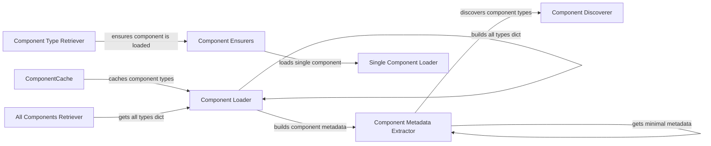

## Component Details

### ComponentCache
The ComponentCache is a singleton that manages the cache for components. It stores the dictionary of all component types and a flag indicating whether a component is fully loaded. This ensures a single source of truth for component loading and avoids redundant loading of components.
- **Related Classes/Methods**: `repos.langflow.src.backend.base.langflow.interface.components`

### Component Loader
The Component Loader is responsible for loading components, either partially (metadata only) or fully. It uses different functions to achieve this, such as `get_and_cache_all_types_dict` for initial loading and caching, `aget_component_metadata` for partial loading, and `aget_all_types_dict` for full loading. It interacts with the `SettingsService` to determine the loading mode and component paths.
- **Related Classes/Methods**: `repos.langflow.src.backend.base.langflow.interface.components`

### Component Discoverer
The Component Discoverer is responsible for discovering available component types and names by scanning the directories specified in `components_paths`. It uses `discover_component_types` to find component types and `discover_component_names` to find component names for a specific type. This information is used to build the component catalog.
- **Related Classes/Methods**: `repos.langflow.src.backend.base.langflow.interface.components`

### Component Metadata Extractor
The Component Metadata Extractor extracts minimal metadata for a component without loading its full implementation. This metadata includes the display name, name, type, and a basic template. It uses `get_component_minimal_metadata` to extract this information, which is used for lazy-loaded components.
- **Related Classes/Methods**: `repos.langflow.src.backend.base.langflow.interface.components`

### Component Ensurers
The Component Ensurers is responsible for ensuring that a component is fully loaded if it was only partially loaded. It checks the `ComponentCache` to see if the component is already fully loaded. If not, it calls `load_single_component` to load the component and update the cache.
- **Related Classes/Methods**: `repos.langflow.src.backend.base.langflow.interface.components`

### Single Component Loader
The Single Component Loader is responsible for loading a single component fully. It delegates to `get_single_component_dict` from `langflow.custom.utils`. It handles various exceptions that may occur during the loading process, such as import errors, file not found errors, and data structure errors.
- **Related Classes/Methods**: `repos.langflow.src.backend.base.langflow.interface.components`

### Component Type Retriever
The Component Type Retriever is responsible for retrieving a specific component type dictionary, loading it if needed. It first ensures that `all_types_dict` is loaded (at least partially) by calling `get_and_cache_all_types_dict`. If the component type exists in the cache, it returns the corresponding dictionary. If in lazy mode, it ensures all components of this type are fully loaded using `ensure_component_loaded`.
- **Related Classes/Methods**: `repos.langflow.src.backend.base.langflow.interface.components`

### All Components Retriever
The All Components Retriever is responsible for retrieving all component names, combining native and custom components. It uses `aget_all_types_dict` to get all component types and then extracts the component names.
- **Related Classes/Methods**: `repos.langflow.src.backend.base.langflow.interface.components`
