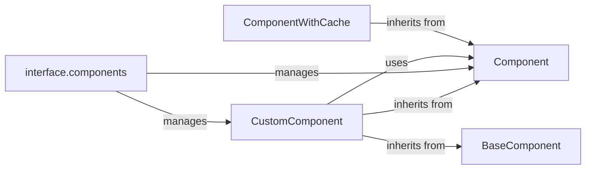

## Component Details

The Component Management subsystem in Langflow is responsible for handling the lifecycle and accessibility of both built-in and custom components. It provides mechanisms for loading, registering, and retrieving components, ensuring they adhere to the Langflow component interface. This system facilitates the creation and integration of custom components, allowing users to extend Langflow's functionality with their own logic. The core flow involves loading component definitions, managing their metadata, and providing access to them for use within Langflow workflows.

### Component
The `Component` class serves as the foundation for all components within Langflow. It encapsulates the core logic for component execution, input/output mapping, validation, and state management. It defines the interface and common functionalities that all components must adhere to, providing a consistent framework for building both built-in and custom components.
- **Related Classes/Methods**: `langflow.src.backend.base.langflow.custom.custom_component.component.Component`

### CustomComponent
The `CustomComponent` class extends the base `Component` class to enable the integration of user-defined components into Langflow. It handles the loading of user-provided code, extracts function signatures to determine input parameters, and sets up the component for execution within the Langflow environment. This allows users to create components with custom logic and seamlessly incorporate them into their workflows.
- **Related Classes/Methods**: `langflow.src.backend.base.langflow.custom.custom_component.custom_component.CustomComponent`

### BaseComponent
The `BaseComponent` class is an abstract base class that provides common functionality for custom component implementations. It includes methods for retrieving code trees and template configurations, serving as a parent class for `CustomComponent`. It defines the base for custom component implementations.
- **Related Classes/Methods**: `langflow.src.backend.base.langflow.custom.custom_component.base_component.BaseComponent`

### ComponentWithCache
The `ComponentWithCache` class enhances component performance by providing caching functionality. It wraps other components and stores their instances or results, allowing for faster access and reduced computational overhead when the same component is used multiple times. This optimization improves the overall efficiency of Langflow workflows.
- **Related Classes/Methods**: `langflow.src.backend.base.langflow.custom.custom_component.component_with_cache.ComponentWithCache`

### interface.components
The `interface.components` module manages and provides access to component metadata. It handles loading components, caching their types, and retrieving their metadata. It provides the necessary information for creating component instances.
- **Related Classes/Methods**: `langflow.src.backend.base.langflow.interface.components`
