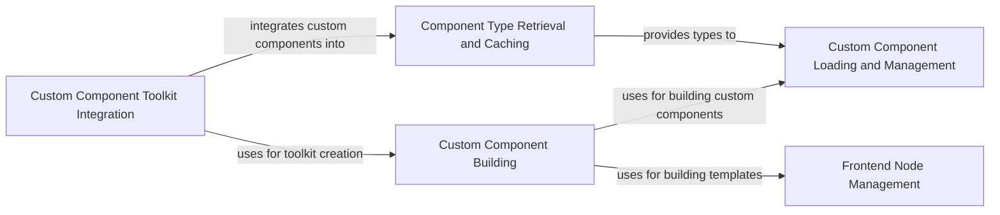

## Component Details

The Component Management subsystem in Langflow is responsible for handling the lifecycle of components, including custom ones. It encompasses loading, building, and managing component configurations, providing the building blocks for creating flows. The main flow involves retrieving component types, building custom components from user inputs or files, and integrating them into toolkits for use within Langflow.

### Component Type Retrieval and Caching
This component focuses on retrieving and caching information about available component types. It fetches metadata for components and manages a dictionary containing all available types, ensuring efficient access to component information throughout the application.
**Related Classes/Methods**:

- <a href="https://github.com/langflow-ai/langflow/blob/master/src/backend/base/langflow/interface/components.py#L26-L45" target="_blank" rel="noopener noreferrer">`langflow.interface.components.get_and_cache_all_types_dict` (26:45)</a>
- <a href="https://github.com/langflow-ai/langflow/blob/master/src/backend/base/langflow/interface/components.py#L48-L50" target="_blank" rel="noopener noreferrer">`langflow.interface.components.aget_all_types_dict` (48:50)</a>
- <a href="https://github.com/langflow-ai/langflow/blob/master/src/backend/base/langflow/interface/components.py#L53-L81" target="_blank" rel="noopener noreferrer">`langflow.interface.components.aget_component_metadata` (53:81)</a>

### Custom Component Building
This component focuses on building custom components from user inputs and configurations. It involves generating templates, validating components, and managing the structure and properties of custom components, allowing users to extend Langflow with their own components.
**Related Classes/Methods**:

- <a href="https://github.com/langflow-ai/langflow/blob/master/src/backend/base/langflow/custom/utils.py#L368-L390" target="_blank" rel="noopener noreferrer">`langflow.custom.utils.build_custom_component_template_from_inputs` (368:390)</a>
- <a href="https://github.com/langflow-ai/langflow/blob/master/src/backend/base/langflow/custom/utils.py#L393-L446" target="_blank" rel="noopener noreferrer">`langflow.custom.utils.build_custom_component_template` (393:446)</a>
- <a href="https://github.com/langflow-ai/langflow/blob/master/src/backend/base/langflow/template/frontend_node/base.py#L182-L192" target="_blank" rel="noopener noreferrer">`langflow.template.frontend_node.base.FrontendNode.from_inputs` (182:192)</a>
- <a href="https://github.com/langflow-ai/langflow/blob/master/src/backend/base/langflow/template/frontend_node/base.py#L124-L126" target="_blank" rel="noopener noreferrer">`langflow.template.frontend_node.base.FrontendNode.validate_component` (124:126)</a>
- <a href="https://github.com/langflow-ai/langflow/blob/master/src/backend/base/langflow/template/frontend_node/base.py#L121-L122" target="_blank" rel="noopener noreferrer">`langflow.template.frontend_node.base.FrontendNode.set_base_classes_from_outputs` (121:122)</a>
- <a href="https://github.com/langflow-ai/langflow/blob/master/src/backend/base/langflow/template/frontend_node/base.py#L108-L113" target="_blank" rel="noopener noreferrer">`langflow.template.frontend_node.base.FrontendNode.to_dict` (108:113)</a>
- <a href="https://github.com/langflow-ai/langflow/blob/master/src/backend/base/langflow/template/frontend_node/custom_components.py#L45-L69" target="_blank" rel="noopener noreferrer">`langflow.template.frontend_node.custom_components.CustomComponentFrontendNode` (45:69)</a>
- <a href="https://github.com/langflow-ai/langflow/blob/master/src/backend/base/langflow/custom/utils.py#L300-L347" target="_blank" rel="noopener noreferrer">`langflow.custom.utils.run_build_config` (300:347)</a>
- <a href="https://github.com/langflow-ai/langflow/blob/master/src/backend/base/langflow/custom/utils.py#L203-L243" target="_blank" rel="noopener noreferrer">`langflow.custom.utils.add_extra_fields` (203:243)</a>
- <a href="https://github.com/langflow-ai/langflow/blob/master/src/backend/base/langflow/custom/utils.py#L350-L365" target="_blank" rel="noopener noreferrer">`langflow.custom.utils.add_code_field` (350:365)</a>
- <a href="https://github.com/langflow-ai/langflow/blob/master/src/backend/base/langflow/custom/utils.py#L76-L93" target="_blank" rel="noopener noreferrer">`langflow.custom.utils.add_base_classes` (76:93)</a>
- <a href="https://github.com/langflow-ai/langflow/blob/master/src/backend/base/langflow/custom/utils.py#L39-L59" target="_blank" rel="noopener noreferrer">`langflow.custom.utils.add_output_types` (39:59)</a>
- <a href="https://github.com/langflow-ai/langflow/blob/master/src/backend/base/langflow/custom/utils.py#L62-L73" target="_blank" rel="noopener noreferrer">`langflow.custom.utils.reorder_fields` (62:73)</a>
- <a href="https://github.com/langflow-ai/langflow/blob/master/src/backend/base/langflow/custom/utils.py#L265-L297" target="_blank" rel="noopener noreferrer">`langflow.src.backend.base.langflow.custom.utils.get_component_instance` (265:297)</a>

### Custom Component Loading and Management
This component deals with loading custom components from directories, managing their configurations, and merging them into a unified structure. It supports both synchronous and asynchronous loading, ensuring that custom components are properly integrated into the Langflow environment.
**Related Classes/Methods**:

- <a href="https://github.com/langflow-ai/langflow/blob/master/src/backend/base/langflow/custom/utils.py#L463-L485" target="_blank" rel="noopener noreferrer">`langflow.custom.utils.build_custom_components` (463:485)</a>
- <a href="https://github.com/langflow-ai/langflow/blob/master/src/backend/base/langflow/custom/utils.py#L488-L510" target="_blank" rel="noopener noreferrer">`langflow.custom.utils.abuild_custom_components` (488:510)</a>
- <a href="https://github.com/langflow-ai/langflow/blob/master/src/backend/base/langflow/custom/directory_reader/utils.py#L73-L83" target="_blank" rel="noopener noreferrer">`langflow.custom.directory_reader.utils.build_custom_component_list_from_path` (73:83)</a>
- <a href="https://github.com/langflow-ai/langflow/blob/master/src/backend/base/langflow/custom/directory_reader/utils.py#L86-L96" target="_blank" rel="noopener noreferrer">`langflow.custom.directory_reader.utils.abuild_custom_component_list_from_path` (86:96)</a>
- <a href="https://github.com/langflow-ai/langflow/blob/master/src/backend/base/langflow/custom/directory_reader/utils.py#L9-L20" target="_blank" rel="noopener noreferrer">`langflow.custom.directory_reader.utils.merge_nested_dicts_with_renaming` (9:20)</a>

### Frontend Node Management
This component manages the structure and properties of frontend nodes, which represent components in the user interface. It handles tasks such as creating nodes from inputs, validating them, and converting them to dictionaries, ensuring that components are properly represented and managed in the user interface.
**Related Classes/Methods**:

- <a href="https://github.com/langflow-ai/langflow/blob/master/src/backend/base/langflow/template/frontend_node/base.py#L182-L192" target="_blank" rel="noopener noreferrer">`langflow.template.frontend_node.base.FrontendNode.from_inputs` (182:192)</a>
- <a href="https://github.com/langflow-ai/langflow/blob/master/src/backend/base/langflow/template/frontend_node/base.py#L124-L126" target="_blank" rel="noopener noreferrer">`langflow.template.frontend_node.base.FrontendNode.validate_component` (124:126)</a>
- <a href="https://github.com/langflow-ai/langflow/blob/master/src/backend/base/langflow/template/frontend_node/base.py#L121-L122" target="_blank" rel="noopener noreferrer">`langflow.template.frontend_node.base.FrontendNode.set_base_classes_from_outputs` (121:122)</a>
- <a href="https://github.com/langflow-ai/langflow/blob/master/src/backend/base/langflow/template/frontend_node/base.py#L108-L113" target="_blank" rel="noopener noreferrer">`langflow.template.frontend_node.base.FrontendNode.to_dict` (108:113)</a>

### Custom Component Toolkit Integration
This component handles the integration of custom components into toolkits, making them available for use within agents and flows. It retrieves component toolkits and updates them with relevant metadata, ensuring that custom components can be easily used within Langflow's ecosystem.
**Related Classes/Methods**:

- <a href="https://github.com/langflow-ai/langflow/blob/master/src/backend/base/langflow/custom/custom_component/component.py#LNone-LNone" target="_blank" rel="noopener noreferrer">`langflow.custom.custom_component.component.to_toolkit` (full file reference)</a>
- <a href="https://github.com/langflow-ai/langflow/blob/master/src/backend/base/langflow/custom/custom_component/component.py#LNone-LNone" target="_blank" rel="noopener noreferrer">`langflow.custom.custom_component.component._get_tools` (full file reference)</a>
- <a href="https://github.com/langflow-ai/langflow/blob/master/src/backend/base/langflow/custom/custom_component/component.py#L58-L64" target="_blank" rel="noopener noreferrer">`langflow.custom.custom_component.component._get_component_toolkit` (58:64)</a>
- <a href="https://github.com/langflow-ai/langflow/blob/master/src/backend/base/langflow/custom/custom_component/component.py#LNone-LNone" target="_blank" rel="noopener noreferrer">`langflow.custom.custom_component.component._update_tools_with_metadata` (full file reference)</a>
- <a href="https://github.com/langflow-ai/langflow/blob/master/src/backend/base/langflow/base/tools/component_tool.py#L176-L283" target="_blank" rel="noopener noreferrer">`langflow.base.tools.component_tool.ComponentToolkit.get_tools` (176:283)</a>
- <a href="https://github.com/langflow-ai/langflow/blob/master/src/backend/base/langflow/base/tools/component_tool.py#L298-L328" target="_blank" rel="noopener noreferrer">`langflow.base.tools.component_tool.ComponentToolkit.update_tools_metadata` (298:328)</a>