```mermaid
graph LR
    Component_Base_Class["Component Base Class"]
    Custom_Component_Base["Custom Component Base"]
    Graph_Vertex["Graph Vertex"]
    Components_Interface["Components Interface"]
    Custom_Component_Utilities["Custom Component Utilities"]
    Store_Service["Store Service"]
    Store_API["Store API"]
    Graph["Graph"]
    Database_Service["Database Service"]
    State_Service["State Service"]
    Component_Base_Class -- "inherits from" --> Graph_Vertex
    Custom_Component_Base -- "inherits from" --> Component_Base_Class
    Components_Interface -- "uses" --> Component_Base_Class
    Custom_Component_Utilities -- "uses" --> Component_Base_Class
    Graph -- "uses" --> Component_Base_Class
    Custom_Component_Utilities -- "uses" --> Custom_Component_Base
    Graph_Vertex -- "interacts with" --> Graph
    Graph_Vertex -- "interacts with" --> State_Service
    Graph -- "uses" --> Graph_Vertex
    Components_Interface -- "uses" --> Custom_Component_Utilities
    Components_Interface -- "provides data to" --> Store_API
    Store_API -- "uses" --> Custom_Component_Utilities
    Store_API -- "uses" --> Store_Service
    Graph -- "composes" --> Graph_Vertex
    Graph -- "interacts with" --> State_Service
    State_Service -- "uses" --> Database_Service
    State_Service -- "interacts with" --> Graph
    State_Service -- "persists state via" --> Database_Service
    click Graph href "https://github.com/CodeBoarding/GeneratedOnBoardings/blob/main//langflow/Graph.md" "Details"
```

## Component Details

The `Component Management System` in Langflow is a crucial subsystem responsible for the lifecycle of all AI components within the platform. It handles their definition, loading, instantiation, configuration, and integration into the graph execution environment, as well as interaction with an external component store.

### Component Base Class
The abstract base class (`langflow.custom.custom_component.component.Component`) from which all reusable AI components in Langflow inherit. It defines the common interface and core functionalities expected of any functional block (e.g., LLM, Tool, Agent) that can be integrated into a flow. It acts as the primary abstraction for both pre-built and user-defined functional units.

**Related Classes/Methods**:

- <a href="https://github.com/langflow-ai/langflow/blob/master/src/backend/base/langflow/custom/custom_component/component.py#L93-L1610" target="_blank" rel="noopener noreferrer">`langflow.custom.custom_component.component.Component` (93:1610)</a>

### Custom Component Base
An intermediate abstract base class (`langflow.custom.custom_component.custom_component.CustomComponent`) that extends the `Component Base Class` with specific functionalities for handling user-defined custom components, including dynamic code execution and integration with the Langflow environment.

**Related Classes/Methods**:

- <a href="https://github.com/langflow-ai/langflow/blob/master/src/backend/base/langflow/custom/custom_component/custom_component.py#L34-L566" target="_blank" rel="noopener noreferrer">`langflow.custom.custom_component.custom_component.CustomComponent` (34:566)</a>

### Graph Vertex
Represents a node within the Langflow graph execution environment. Each instance of a `Component Base Class` in a flow is treated as a `Vertex` (`langflow.graph.vertex.base.Vertex`), managing its inputs, outputs, and execution state within the overall graph. It's the runtime representation of a component.

**Related Classes/Methods**:

- <a href="https://github.com/langflow-ai/langflow/blob/master/src/backend/base/langflow/graph/vertex/base.py#L45-L817" target="_blank" rel="noopener noreferrer">`langflow.graph.vertex.base.Vertex` (45:817)</a>

### Components Interface
This conceptual component, primarily implemented by `langflow.interface.components` and `langflow.interface.listing`, is responsible for discovering, loading, and providing a unified interface to all available AI components (both pre-built and custom) within Langflow. It enables the frontend to list and interact with components.

**Related Classes/Methods**:

- <a href="https://github.com/langflow-ai/langflow/blob/master/src/backend/base/langflow/interface/components.py#L1-L1" target="_blank" rel="noopener noreferrer">`langflow.interface.components` (1:1)</a>
- <a href="https://github.com/langflow-ai/langflow/blob/master/src/backend/base/langflow/interface/listing.py#L1-L1" target="_blank" rel="noopener noreferrer">`langflow.interface.listing` (1:1)</a>

### Custom Component Utilities
A collection of utility functions and helpers (`langflow.custom.utils`) specifically designed for the management, registration, validation, and dynamic loading of custom (user-defined) components. It ensures that user-defined components can be seamlessly integrated into the Langflow ecosystem.

**Related Classes/Methods**:

- <a href="https://github.com/langflow-ai/langflow/blob/master/src/backend/base/langflow/custom/utils.py#L1-L1" target="_blank" rel="noopener noreferrer">`langflow.custom.utils` (1:1)</a>

### Store Service
Manages the backend logic for interacting with an external component store. This includes functionalities for uploading, downloading, and listing reusable AI components, facilitating sharing and discovery. It is implemented by `langflow.services.store.service.StoreService`.

**Related Classes/Methods**:

- <a href="https://github.com/langflow-ai/langflow/blob/master/src/backend/base/langflow/services/store/service.py#L74-L599" target="_blank" rel="noopener noreferrer">`langflow.services.store.service.StoreService` (74:599)</a>

### Store API
Provides the RESTful API endpoints (`langflow.api.v1.store`) that allow external systems and the Langflow frontend to interact with the `Store Service`. It handles requests for component management in the external store, such as listing available components, uploading new ones, or downloading existing ones.

**Related Classes/Methods**:

- <a href="https://github.com/langflow-ai/langflow/blob/master/src/backend/base/langflow/api/v1/store.py#L1-L1" target="_blank" rel="noopener noreferrer">`langflow.api.v1.store` (1:1)</a>

### Graph
The core execution engine of Langflow, represented by `langflow.graph.graph.base.Graph`. It is responsible for orchestrating the flow of data and control between connected `Graph Vertex` instances (components) to execute a complete AI workflow.

**Related Classes/Methods**:

- <a href="https://github.com/langflow-ai/langflow/blob/master/src/backend/base/langflow/graph/graph/base.py#L59-L2146" target="_blank" rel="noopener noreferrer">`langflow.graph.graph.base.Graph` (59:2146)</a>

### Database Service
Manages all persistent data storage for Langflow, including flow definitions (which contain component configurations), user accounts, and other application-critical information. It is implemented by `langflow.services.database.service.DatabaseService` and is essential for loading and saving component-based flows.

**Related Classes/Methods**:

- <a href="https://github.com/langflow-ai/langflow/blob/master/src/backend/base/langflow/services/database/service.py#L37-L481" target="_blank" rel="noopener noreferrer">`langflow.services.database.service.DatabaseService` (37:481)</a>

### State Service
Manages the dynamic, runtime state of active Langflow flows. This includes tracking intermediate results, conversational history, and any other transient data generated during the execution of components within a flow. It is implemented by `langflow.services.state.service.StateService`.

**Related Classes/Methods**:

- <a href="https://github.com/langflow-ai/langflow/blob/master/src/backend/base/langflow/services/state/service.py#L10-L29" target="_blank" rel="noopener noreferrer">`langflow.services.state.service.StateService` (10:29)</a>

### [FAQ](https://github.com/CodeBoarding/GeneratedOnBoardings/tree/main?tab=readme-ov-file#faq)