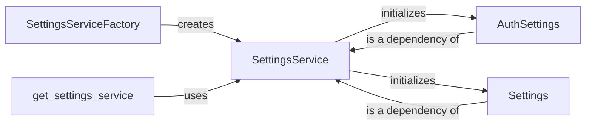

## Component Details

### SettingsService
The SettingsService is a central component responsible for managing the application's configuration settings. It provides a unified interface for accessing and modifying settings, ensuring consistent behavior across the application. It initializes and holds the application settings, including authentication settings and database URLs.
- **Related Classes/Methods**: `repos.langflow.src.backend.base.langflow.services.settings.service.SettingsService`

### SettingsServiceFactory
The SettingsServiceFactory is responsible for creating instances of the SettingsService. It decouples the creation process from the usage, allowing for flexible instantiation and potential customization of the SettingsService based on different environments or configurations.
- **Related Classes/Methods**: `repos.langflow.src.backend.base.langflow.services.settings.factory.SettingsServiceFactory`

### get_settings_service
The `get_settings_service` function acts as a dependency injection point for the SettingsService. It ensures that a single instance of the SettingsService is available throughout the application, promoting code reusability and simplifying access to configuration settings.
- **Related Classes/Methods**: `repos.langflow.src.backend.base.langflow.services.deps.get_settings_service`

### AuthSettings
The AuthSettings class encapsulates authentication-related settings, such as the secret key for JWTs. It provides a structured way to manage and access these settings, ensuring secure authentication processes within the application.
- **Related Classes/Methods**: `repos.langflow.src.backend.base.langflow.services.settings.auth.AuthSettings`

### Settings
The Settings class represents the core application settings, including the database URL and development mode. It provides a structured way to manage and access these settings, ensuring consistent application behavior across different environments.
- **Related Classes/Methods**: `repos.langflow.src.backend.base.langflow.services.settings.base.Settings`
