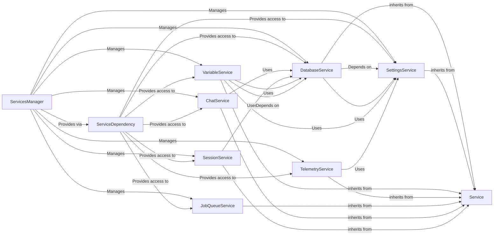

## Component Details

The Core Backend Services component acts as the foundational dependency injection system for the entire application. It is responsible for initializing, registering, and providing access to all essential application services, forming the backbone for shared functionalities across other components.

### ServicesManager
The central orchestrator for all backend services. It is responsible for initializing, registering, and providing access to various service instances throughout the application. It ensures that services are properly set up and available for dependency injection.

**Related Classes/Methods**:

- <a href="https://github.com/langflow-ai/langflow/blob/master/src/backend/base/langflow/services/manager.py#L1-L1" target="_blank" rel="noopener noreferrer">`langflow.services.manager.ServicesManager` (1:1)</a>

### ServiceDependency
This module acts as the primary dependency injection mechanism for all core services. It provides convenient functions (e.g., `get_db_service`, `get_settings_service`) to retrieve singleton instances of registered services, ensuring that components across the application can access shared functionalities consistently.

**Related Classes/Methods**:

- <a href="https://github.com/langflow-ai/langflow/blob/master/src/backend/base/langflow/services/deps.py#L1-L1" target="_blank" rel="noopener noreferrer">`langflow.services.deps` (1:1)</a>

### DatabaseService
Manages all interactions with the application's persistent data storage. This includes handling database connections, managing sessions, and providing an interface for CRUD operations on various application models (flows, users, messages, etc.). It is crucial for data persistence and retrieval.

**Related Classes/Methods**:

- <a href="https://github.com/langflow-ai/langflow/blob/master/src/backend/base/langflow/services/database/service.py#L37-L481" target="_blank" rel="noopener noreferrer">`langflow.services.database.service.DatabaseService` (37:481)</a>

### SettingsService
Centralizes and manages all application-wide configurations and settings. It provides a unified interface to access various configuration parameters, ensuring that different parts of the application operate with consistent settings.

**Related Classes/Methods**:

- <a href="https://github.com/langflow-ai/langflow/blob/master/src/backend/base/langflow/services/settings/service.py#L7-L31" target="_blank" rel="noopener noreferrer">`langflow.services.settings.service.SettingsService` (7:31)</a>

### VariableService
Handles the management of global variables within the application. This service allows for the storage and retrieval of dynamic, application-wide variables that can influence the behavior of different components.

**Related Classes/Methods**:

- <a href="https://github.com/langflow-ai/langflow/blob/master/src/backend/base/langflow/services/variable/service.py#L1-L1" target="_blank" rel="noopener noreferrer">`langflow.services.variable.service.VariableService` (1:1)</a>

### TelemetryService
Responsible for collecting and managing telemetry and tracing data. This service is crucial for monitoring application performance, debugging, and gaining insights into user interactions and system behavior.

**Related Classes/Methods**:

- <a href="https://github.com/langflow-ai/langflow/blob/master/src/backend/base/langflow/services/telemetry/service.py#L28-L166" target="_blank" rel="noopener noreferrer">`langflow.services.telemetry.service.TelemetryService` (28:166)</a>

### JobQueueService
Manages background task processing. It allows for the asynchronous execution of long-running or resource-intensive tasks, preventing blocking operations and improving application responsiveness.

**Related Classes/Methods**:

- <a href="https://github.com/langflow-ai/langflow/blob/master/src/backend/base/langflow/services/job_queue/service.py#L18-L326" target="_blank" rel="noopener noreferrer">`langflow.services.job_queue.service.JobQueueService` (18:326)</a>

### ChatService
Manages the storage and retrieval of chat history. This service is essential for maintaining conversational context across user sessions and flows.

**Related Classes/Methods**:

- <a href="https://github.com/langflow-ai/langflow/blob/master/src/backend/base/langflow/services/chat/service.py#L10-L66" target="_blank" rel="noopener noreferrer">`langflow.services.chat.service.ChatService` (10:66)</a>

### SessionService
Manages user sessions, including session creation, validation, and invalidation. It ensures secure and consistent user experiences across different interactions.

**Related Classes/Methods**:

- <a href="https://github.com/langflow-ai/langflow/blob/master/src/backend/base/langflow/services/session/service.py#L12-L62" target="_blank" rel="noopener noreferrer">`langflow.services.session.service.SessionService` (12:62)</a>

### Service
A base class or interface for various services in the application. It provides a common structure and potentially shared functionalities or lifecycle methods for all services, ensuring consistency and extensibility.

**Related Classes/Methods**:

- <a href="https://github.com/langflow-ai/langflow/blob/master/src/backend/base/langflow/services/base.py#L3-L27" target="_blank" rel="noopener noreferrer">`langflow.services.base.Service` (3:27)</a>

### [FAQ](https://github.com/CodeBoarding/GeneratedOnBoardings/tree/main?tab=readme-ov-file#faq)