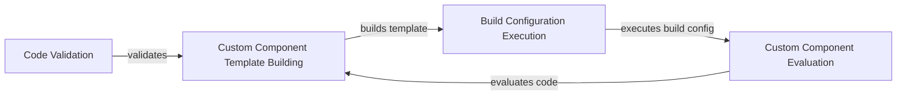

## Component Details

The Custom Code Execution component in Langflow enables users to extend the platform's functionality by writing and integrating their own code. This involves validating the code, building component templates, evaluating the code to create component instances, and managing the execution of build configurations. The main flow includes validating user-provided code, constructing a template for the custom component, evaluating the code to instantiate the component, and executing any build configurations specified. This allows for dynamic and flexible customization of Langflow's capabilities.

### Code Validation
This component is responsible for validating custom code snippets provided by users. It ensures that the code is safe, syntactically correct, and adheres to the platform's requirements, preventing potential security risks and errors.
**Related Classes/Methods**:

- <a href="https://github.com/langflow-ai/langflow/blob/master/src/backend/base/langflow/utils/validate.py#L24-L63" target="_blank" rel="noopener noreferrer">`src.backend.base.langflow.utils.validate:validate_code` (24:63)</a>

### Custom Component Template Building
This component constructs the template for custom components based on user-defined inputs and configurations. It handles the creation of frontend node representations, adds extra fields, code fields, base classes, and output types, and converts the frontend node to a dictionary for frontend consumption.
**Related Classes/Methods**:

- <a href="https://github.com/langflow-ai/langflow/blob/master/src/backend/base/langflow/custom/utils.py#L393-L446" target="_blank" rel="noopener noreferrer">`src.backend.base.langflow.custom.utils:build_custom_component_template` (393:446)</a>
- <a href="https://github.com/langflow-ai/langflow/blob/master/src/backend/base/langflow/template/frontend_node/custom_components.py#L45-L69" target="_blank" rel="noopener noreferrer">`langflow.template.frontend_node.custom_components.CustomComponentFrontendNode` (45:69)</a>

### Build Configuration Execution
This component executes the build configuration for custom components. It evaluates custom component code and retrieves field dictionaries, which are used to configure the component.
**Related Classes/Methods**:

- <a href="https://github.com/langflow-ai/langflow/blob/master/src/backend/base/langflow/custom/utils.py#L300-L347" target="_blank" rel="noopener noreferrer">`src.backend.base.langflow.custom.utils:run_build_config` (300:347)</a>

### Custom Component Evaluation
This component is responsible for evaluating custom code provided for components. It extracts class names, creates class instances, and handles potential errors during the evaluation process.
**Related Classes/Methods**:

- <a href="https://github.com/langflow-ai/langflow/blob/master/src/backend/base/langflow/custom/eval.py#L9-L12" target="_blank" rel="noopener noreferrer">`src.backend.base.langflow.custom.eval:eval_custom_component_code` (9:12)</a>