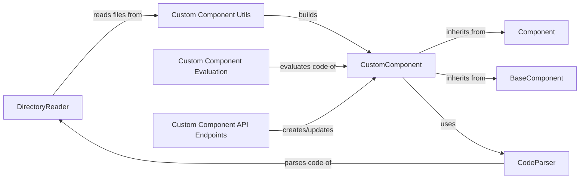

## Component Details

The Custom Component Handling subsystem in Langflow enables users to define and integrate their own components into the Langflow environment. It encompasses the processes of reading custom component files, parsing code, validating and compiling components, and making them available for use in flow graphs. The subsystem ensures adherence to the Langflow component interface and provides utilities for working with custom code, ultimately extending Langflow's functionality with user-defined building blocks.

### DirectoryReader
The DirectoryReader component is responsible for reading custom component files from a specified directory. It filters files, processes them to extract component definitions, and builds a menu list of available components for the user interface, making custom components discoverable within Langflow.
- **Related Classes/Methods**: `langflow.src.backend.base.langflow.custom.directory_reader.directory_reader.DirectoryReader`

### CodeParser
The CodeParser component is responsible for parsing the code of custom components. It extracts information about functions, classes, and their arguments, return types, and base classes. It builds an abstract syntax tree (AST) of the code and uses it to analyze the code structure, enabling Langflow to understand and validate the custom component's code.
- **Related Classes/Methods**: `langflow.src.backend.base.langflow.custom.code_parser.code_parser.CodeParser`

### CustomComponent
The CustomComponent component represents a custom component loaded from code. It handles the component's logic, including setting parameters, retrieving function entry points, extracting return types, and managing the component's template configuration. It also handles loading and running flows defined within the custom component, allowing users to execute custom logic within Langflow flows.
- **Related Classes/Methods**: `langflow.src.backend.base.langflow.custom.custom_component.custom_component.CustomComponent`

### Component
The Component class is the base class for all components in Langflow. It provides the core functionality for building, running, and managing components. It handles input and output mapping, validation, and execution of the component's logic. It also includes methods for interacting with the frontend and managing the component's state, providing a unified interface for all components in Langflow.
- **Related Classes/Methods**: `langflow.src.backend.base.langflow.custom.custom_component.component.Component`

### BaseComponent
The BaseComponent provides base functionalities for custom components, such as retrieving the code tree, getting functions, and building the template configuration. It serves as an abstract class for custom components.
- **Related Classes/Methods**: `langflow.src.backend.base.langflow.custom.custom_component.base_component.BaseComponent`

### Custom Component Utils
This module provides utility functions for building and loading custom components. It includes functions for building custom components, building individual components, retrieving functions, getting all types, and loading custom components, simplifying the process of integrating custom components into Langflow.
- **Related Classes/Methods**: `langflow.src.backend.base.langflow.custom.utils`

### Custom Component API Endpoints
These endpoints handle the creation and updating of custom components via the API, allowing users to manage custom components programmatically.
- **Related Classes/Methods**: `langflow.src.backend.base.langflow.api.v1.endpoints`

### Custom Component Evaluation
This module is responsible for evaluating the code of custom components, ensuring that the code is safe and valid before it is executed within Langflow.
- **Related Classes/Methods**: `langflow.src.backend.base.langflow.custom.eval`
