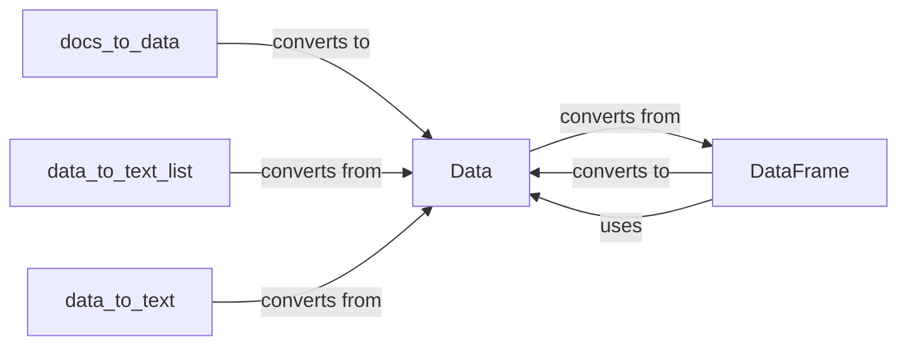

## Component Details

The Data Handling component in Langflow provides a unified way to represent and manipulate data within the system. It defines core data structures like `Data` and `DataFrame` for handling various data types, including text and tabular data. Helper functions are included to facilitate conversions between these data structures and other formats, such as lists of documents or plain text. This component ensures seamless data exchange between different parts of a Langflow flow graph, enabling consistent data processing throughout the system.

### Data
Represents a generic data structure within Langflow, serving as a base class for more specific data representations. It includes methods for converting from documents and LangChain messages, as well as methods for filtering, adding, and deep copying data.
- **Related Classes/Methods**: `langflow.schema.data.Data`

### DataFrame
Represents data in a tabular format, similar to a Pandas DataFrame. It provides methods for converting to a list of Data objects, adding rows, and constructing from documents. It's used to handle structured data within Langflow.
- **Related Classes/Methods**: `langflow.schema.dataframe.DataFrame`

### docs_to_data
A helper function that converts a list of documents into a list of Data objects. This function facilitates the conversion of document-based data into Langflow's internal data representation.
- **Related Classes/Methods**: `langflow.helpers.data:docs_to_data`

### data_to_text_list
A helper function that converts a list of Data objects into a list of text strings. This is useful for extracting textual information from Langflow's data representation.
- **Related Classes/Methods**: `langflow.helpers.data:data_to_text_list`

### data_to_text
A helper function that converts a Data object into a text string. It provides a way to represent Langflow's data as plain text.
- **Related Classes/Methods**: `langflow.helpers.data:data_to_text`
