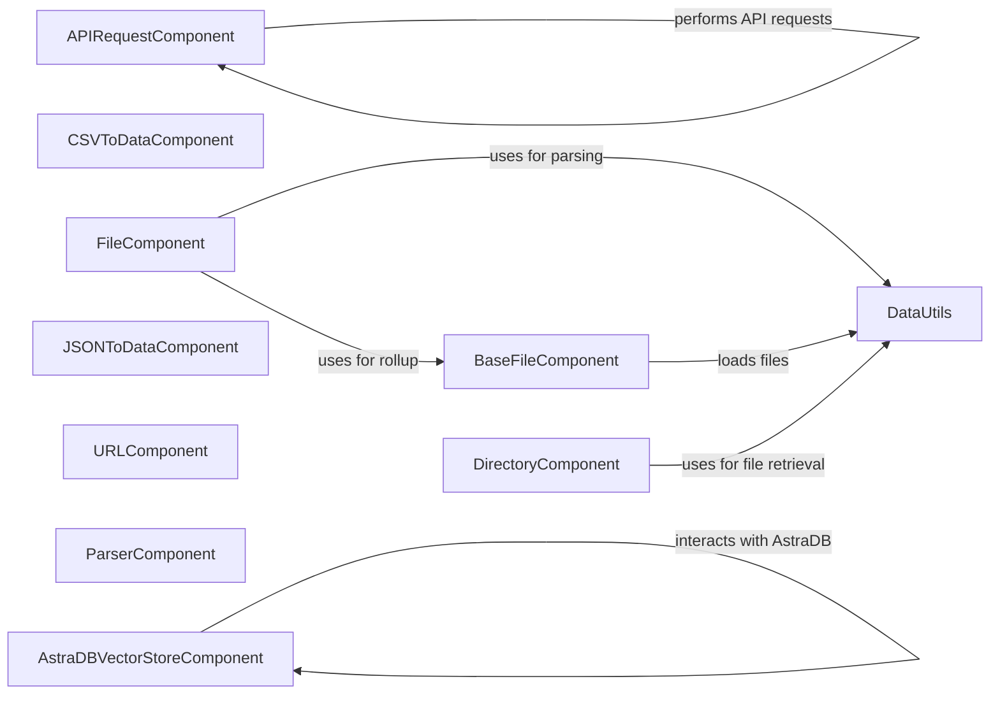

## Component Details

The Data Handling component is responsible for managing the data pipeline within the application. It encompasses functionalities for loading data from diverse sources such as files, APIs, and web searches, transforming this data through parsing, cleaning, and format conversion, and storing the processed data in vector stores like AstraDB. This component ensures that data is readily available and properly formatted for use in various flows, acting as a crucial bridge between external data sources and the application's internal processing mechanisms.

### BaseFileComponent
This component serves as an abstract base for handling file-related operations. It provides core functionalities for loading, validating, unpacking, filtering, and processing files of various types. It defines the basic structure and methods for file ingestion and manipulation, which are then inherited and extended by more specialized file processing components.
**Related Classes/Methods**:

- <a href="https://github.com/langflow-ai/langflow/blob/master/src/backend/base/langflow/base/data/base_file.py#L191-L226" target="_blank" rel="noopener noreferrer">`src.backend.base.langflow.base.data.base_file.BaseFileComponent:load_files_base` (191:226)</a>
- <a href="https://github.com/langflow-ai/langflow/blob/master/src/backend/base/langflow/base/data/base_file.py#L228-L237" target="_blank" rel="noopener noreferrer">`src.backend.base.langflow.base.data.base_file.BaseFileComponent:load_files` (228:237)</a>
- <a href="https://github.com/langflow-ai/langflow/blob/master/src/backend/base/langflow/base/data/base_file.py#L239-L273" target="_blank" rel="noopener noreferrer">`src.backend.base.langflow.base.data.base_file.BaseFileComponent:load_dataframe` (239:273)</a>
- <a href="https://github.com/langflow-ai/langflow/blob/master/src/backend/base/langflow/base/data/base_file.py#L296-L347" target="_blank" rel="noopener noreferrer">`src.backend.base.langflow.base.data.base_file.BaseFileComponent:rollup_data` (296:347)</a>
- <a href="https://github.com/langflow-ai/langflow/blob/master/src/backend/base/langflow/base/data/base_file.py#L349-L380" target="_blank" rel="noopener noreferrer">`src.backend.base.langflow.base.data.base_file.BaseFileComponent:_file_path_as_list` (349:380)</a>
- <a href="https://github.com/langflow-ai/langflow/blob/master/src/backend/base/langflow/base/data/base_file.py#L382-L434" target="_blank" rel="noopener noreferrer">`src.backend.base.langflow.base.data.base_file.BaseFileComponent:_validate_and_resolve_paths` (382:434)</a>
- <a href="https://github.com/langflow-ai/langflow/blob/master/src/backend/base/langflow/base/data/base_file.py#L436-L492" target="_blank" rel="noopener noreferrer">`src.backend.base.langflow.base.data.base_file.BaseFileComponent:_unpack_and_collect_files` (436:492)</a>
- <a href="https://github.com/langflow-ai/langflow/blob/master/src/backend/base/langflow/base/data/base_file.py#L494-L534" target="_blank" rel="noopener noreferrer">`src.backend.base.langflow.base.data.base_file.BaseFileComponent:_unpack_bundle` (494:534)</a>
- <a href="https://github.com/langflow-ai/langflow/blob/master/src/backend/base/langflow/base/data/base_file.py#L536-L570" target="_blank" rel="noopener noreferrer">`src.backend.base.langflow.base.data.base_file.BaseFileComponent:_filter_and_mark_files` (536:570)</a>

### DataUtils
This component provides a collection of utility functions for handling file paths, partitioning files, parsing text files, and parallelizing data loading. It offers essential tools for managing file system operations, converting data formats, and optimizing data ingestion processes, supporting various data-related tasks within the application.
**Related Classes/Methods**:

- <a href="https://github.com/langflow-ai/langflow/blob/master/src/backend/base/langflow/base/data/utils.py#L61-L89" target="_blank" rel="noopener noreferrer">`src.backend.base.langflow.base.data.utils:retrieve_file_paths` (61:89)</a>
- <a href="https://github.com/langflow-ai/langflow/blob/master/src/backend/base/langflow/base/data/utils.py#L92-L108" target="_blank" rel="noopener noreferrer">`src.backend.base.langflow.base.data.utils:partition_file_to_data` (92:108)</a>
- <a href="https://github.com/langflow-ai/langflow/blob/master/src/backend/base/langflow/base/data/utils.py#L138-L167" target="_blank" rel="noopener noreferrer">`src.backend.base.langflow.base.data.utils:parse_text_file_to_data` (138:167)</a>
- <a href="https://github.com/langflow-ai/langflow/blob/master/src/backend/base/langflow/base/data/utils.py#L186-L199" target="_blank" rel="noopener noreferrer">`src.backend.base.langflow.base.data.utils:parallel_load_data` (186:199)</a>

### APIRequestComponent
This component is responsible for making requests to external APIs. It handles the construction of request bodies and headers, parsing of curl commands, and normalization of URLs. It facilitates seamless interaction with external services by providing tools for crafting and executing API calls, as well as processing the responses.
**Related Classes/Methods**:

- <a href="https://github.com/langflow-ai/langflow/blob/master/src/backend/base/langflow/components/data/api_request.py#L187-L197" target="_blank" rel="noopener noreferrer">`src.backend.base.langflow.components.data.api_request.APIRequestComponent:_process_body` (187:197)</a>
- <a href="https://github.com/langflow-ai/langflow/blob/master/src/backend/base/langflow/components/data/api_request.py#L199-L201" target="_blank" rel="noopener noreferrer">`src.backend.base.langflow.components.data.api_request.APIRequestComponent:_process_dict_body` (199:201)</a>
- <a href="https://github.com/langflow-ai/langflow/blob/master/src/backend/base/langflow/components/data/api_request.py#L203-L208" target="_blank" rel="noopener noreferrer">`src.backend.base.langflow.components.data.api_request.APIRequestComponent:_process_string_body` (203:208)</a>
- <a href="https://github.com/langflow-ai/langflow/blob/master/src/backend/base/langflow/components/data/api_request.py#L210-L223" target="_blank" rel="noopener noreferrer">`src.backend.base.langflow.components.data.api_request.APIRequestComponent:_process_list_body` (210:223)</a>
- <a href="https://github.com/langflow-ai/langflow/blob/master/src/backend/base/langflow/components/data/api_request.py#L229-L268" target="_blank" rel="noopener noreferrer">`src.backend.base.langflow.components.data.api_request.APIRequestComponent:parse_curl` (229:268)</a>
- <a href="https://github.com/langflow-ai/langflow/blob/master/src/backend/base/langflow/components/data/api_request.py#L281-L380" target="_blank" rel="noopener noreferrer">`src.backend.base.langflow.components.data.api_request.APIRequestComponent:make_request` (281:380)</a>
- <a href="https://github.com/langflow-ai/langflow/blob/master/src/backend/base/langflow/components/data/api_request.py#L396-L404" target="_blank" rel="noopener noreferrer">`src.backend.base.langflow.components.data.api_request.APIRequestComponent:_process_headers` (396:404)</a>
- <a href="https://github.com/langflow-ai/langflow/blob/master/src/backend/base/langflow/components/data/api_request.py#L406-L454" target="_blank" rel="noopener noreferrer">`src.backend.base.langflow.components.data.api_request.APIRequestComponent:make_api_request` (406:454)</a>
- <a href="https://github.com/langflow-ai/langflow/blob/master/src/backend/base/langflow/components/data/api_request.py#L456-L475" target="_blank" rel="noopener noreferrer">`src.backend.base.langflow.components.data.api_request.APIRequestComponent:update_build_config` (456:475)</a>

### CSVToDataComponent
This component specializes in loading data from CSV files and converting it into a structured data format suitable for further processing. It provides a straightforward method for ingesting CSV data, making it readily available for use within the application's data flows.
**Related Classes/Methods**:

- <a href="https://github.com/langflow-ai/langflow/blob/master/src/backend/base/langflow/components/data/csv_to_data.py#L46-L95" target="_blank" rel="noopener noreferrer">`src.backend.base.langflow.components.data.csv_to_data.CSVToDataComponent:load_csv_to_data` (46:95)</a>

### DirectoryComponent
This component is designed to load files from a specified directory and represent them as a DataFrame. It leverages the DataUtils component for file retrieval and parsing, providing a convenient way to ingest data from entire directories into the application.
**Related Classes/Methods**:

- <a href="https://github.com/langflow-ai/langflow/blob/master/src/backend/base/langflow/components/data/directory.py#L74-L110" target="_blank" rel="noopener noreferrer">`src.backend.base.langflow.components.data.directory.DirectoryComponent:load_directory` (74:110)</a>
- <a href="https://github.com/langflow-ai/langflow/blob/master/src/backend/base/langflow/components/data/directory.py#L112-L113" target="_blank" rel="noopener noreferrer">`src.backend.base.langflow.components.data.directory.DirectoryComponent:as_dataframe` (112:113)</a>

### FileComponent
This component focuses on processing individual files. It utilizes the BaseFileComponent for core file handling functionalities and DataUtils for rollup and parsing operations. It provides a flexible way to manage and transform data from individual files within the application.
**Related Classes/Methods**:

- <a href="https://github.com/langflow-ai/langflow/blob/master/src/backend/base/langflow/components/data/file.py#L43-L93" target="_blank" rel="noopener noreferrer">`src.backend.base.langflow.components.data.file.FileComponent:process_files` (43:93)</a>

### JSONToDataComponent
This component is responsible for converting JSON data into a structured data format. It provides a simple and efficient way to ingest JSON data into the application, making it readily available for further processing and analysis.
**Related Classes/Methods**:

- <a href="https://github.com/langflow-ai/langflow/blob/master/src/backend/base/langflow/components/data/json_to_data.py#L43-L98" target="_blank" rel="noopener noreferrer">`src.backend.base.langflow.components.data.json_to_data.JSONToDataComponent:convert_json_to_data` (43:98)</a>

### URLComponent
This component fetches content from URLs and represents it as either a DataFrame or a Message. It includes functionality for validating URLs and creating loaders, providing a versatile tool for ingesting data directly from web sources.
**Related Classes/Methods**:

- <a href="https://github.com/langflow-ai/langflow/blob/master/src/backend/base/langflow/components/data/url.py#L182-L202" target="_blank" rel="noopener noreferrer">`src.backend.base.langflow.components.data.url.URLComponent:ensure_url` (182:202)</a>
- <a href="https://github.com/langflow-ai/langflow/blob/master/src/backend/base/langflow/components/data/url.py#L232-L288" target="_blank" rel="noopener noreferrer">`src.backend.base.langflow.components.data.url.URLComponent:fetch_url_contents` (232:288)</a>
- <a href="https://github.com/langflow-ai/langflow/blob/master/src/backend/base/langflow/components/data/url.py#L290-L292" target="_blank" rel="noopener noreferrer">`src.backend.base.langflow.components.data.url.URLComponent:fetch_content` (290:292)</a>
- <a href="https://github.com/langflow-ai/langflow/blob/master/src/backend/base/langflow/components/data/url.py#L294-L297" target="_blank" rel="noopener noreferrer">`src.backend.base.langflow.components.data.url.URLComponent:as_message` (294:297)</a>

### ParserComponent
This component is responsible for parsing combined text and converting it into a Message format. It provides a crucial step in transforming unstructured text data into a structured format that can be easily processed and utilized within the application's workflows.
**Related Classes/Methods**:

- <a href="https://github.com/langflow-ai/langflow/blob/master/src/backend/base/langflow/components/processing/parser.py#L115-L134" target="_blank" rel="noopener noreferrer">`src.backend.base.langflow.components.processing.parser.ParserComponent:parse_combined_text` (115:134)</a>

### AstraDBVectorStoreComponent
This component facilitates interaction with AstraDB as a vector store. It manages database and collection creation, data ingestion, and document searching. It provides the necessary tools for storing and retrieving vector embeddings, enabling similarity searches and other vector-based operations within the application.
**Related Classes/Methods**:

- <a href="https://github.com/langflow-ai/langflow/blob/master/src/backend/base/langflow/components/vectorstores/astradb.py#L354-L383" target="_blank" rel="noopener noreferrer">`src.backend.base.langflow.components.vectorstores.astradb.AstraDBVectorStoreComponent:create_database_api` (354:383)</a>
- <a href="https://github.com/langflow-ai/langflow/blob/master/src/backend/base/langflow/components/vectorstores/astradb.py#L386-L432" target="_blank" rel="noopener noreferrer">`src.backend.base.langflow.components.vectorstores.astradb.AstraDBVectorStoreComponent:create_collection_api` (386:432)</a>
- <a href="https://github.com/langflow-ai/langflow/blob/master/src/backend/base/langflow/components/vectorstores/astradb.py#L512-L518" target="_blank" rel="noopener noreferrer">`src.backend.base.langflow.components.vectorstores.astradb.AstraDBVectorStoreComponent:get_api_endpoint` (512:518)</a>
- <a href="https://github.com/langflow-ai/langflow/blob/master/src/backend/base/langflow/components/vectorstores/astradb.py#L539-L550" target="_blank" rel="noopener noreferrer">`src.backend.base.langflow.components.vectorstores.astradb.AstraDBVectorStoreComponent:get_database_object` (539:550)</a>
- <a href="https://github.com/langflow-ai/langflow/blob/master/src/backend/base/langflow/components/vectorstores/astradb.py#L552-L569" target="_blank" rel="noopener noreferrer">`src.backend.base.langflow.components.vectorstores.astradb.AstraDBVectorStoreComponent:collection_data` (552:569)</a>
- <a href="https://github.com/langflow-ai/langflow/blob/master/src/backend/base/langflow/components/vectorstores/astradb.py#L571-L586" target="_blank" rel="noopener noreferrer">`src.backend.base.langflow.components.vectorstores.astradb.AstraDBVectorStoreComponent:_initialize_database_options` (571:586)</a>
- <a href="https://github.com/langflow-ai/langflow/blob/master/src/backend/base/langflow/components/vectorstores/astradb.py#L622-L652" target="_blank" rel="noopener noreferrer">`src.backend.base.langflow.components.vectorstores.astradb.AstraDBVectorStoreComponent:_initialize_collection_options` (622:652)</a>
- <a href="https://github.com/langflow-ai/langflow/blob/master/src/backend/base/langflow/components/vectorstores/astradb.py#L654-L704" target="_blank" rel="noopener noreferrer">`src.backend.base.langflow.components.vectorstores.astradb.AstraDBVectorStoreComponent:reset_provider_options` (654:704)</a>
- <a href="https://github.com/langflow-ai/langflow/blob/master/src/backend/base/langflow/components/vectorstores/astradb.py#L730-L750" target="_blank" rel="noopener noreferrer">`src.backend.base.langflow.components.vectorstores.astradb.AstraDBVectorStoreComponent:reset_collection_list` (730:750)</a>
- <a href="https://github.com/langflow-ai/langflow/blob/master/src/backend/base/langflow/components/vectorstores/astradb.py#L752-L780" target="_blank" rel="noopener noreferrer">`src.backend.base.langflow.components.vectorstores.astradb.AstraDBVectorStoreComponent:reset_database_list` (752:780)</a>
- <a href="https://github.com/langflow-ai/langflow/blob/master/src/backend/base/langflow/components/vectorstores/astradb.py#L795-L836" target="_blank" rel="noopener noreferrer">`src.backend.base.langflow.components.vectorstores.astradb.AstraDBVectorStoreComponent:_handle_hybrid_search_options` (795:836)</a>
- <a href="https://github.com/langflow-ai/langflow/blob/master/src/backend/base/langflow/components/vectorstores/astradb.py#L838-L905" target="_blank" rel="noopener noreferrer">`src.backend.base.langflow.components.vectorstores.astradb.AstraDBVectorStoreComponent:update_build_config` (838:905)</a>
- <a href="https://github.com/langflow-ai/langflow/blob/master/src/backend/base/langflow/components/vectorstores/astradb.py#L907-L931" target="_blank" rel="noopener noreferrer">`src.backend.base.langflow.components.vectorstores.astradb.AstraDBVectorStoreComponent:_create_new_database` (907:931)</a>
- <a href="https://github.com/langflow-ai/langflow/blob/master/src/backend/base/langflow/components/vectorstores/astradb.py#L933-L946" target="_blank" rel="noopener noreferrer">`src.backend.base.langflow.components.vectorstores.astradb.AstraDBVectorStoreComponent:_update_cloud_regions` (933:946)</a>
- <a href="https://github.com/langflow-ai/langflow/blob/master/src/backend/base/langflow/components/vectorstores/astradb.py#L948-L987" target="_blank" rel="noopener noreferrer">`src.backend.base.langflow.components.vectorstores.astradb.AstraDBVectorStoreComponent:_create_new_collection` (948:987)</a>
- <a href="https://github.com/langflow-ai/langflow/blob/master/src/backend/base/langflow/components/vectorstores/astradb.py#L989-L1034" target="_blank" rel="noopener noreferrer">`src.backend.base.langflow.components.vectorstores.astradb.AstraDBVectorStoreComponent:_handle_database_selection` (989:1034)</a>
- <a href="https://github.com/langflow-ai/langflow/blob/master/src/backend/base/langflow/components/vectorstores/astradb.py#L1036-L1081" target="_blank" rel="noopener noreferrer">`src.backend.base.langflow.components.vectorstores.astradb.AstraDBVectorStoreComponent:_handle_collection_selection` (1036:1081)</a>
- <a href="https://github.com/langflow-ai/langflow/blob/master/src/backend/base/langflow/components/vectorstores/astradb.py#L1084-L1154" target="_blank" rel="noopener noreferrer">`src.backend.base.langflow.components.vectorstores.astradb.AstraDBVectorStoreComponent:build_vector_store` (1084:1154)</a>
- <a href="https://github.com/langflow-ai/langflow/blob/master/src/backend/base/langflow/components/vectorstores/astradb.py#L1156-L1187" target="_blank" rel="noopener noreferrer">`src.backend.base.langflow.components.vectorstores.astradb.AstraDBVectorStoreComponent:_add_documents_to_vector_store` (1156:1187)</a>
- <a href="https://github.com/langflow-ai/langflow/blob/master/src/backend/base/langflow/components/vectorstores/astradb.py#L1197-L1222" target="_blank" rel="noopener noreferrer">`src.backend.base.langflow.components.vectorstores.astradb.AstraDBVectorStoreComponent:_build_search_args` (1197:1222)</a>
- <a href="https://github.com/langflow-ai/langflow/blob/master/src/backend/base/langflow/components/vectorstores/astradb.py#L1224-L1260" target="_blank" rel="noopener noreferrer">`src.backend.base.langflow.components.vectorstores.astradb.AstraDBVectorStoreComponent:search_documents` (1224:1260)</a>
- <a href="https://github.com/langflow-ai/langflow/blob/master/src/backend/base/langflow/components/vectorstores/astradb.py#L1262-L1268" target="_blank" rel="noopener noreferrer">`src.backend.base.langflow.components.vectorstores.astradb.AstraDBVectorStoreComponent:get_retriever_kwargs` (1262:1268)</a>