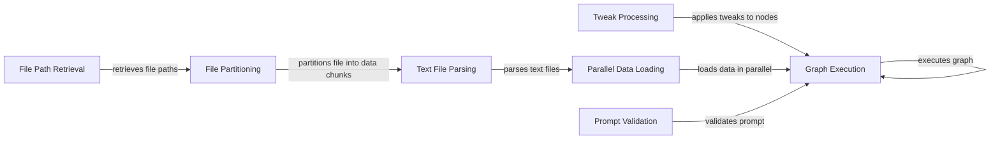

## Component Details

### Graph Execution
This component is responsible for executing the Langflow graph. It receives the graph, input data, and other parameters, then orchestrates the execution of the graph by processing nodes and their connections. It handles input processing, session management, and result retrieval.
- **Related Classes/Methods**: `langflow.processing.process:run_graph_internal`, `langflow.processing.process:run_graph`

### Tweak Processing
This component handles the processing of tweaks for the Langflow graph. It validates the input, applies the tweaks to the nodes in the graph data, and returns the modified graph data. It supports tweaks specified by node ID or tweak name. It applies modifications or adjustments (tweaks) to the configuration of a node within the Langflow graph.
- **Related Classes/Methods**: `langflow.processing.process:apply_tweaks`, `langflow.processing.process:process_tweaks`, `langflow.processing.process:process_tweaks_on_graph`

### File Path Retrieval
This component retrieves file paths from a specified directory, filtering them based on criteria such as file type, hidden status, recursion depth and whether to load hidden files. It formats the directory path, validates its existence, and then uses helper functions to match file types, check hidden status, and walk the directory tree.
- **Related Classes/Methods**: `langflow.base.data.utils:retrieve_file_paths`

### File Partitioning
This component partitions a file into data chunks using the unstructured library. It attempts to load the file and partition it into elements, then creates a Data object containing the extracted text and metadata. It handles potential errors during file loading and partitioning.
- **Related Classes/Methods**: `langflow.base.data.utils:partition_file_to_data`

### Text File Parsing
This component parses a text-based file and converts it into a structured Data format. It determines the file type (PDF, DOCX, or other text file) and uses the appropriate parsing function to extract the text content. It also handles JSON, YAML, and XML files by parsing them into Python objects.
- **Related Classes/Methods**: `langflow.base.data.utils:parse_text_file_to_data`

### Parallel Data Loading
This component loads data from multiple files in parallel using a thread pool executor. It receives a list of file paths and a loading function, then uses the executor to map the loading function to each file path. It returns a list of Data objects representing the loaded data.
- **Related Classes/Methods**: `langflow.base.data.utils:parallel_load_data`

### Prompt Validation
This component validates a prompt by checking if it contains input variables. If not, it calls fix_prompt to add a default input variable.
- **Related Classes/Methods**: `langflow.graph.utils:validate_prompt`
