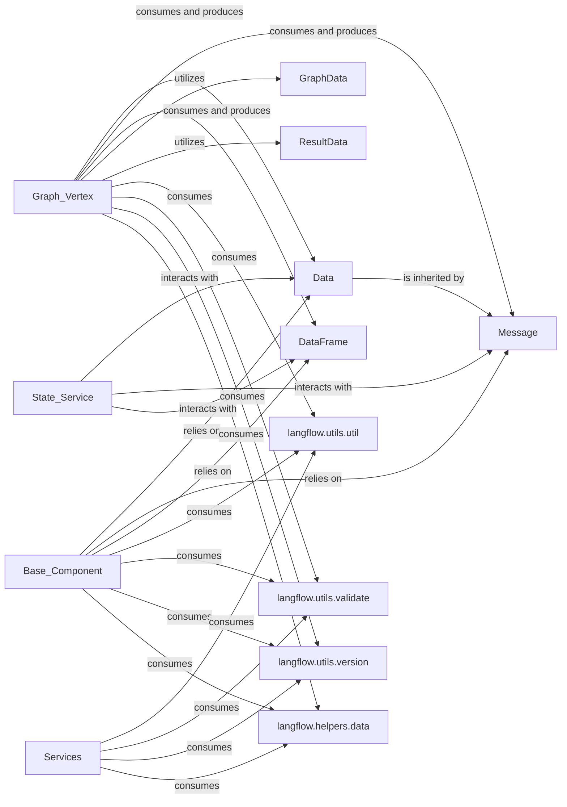

## Component Details

This component defines the standardized data structures and schemas used for communication and processing throughout the entire application. It ensures data consistency and facilitates interoperability between different parts of the system (e.g., Data, Message, DataFrame objects). Additionally, it provides a collection of common, reusable helper functions for data manipulation, validation, version management, and other general-purpose tasks.

### Data
The fundamental abstract base class for all data objects exchanged within Langflow. It provides a common interface and properties for various types of data, ensuring consistency across the system.

**Related Classes/Methods**:

- <a href="https://github.com/langflow-ai/langflow/blob/master/src/backend/base/langflow/schema/data.py#L22-L274" target="_blank" rel="noopener noreferrer">`langflow.schema.data.Data` (22:274)</a>

### Message
A specialized data model inheriting from Data, specifically designed to represent conversational messages. It includes fields for content, sender, and message type, crucial for chat-based interactions.

**Related Classes/Methods**:

- <a href="https://github.com/langflow-ai/langflow/blob/master/src/backend/base/langflow/schema/message.py#L37-L287" target="_blank" rel="noopener noreferrer">`langflow.schema.message.Message` (37:287)</a>

### DataFrame
A data model representing tabular data, similar to a pandas DataFrame. It provides a structured way to handle and process data in rows and columns within Langflow flows.

**Related Classes/Methods**:

- <a href="https://github.com/langflow-ai/langflow/blob/master/src/backend/base/langflow/schema/dataframe.py#L10-L205" target="_blank" rel="noopener noreferrer">`langflow.schema.dataframe.DataFrame` (10:205)</a>

### GraphData
Defines the overall schema for a Langflow graph, including its vertices (components) and edges (connections). It is essential for representing and persisting the structural definition of a user-defined flow.

**Related Classes/Methods**:

- <a href="https://github.com/langflow-ai/langflow/blob/master/src/backend/base/langflow/graph/schema.py#L1-L1" target="_blank" rel="noopener noreferrer">`langflow.graph.schema.GraphData` (1:1)</a>

### ResultData
A schema used to encapsulate the results produced by a component (Vertex) during the execution of a flow. It ensures a standardized format for outputs, facilitating downstream processing.

**Related Classes/Methods**:

- <a href="https://github.com/langflow-ai/langflow/blob/master/src/backend/base/langflow/graph/schema.py#L10-L46" target="_blank" rel="noopener noreferrer">`langflow.graph.schema.ResultData` (10:46)</a>

### langflow.utils.util
A collection of miscellaneous, general-purpose helper functions that provide common functionalities used across different parts of the application, such as data manipulation or type conversions.

**Related Classes/Methods**:

- <a href="https://github.com/langflow-ai/langflow/blob/master/src/backend/base/langflow/utils/util.py#L1-L1" target="_blank" rel="noopener noreferrer">`langflow.utils.util` (1:1)</a>

### langflow.utils.validate
Contains functions specifically designed for validating input data, configurations, or other parameters to ensure they meet required formats and constraints, enhancing system robustness and preventing errors.

**Related Classes/Methods**:

- <a href="https://github.com/langflow-ai/langflow/blob/master/src/backend/base/langflow/utils/validate.py#L1-L1" target="_blank" rel="noopener noreferrer">`langflow.utils.validate` (1:1)</a>

### langflow.utils.version
Provides functionalities related to managing and retrieving version information for the Langflow application or its components, which is important for compatibility checks and system updates.

**Related Classes/Methods**:

- <a href="https://github.com/langflow-ai/langflow/blob/master/src/backend/base/langflow/utils/version.py#L1-L1" target="_blank" rel="noopener noreferrer">`langflow.utils.version` (1:1)</a>

### langflow.helpers.data
A module dedicated to providing helper functions specifically for data-related operations, potentially offering more specialized data processing capabilities beyond general utilities.

**Related Classes/Methods**:

- <a href="https://github.com/langflow-ai/langflow/blob/master/src/backend/base/langflow/helpers/data.py#L1-L1" target="_blank" rel="noopener noreferrer">`langflow.helpers.data` (1:1)</a>

### [FAQ](https://github.com/CodeBoarding/GeneratedOnBoardings/tree/main?tab=readme-ov-file#faq)