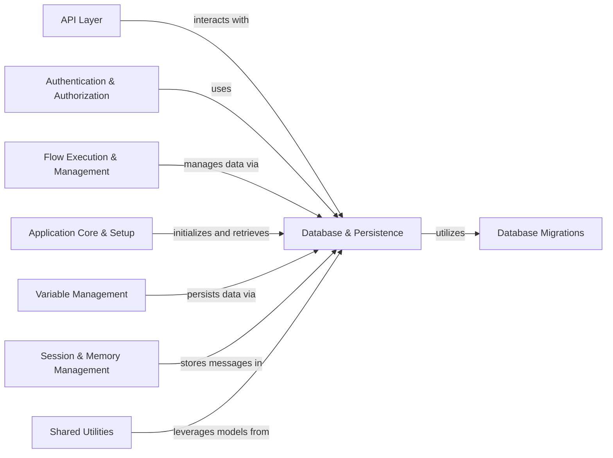

## Component Details

The Database & Persistence component provides the core interface for all data interactions within Langflow. It manages data models for various entities like flows, users, messages, API keys, and other persistent data. This component is also responsible for database connection management, session handling, schema health checks, and orchestrating database migrations. It serves as the central data layer, ensuring data integrity and persistence across the application.

### Database & Persistence
Provides an interface for interacting with the underlying database, handling data models for flows, users, messages, API keys, and other persistent data. It also manages database migrations, database connection management, session handling, and schema health checks.

**Related Classes/Methods**:

- <a href="https://github.com/langflow-ai/langflow/blob/master/src/backend/base/langflow/services/database/service.py#L38-L482" target="_blank" rel="noopener noreferrer">`langflow.services.database.service.DatabaseService` (38:482)</a>
- `langflow.services.database.factory` (full file reference)
- `langflow.services.database.utils` (full file reference)
- `langflow.services.database.models.flow.model` (full file reference)
- `langflow.services.database.models.transactions.crud` (full file reference)
- `langflow.services.database.models.transactions.model` (full file reference)
- `langflow.services.database.models.vertex_builds.crud` (full file reference)
- `langflow.services.database.models.vertex_builds.model` (full file reference)
- `langflow.services.database.models.api_key.crud` (full file reference)
- `langflow.services.database.models.api_key.model` (full file reference)
- `langflow.services.database.models.message.crud` (full file reference)
- `langflow.services.database.models.message.model` (full file reference)
- `langflow.services.database.models.folder.utils` (full file reference)
- `langflow.services.database.models.user.crud` (full file reference)
- `langflow.services.database.models.user.model` (full file reference)
- `langflow.services.database.models.file.model` (full file reference)
- `langflow.services.database.models.variable.model` (full file reference)
- `src.backend.base.langflow.alembic.env` (full file reference)
- `langflow.utils.migration` (full file reference)

### API Layer
Exposes the core functionalities of Langflow through various API endpoints, handling incoming HTTP requests, routing them to appropriate handlers, and returning responses.

**Related Classes/Methods**:

- `langflow.src.backend.base.langflow.api.v1.mcp` (full file reference)
- `langflow.src.backend.base.langflow.api.v1.voice_mode` (full file reference)
- `langflow.src.backend.base.langflow.api.v1.projects` (full file reference)
- `langflow.src.backend.base.langflow.api.v1.users` (full file reference)
- `langflow.src.backend.base.langflow.api.v1.api_key` (full file reference)
- `langflow.src.backend.base.langflow.api.v1.monitor` (full file reference)
- `langflow.src.backend.base.langflow.api.v1.flows` (full file reference)
- `langflow.src.backend.base.langflow.api.v1.login` (full file reference)
- `langflow.src.backend.base.langflow.api.v1.mcp_projects` (full file reference)
- `langflow.src.backend.base.langflow.api.v2.files` (full file reference)

### Authentication & Authorization
Responsible for user authentication, API key validation, and managing user permissions, handling login processes and token generation.

**Related Classes/Methods**:

- `langflow.src.backend.base.langflow.services.auth.utils` (full file reference)

### Flow Execution & Management
Provides functionalities for managing Langflow flows, including creating, retrieving, updating, and deleting flows, and encompasses the logic for running and executing flows.

**Related Classes/Methods**:

- `langflow.src.backend.base.langflow.helpers.flow` (full file reference)
- `langflow.src.backend.base.langflow.services.flow.flow_runner` (full file reference)
- `langflow.src.backend.base.langflow.services.task.temp_flow_cleanup` (full file reference)

### Application Core & Setup
Contains the main entry points for the Langflow application, handles initial setup procedures like superuser creation and default folder setup, and provides general utility functions for service initialization and teardown.

**Related Classes/Methods**:

- `langflow.src.backend.base.langflow.__main__` (full file reference)
- `langflow.src.backend.base.langflow.initial_setup.setup` (full file reference)
- `langflow.src.backend.base.langflow.services.utils` (full file reference)
- `langflow.src.backend.base.langflow.services.deps` (full file reference)

### Variable Management
Responsible for managing variables within Langflow, including their creation, retrieval, and updates, and handles the encryption and decryption of sensitive variable data.

**Related Classes/Methods**:

- `langflow.src.backend.base.langflow.services.variable.service` (full file reference)
- `langflow.src.backend.base.langflow.services.variable.factory` (full file reference)

### Session & Memory Management
Handles the storage, retrieval, and management of messages within Langflow sessions, providing functionalities for adding, updating, and deleting messages.

**Related Classes/Methods**:

- `langflow.src.backend.base.langflow.memory` (full file reference)

### Shared Utilities
Provides common utility functions and helper classes that are utilized across various parts of the Langflow system, including serialization, asynchronous helpers, and graph-related logging.

**Related Classes/Methods**:

- `langflow.serialization.serialization` (full file reference)
- `langflow.schema.data` (full file reference)
- `langflow.utils.async_helpers` (full file reference)
- `langflow.src.backend.base.langflow.graph.utils` (full file reference)

### Database Migrations
Manages the evolution of the database schema using Alembic, including scripts and utilities for applying and reverting database migrations.

**Related Classes/Methods**:

- `src.backend.base.langflow.alembic.env` (full file reference)
- `src.backend.base.langflow.alembic.versions.e5a65ecff2cd_nullable_in_vertex_build` (full file reference)
- `src.backend.base.langflow.alembic.versions.d2d475a1f7c0_add_tags_column_to_flow` (full file reference)
- `src.backend.base.langflow.alembic.versions.0ae3a2674f32_update_the_columns_that_need_to_change_` (full file reference)
- `src.backend.base.langflow.alembic.versions.58b28437a398_modify_nullable` (full file reference)
- `src.backend.base.langflow.alembic.versions.1d90f8a0efe1_update_description_columns_type` (full file reference)
- `src.backend.base.langflow.alembic.versions.d066bfd22890_add_message_table` (full file reference)
- `src.backend.base.langflow.alembic.versions.90be8e2ed91e_create_transactions_table` (full file reference)
- `langflow.src.backend.base.langflow.alembic.versions.f3b2d1f1002d_add_column_access_type_to_flow` (full file reference)
- `langflow.src.backend.base.langflow.alembic.versions.dd9e0804ebd1_add_v2_file_table` (full file reference)
- `langflow.src.backend.base.langflow.alembic.versions.1b8b740a6fa3_remove_fk_constraint_in_message_` (full file reference)
- `langflow.src.backend.base.langflow.alembic.versions.1ef9c4f3765d_` (full file reference)
- `langflow.src.backend.base.langflow.alembic.versions.d3dbf656a499_add_gradient_column_in_flow` (full file reference)
- `langflow.src.backend.base.langflow.alembic.versions.e56d87f8994a_add_optins_column_to_user` (full file reference)
- `langflow.src.backend.base.langflow.alembic.versions.0d60fcbd4e8e_create_vertex_builds_table` (full file reference)
- `langflow.utils.migration` (full file reference)

### [FAQ](https://github.com/CodeBoarding/GeneratedOnBoardings/tree/main?tab=readme-ov-file#faq)