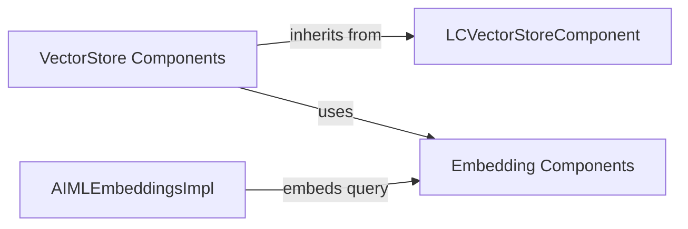

## Component Details

The External Resource Integration component provides a unified interface for interacting with external resources like vector stores and language models. It abstracts the complexities of connecting to and querying these resources, allowing Langflow applications to easily perform similarity searches and generate text using different LLMs and vector databases. The main flow involves selecting a specific vector store or LLM component, configuring its parameters, and then using it to perform operations like storing data, searching for similar documents, or generating text. This component simplifies the integration of external resources into Langflow applications.

### LCVectorStoreComponent
LCVectorStoreComponent serves as the abstract base class for all vector store components within Langflow. It defines the common interface and functionalities expected from a vector store, such as adding documents, performing similarity searches, and converting the store to a dataframe. Concrete vector store implementations inherit from this class and provide specific implementations for interacting with different vector store backends.
- **Related Classes/Methods**: `langflow.src.backend.base.langflow.base.vectorstores.model.LCVectorStoreComponent`

### VectorStore Components
VectorStore Components are concrete implementations of LCVectorStoreComponent for specific vector store backends like AstraDB, Pinecone, Elasticsearch, etc. Each component handles the connection, data storage, and search operations specific to its backend. They provide methods for adding documents, performing similarity searches, and retrieving results from the vector store. These components allow Langflow to interact with a variety of vector databases in a consistent manner.
- **Related Classes/Methods**: `langflow.src.backend.base.langflow.components.vectorstores.astradb.AstraDBVectorStoreComponent`, `langflow.src.backend.base.langflow.components.vectorstores.pinecone.PineconeVectorStoreComponent`, `langflow.src.backend.base.langflow.components.vectorstores.elasticsearch.ElasticsearchVectorStoreComponent`, `langflow.src.backend.base.langflow.components.vectorstores.local_db.LocalDBComponent`, `langflow.src.backend.base.langflow.components.vectorstores.milvus.MilvusVectorStoreComponent`, `langflow.src.backend.base.langflow.components.vectorstores.opensearch.OpenSearchVectorStoreComponent`, `langflow.src.backend.base.langflow.components.vectorstores.supabase.SupabaseVectorStoreComponent`, `langflow.src.backend.base.langflow.components.vectorstores.upstash.UpstashVectorStoreComponent`, `langflow.src.backend.base.langflow.components.vectorstores.faiss.FaissVectorStoreComponent`, `langflow.src.backend.base.langflow.components.vectorstores.clickhouse.ClickhouseVectorStoreComponent`, `langflow.src.backend.base.langflow.components.vectorstores.weaviate.WeaviateVectorStoreComponent`, `langflow.src.backend.base.langflow.components.vectorstores.chroma.ChromaVectorStoreComponent`, `langflow.src.backend.base.langflow.components.vectorstores.astradb_graph.AstraDBGraphVectorStoreComponent`, `langflow.src.backend.base.langflow.components.vectorstores.vectara.VectaraVectorStoreComponent`, `langflow.src.backend.base.langflow.components.vectorstores.redis.RedisVectorStoreComponent`, `langflow.src.backend.base.langflow.components.vectorstores.qdrant.QdrantVectorStoreComponent`, `langflow.src.backend.base.langflow.components.vectorstores.couchbase.CouchbaseVectorStoreComponent`, `langflow.src.backend.base.langflow.components.vectorstores.cassandra.CassandraVectorStoreComponent`, `langflow.src.backend.base.langflow.components.vectorstores.pgvector.PGVectorStoreComponent`, `langflow.src.backend.base.langflow.components.vectorstores.mongodb_atlas.MongoVectorStoreComponent`, `langflow.src.backend.base.langflow.components.vectorstores.cassandra_graph.CassandraGraphVectorStoreComponent`, `langflow.src.backend.base.langflow.components.vectorstores.hcd.HCDVectorStoreComponent`

### Embedding Components
Embedding Components are responsible for generating vector embeddings from text. These embeddings are used to represent documents and queries in a vector space, enabling similarity searches. They provide a common interface for different embedding models, such as those from Google, Hugging Face, and NVIDIA. These components take text as input and output a vector representation that can be used for similarity comparisons.
- **Related Classes/Methods**: `langflow.src.backend.base.langflow.components.embeddings.google_generative_ai.GoogleGenerativeAIEmbeddingsComponent`, `langflow.src.backend.base.langflow.components.embeddings.huggingface_inference_api.HuggingFaceInferenceAPIEmbeddingsComponent`, `langflow.src.backend.base.langflow.components.embeddings.nvidia.NVIDIAEmbeddingsComponent`, `langflow.src.backend.base.langflow.components.embeddings.lmstudioembeddings.LMStudioEmbeddingsComponent`, `langflow.src.backend.base.langflow.components.embeddings.ollama.OllamaEmbeddingsComponent`, `langflow.src.backend.base.langflow.components.embeddings.watsonx.WatsonxEmbeddingsComponent`, `langflow.src.backend.base.langflow.components.embeddings.cohere.CohereEmbeddingsComponent`, `langflow.src.backend.base.langflow.components.embeddings.aiml.AIMLEmbeddingsComponent`, `langflow.src.backend.base.langflow.components.embeddings.text_embedder.TextEmbedderComponent`, `langflow.src.backend.base.langflow.components.embeddings.similarity.EmbeddingSimilarityComponent`, `langflow.src.backend.base.langflow.components.twelvelabs.video_embeddings.TwelveLabsVideoEmbeddings`, `langflow.src.backend.base.langflow.components.twelvelabs.video_embeddings.TwelveLabsVideoEmbeddingsComponent`, `langflow.src.backend.base.langflow.components.twelvelabs.text_embeddings.TwelveLabsTextEmbeddingsComponent`

### AIMLEmbeddingsImpl
AIMLEmbeddingsImpl is a specific implementation of embeddings using the AIML model. It provides the functionality to generate embeddings from text using the AIML model. This component is used when AIML embeddings are selected for a particular task.
- **Related Classes/Methods**: `langflow.src.backend.base.langflow.base.embeddings.aiml_embeddings.AIMLEmbeddingsImpl`
