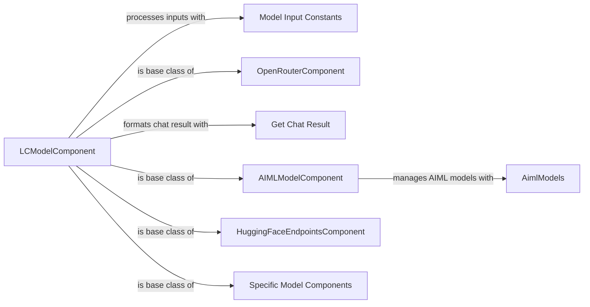

## Component Details

### LCModelComponent
LCModelComponent serves as the base class for all LangChain model components within Langflow. It provides a standardized interface for building language models, handling results, and managing exceptions. It interacts with various language model providers, offering common logic for different model types and ensuring consistent behavior across integrations.
- **Related Classes/Methods**: `repos.langflow.src.backend.base.langflow.base.models.model.LCModelComponent`, `repos.langflow.src.backend.base.langflow.components.models.model.LCModelComponent`

### Model Input Constants
The `model_input_constants` module provides constants and functions for processing input fields for different language models, including OpenAI, Google, and Azure. It allows LCModelComponent and its subclasses to dynamically adjust the input fields based on the selected model, ensuring that the correct parameters are passed to each language model provider.
- **Related Classes/Methods**: `repos.langflow.src.backend.base.langflow.components.models.model_input_constants`

### OpenRouterComponent
The OpenRouterComponent is responsible for integrating with the OpenRouter API to fetch and build language models. It fetches available models from OpenRouter, allowing users to select and configure them within Langflow. It inherits from LCModelComponent, leveraging its base functionality for building and managing language models.
- **Related Classes/Methods**: `repos.langflow.src.backend.base.langflow.components.models.openrouter.OpenRouterComponent`

### Get Chat Result
The `get_chat_result` function is used to build messages and runnables for chat models. It takes the model's response and formats it into a Langflow Message object, ensuring a standardized output format for chat models. It is used by LCModelComponent and its subclasses to process and format the output of chat models.
- **Related Classes/Methods**: `repos.langflow.src.backend.base.langflow.components.models.chat_result:get_chat_result`

### AIMLModelComponent
The AIMLModelComponent enables the integration of AIML models into Langflow. It allows users to load and interact with AIML models within the Langflow environment. Inheriting from LCModelComponent, it utilizes the base class's functionalities for model management and interaction.
- **Related Classes/Methods**: `repos.langflow.src.backend.base.langflow.components.models.aiml.AIMLModelComponent`

### AimlModels
The AimlModels module provides functionalities to retrieve and manage AIML models. It is used by AIMLModelComponent to load and manage AIML models, providing a centralized location for accessing and managing AIML model resources.
- **Related Classes/Methods**: `repos.langflow.src.backend.base.langflow.components.models.aiml_constants.AimlModels`

### HuggingFaceEndpointsComponent
The HuggingFaceEndpointsComponent is responsible for creating and managing Hugging Face endpoints within Langflow. It allows users to create and configure endpoints for Hugging Face models, enabling seamless integration with the Hugging Face ecosystem. It inherits from LCModelComponent.
- **Related Classes/Methods**: `repos.langflow.src.backend.base.langflow.components.models.huggingface.HuggingFaceEndpointsComponent`

### Specific Model Components
These components (GroqModel, GoogleGenerativeAIComponent, AnthropicModelComponent, ChatOllamaComponent, LMStudioModelComponent, WatsonxAIComponent, NovitaModelComponent, XAIModelComponent, DeepSeekModelComponent, NVIDIAModelComponent) are responsible for interacting with their respective model providers. They allow users to select and configure models from these providers within Langflow. They inherit from LCModelComponent.
- **Related Classes/Methods**: `repos.langflow.src.backend.base.langflow.components.models.groq.GroqModel`, `repos.langflow.src.backend.base.langflow.components.models.google_generative_ai.GoogleGenerativeAIComponent`, `repos.langflow.src.backend.base.langflow.components.models.anthropic.AnthropicModelComponent`, `repos.langflow.src.backend.base.langflow.components.models.ollama.ChatOllamaComponent`, `repos.langflow.src.backend.base.langflow.components.models.lmstudiomodel.LMStudioModelComponent`, `repos.langflow.src.backend.base.langflow.components.models.watsonx.WatsonxAIComponent`, `repos.langflow.src.backend.base.langflow.components.models.novita.NovitaModelComponent`, `repos.langflow.src.backend.base.langflow.components.models.xai.XAIModelComponent`, `repos.langflow.src.backend.base.langflow.components.models.deepseek.DeepSeekModelComponent`, `repos.langflow.src.backend.base.langflow.components.models.nvidia.NVIDIAModelComponent`
