```mermaid
graph LR
    LangflowRunnerExperimental["LangflowRunnerExperimental"]
    Flow_Processor["Flow Processor"]
    Graph["Graph"]
    Vertex["Vertex"]
    GraphStateManager["GraphStateManager"]
    Flow_Loader["Flow Loader"]
    Component_Instantiator["Component Instantiator"]
    SessionService["SessionService"]
    Dependency_Injector["Dependency Injector"]
    API_Endpoints["API Endpoints"]
    API_Flow_Builder["API Flow Builder"]
    Message_Schema["Message Schema"]
    API_Endpoints -- "initiates" --> LangflowRunnerExperimental
    API_Endpoints -- "initiates" --> Flow_Processor
    API_Endpoints -- "utilizes" --> API_Flow_Builder
    LangflowRunnerExperimental -- "loads flow via" --> Flow_Loader
    LangflowRunnerExperimental -- "executes graph via" --> Flow_Processor
    LangflowRunnerExperimental -- "manages sessions with" --> SessionService
    LangflowRunnerExperimental -- "retrieves services from" --> Dependency_Injector
    LangflowRunnerExperimental -- "constructs" --> Graph
    Flow_Loader -- "preprocesses with" --> Flow_Processor
    Flow_Loader -- "creates" --> Graph
    Graph -- "composes" --> Vertex
    Graph -- "orchestrates execution with" --> RunnableVerticesManager
    Graph -- "manages state with" --> GraphStateManager
    Graph -- "accesses services via" --> Dependency_Injector
    Graph -- "builds instances of" --> Vertex
    Vertex -- "instantiates components using" --> Component_Instantiator
    Vertex -- "handles parameters with" --> ParameterHandler
    Vertex -- "updates state in" --> Graph
    Vertex -- "produces" --> Data_Schema
    Vertex -- "produces" --> Message_Schema
    Component_Instantiator -- "evaluates code using" --> Custom_Component_Evaluator
    Component_Instantiator -- "retrieves services from" --> Dependency_Injector
    GraphStateManager -- "relies on" --> Dependency_Injector
    GraphStateManager -- "implements state with" --> InMemoryStateService
    SessionService -- "uses" --> Dependency_Injector
    ParameterHandler -- "uses" --> Dependency_Injector
    ParameterHandler -- "processes" --> Data_Schema
    API_Flow_Builder -- "orchestrates building of" --> Graph
    API_Flow_Builder -- "retrieves services from" --> Dependency_Injector
    API_Flow_Builder -- "generates" --> Message_Schema
    API_Flow_Builder -- "processes" --> InputValue
    Flow_Processor -- "processes" --> InputValue
    Flow_Processor -- "executes" --> Graph
    Flow_Processor -- "retrieves settings from" --> Dependency_Injector
    Message_Schema -- "extends" --> Data_Schema
    Data_Schema -- "converts to/from" --> Message_Schema
    InputValue -- "defines flow inputs for" --> API_Endpoints
    InputValue -- "defines flow inputs for" --> Flow_Processor
```

## Component Details

The Flow Execution & Orchestration subsystem is responsible for the entire lifecycle of an AI flow, from loading and preprocessing to execution and state management. The `LangflowRunnerExperimental` acts as the primary orchestrator, initiating flow runs, managing sessions, and interacting with the database. It leverages the `Flow Loader` to deserialize flow definitions and the `Flow Processor` to apply necessary transformations and execute the core graph logic. The `Graph` component, composed of `Vertex` objects, represents the flow's structure and manages its execution order with the help of the `RunnableVerticesManager`. State persistence is handled by the `GraphStateManager`, which utilizes the `InMemoryStateService` for in-memory storage. `Component Instantiator` dynamically creates components, potentially evaluating custom code via the `Custom Component Evaluator`. `ParameterHandler` ensures correct input processing for vertices. `SessionService` manages user sessions, and the `Dependency Injector` provides a centralized mechanism for accessing various services. `API Endpoints` expose the functionality to external systems, and the `API Flow Builder` orchestrates the API-driven flow execution. `Message Schema` and `Data Schema` define the data structures for communication and data transfer within the system, with `Message Schema` extending `Data Schema`.

### LangflowRunnerExperimental
The top-level orchestrator that initiates and manages entire AI flow runs. It handles loading flow definitions, setting up the graph, adding flows to the database, and executing the graph. It also manages session IDs and clears flow states.

**Related Classes/Methods**:

- <a href="https://github.com/langflow-ai/langflow/blob/master/src/backend/base/langflow/services/flow/flow_runner.py#L41-L65" target="_blank" rel="noopener noreferrer">`langflow.services.flow.flow_runner.LangflowRunnerExperimental.run` (41:65)</a>
- <a href="https://github.com/langflow-ai/langflow/blob/master/src/backend/base/langflow/services/flow/flow_runner.py#L132-L141" target="_blank" rel="noopener noreferrer">`langflow.services.flow.flow_runner.LangflowRunnerExperimental.get_flow_dict` (132:141)</a>
- <a href="https://github.com/langflow-ai/langflow/blob/master/src/backend/base/langflow/services/flow/flow_runner.py#L68-L69" target="_blank" rel="noopener noreferrer">`langflow.services.flow.flow_runner.LangflowRunnerExperimental.set_flow_id` (68:69)</a>
- <a href="https://github.com/langflow-ai/langflow/blob/master/src/backend/base/langflow/services/flow/flow_runner.py#L72-L76" target="_blank" rel="noopener noreferrer">`langflow.services.flow.flow_runner.LangflowRunnerExperimental.add_flow_to_db` (72:76)</a>
- <a href="https://github.com/langflow-ai/langflow/blob/master/src/backend/base/langflow/services/flow/flow_runner.py#L164-L180" target="_blank" rel="noopener noreferrer">`langflow.services.flow.flow_runner.LangflowRunnerExperimental.modification` (164:180)</a>
- <a href="https://github.com/langflow-ai/langflow/blob/master/src/backend/base/langflow/services/flow/flow_runner.py#L103-L112" target="_blank" rel="noopener noreferrer">`langflow.services.flow.flow_runner.LangflowRunnerExperimental.clear_flow_state` (103:112)</a>
- <a href="https://github.com/langflow-ai/langflow/blob/master/src/backend/base/langflow/services/flow/flow_runner.py#L93-L100" target="_blank" rel="noopener noreferrer">`langflow.services.flow.flow_runner.LangflowRunnerExperimental.create_graph_from_flow` (93:100)</a>
- <a href="https://github.com/langflow-ai/langflow/blob/master/src/backend/base/langflow/services/flow/flow_runner.py#L79-L90" target="_blank" rel="noopener noreferrer">`langflow.services.flow.flow_runner.LangflowRunnerExperimental.run_graph` (79:90)</a>
- <a href="https://github.com/langflow-ai/langflow/blob/master/src/backend/base/langflow/services/flow/flow_runner.py#L114-L119" target="_blank" rel="noopener noreferrer">`langflow.services.flow.flow_runner.LangflowRunnerExperimental.init_db_if_needed` (114:119)</a>
- <a href="https://github.com/langflow-ai/langflow/blob/master/src/backend/base/langflow/services/flow/flow_runner.py#L122-L129" target="_blank" rel="noopener noreferrer">`langflow.services.flow.flow_runner.LangflowRunnerExperimental.database_exists_check` (122:129)</a>

### Flow Processor
Contains core logic for running the graph and applying preprocessing steps (tweaks) to the flow definition before execution. It orchestrates the internal graph execution by interacting with the Graph component.

**Related Classes/Methods**:

- <a href="https://github.com/langflow-ai/langflow/blob/master/src/backend/base/langflow/processing/process.py#L26-L62" target="_blank" rel="noopener noreferrer">`langflow.processing.process.run_graph_internal` (26:62)</a>
- <a href="https://github.com/langflow-ai/langflow/blob/master/src/backend/base/langflow/processing/process.py#L65-L121" target="_blank" rel="noopener noreferrer">`langflow.processing.process.run_graph` (65:121)</a>
- <a href="https://github.com/langflow-ai/langflow/blob/master/src/backend/base/langflow/processing/process.py#L124-L137" target="_blank" rel="noopener noreferrer">`langflow.processing.process.validate_input` (124:137)</a>
- <a href="https://github.com/langflow-ai/langflow/blob/master/src/backend/base/langflow/processing/process.py#L140-L160" target="_blank" rel="noopener noreferrer">`langflow.processing.process.apply_tweaks` (140:160)</a>
- <a href="https://github.com/langflow-ai/langflow/blob/master/src/backend/base/langflow/processing/process.py#L163-L166" target="_blank" rel="noopener noreferrer">`langflow.processing.process.apply_tweaks_on_vertex` (163:166)</a>
- <a href="https://github.com/langflow-ai/langflow/blob/master/src/backend/base/langflow/processing/process.py#L169-L201" target="_blank" rel="noopener noreferrer">`langflow.processing.process.process_tweaks` (169:201)</a>
- <a href="https://github.com/langflow-ai/langflow/blob/master/src/backend/base/langflow/processing/process.py#L204-L213" target="_blank" rel="noopener noreferrer">`langflow.processing.process.process_tweaks_on_graph` (204:213)</a>

### Graph
The central data structure representing the AI flow as a directed graph of interconnected components (vertices). It manages graph initialization, the execution loop, state updates, and topological sorting of vertices to determine execution order.

**Related Classes/Methods**:

- <a href="https://github.com/langflow-ai/langflow/blob/master/src/backend/base/langflow/graph/graph/base.py#L63-L151" target="_blank" rel="noopener noreferrer">`langflow.graph.graph.base.Graph.__init__` (63:151)</a>
- <a href="https://github.com/langflow-ai/langflow/blob/master/src/backend/base/langflow/graph/graph/base.py#L207-L214" target="_blank" rel="noopener noreferrer">`langflow.graph.graph.base.Graph.dumps` (207:214)</a>
- <a href="https://github.com/langflow-ai/langflow/blob/master/src/backend/base/langflow/graph/graph/base.py#L216-L240" target="_blank" rel="noopener noreferrer">`langflow.graph.graph.base.Graph.dump` (216:240)</a>
- <a href="https://github.com/langflow-ai/langflow/blob/master/src/backend/base/langflow/graph/graph/base.py#L242-L256" target="_blank" rel="noopener noreferrer">`langflow.graph.graph.base.Graph.add_nodes_and_edges` (242:256)</a>
- <a href="https://github.com/langflow-ai/langflow/blob/master/src/backend/base/langflow/graph/graph/base.py#L258-L279" target="_blank" rel="noopener noreferrer">`langflow.graph.graph.base.Graph.add_component` (258:279)</a>
- <a href="https://github.com/langflow-ai/langflow/blob/master/src/backend/base/langflow/graph/graph/base.py#L291-L339" target="_blank" rel="noopener noreferrer">`langflow.graph.graph.base.Graph.add_component_edge` (291:339)</a>
- <a href="https://github.com/langflow-ai/langflow/blob/master/src/backend/base/langflow/graph/graph/base.py#L341-L372" target="_blank" rel="noopener noreferrer">`langflow.graph.graph.base.Graph.async_start` (341:372)</a>
- <a href="https://github.com/langflow-ai/langflow/blob/master/src/backend/base/langflow/graph/graph/base.py#L391-L472" target="_blank" rel="noopener noreferrer">`langflow.graph.graph.base.Graph.start` (391:472)</a>
- <a href="https://github.com/langflow-ai/langflow/blob/master/src/backend/base/langflow/graph/graph/base.py#L486-L490" target="_blank" rel="noopener noreferrer">`langflow.graph.graph.base.Graph.add_edge` (486:490)</a>
- <a href="https://github.com/langflow-ai/langflow/blob/master/src/backend/base/langflow/graph/graph/base.py#L492-L495" target="_blank" rel="noopener noreferrer">`langflow.graph.graph.base.Graph.initialize` (492:495)</a>
- <a href="https://github.com/langflow-ai/langflow/blob/master/src/backend/base/langflow/graph/graph/base.py#L497-L506" target="_blank" rel="noopener noreferrer">`langflow.graph.graph.base.Graph.get_state` (497:506)</a>
- <a href="https://github.com/langflow-ai/langflow/blob/master/src/backend/base/langflow/graph/graph/base.py#L508-L523" target="_blank" rel="noopener noreferrer">`langflow.graph.graph.base.Graph.update_state` (508:523)</a>
- <a href="https://github.com/langflow-ai/langflow/blob/master/src/backend/base/langflow/graph/graph/base.py#L525-L572" target="_blank" rel="noopener noreferrer">`langflow.graph.graph.base.Graph.activate_state_vertices` (525:572)</a>
- <a href="https://github.com/langflow-ai/langflow/blob/master/src/backend/base/langflow/graph/graph/base.py#L574-L576" target="_blank" rel="noopener noreferrer">`langflow.graph.graph.base.Graph.reset_activated_vertices` (574:576)</a>
- <a href="https://github.com/langflow-ai/langflow/blob/master/src/backend/base/langflow/graph/graph/base.py#L578-L589" target="_blank" rel="noopener noreferrer">`langflow.graph.graph.base.Graph.append_state` (578:589)</a>
- <a href="https://github.com/langflow-ai/langflow/blob/master/src/backend/base/langflow/graph/graph/base.py#L591-L609" target="_blank" rel="noopener noreferrer">`langflow.graph.graph.base.Graph.validate_stream` (591:609)</a>
- <a href="https://github.com/langflow-ai/langflow/blob/master/src/backend/base/langflow/graph/graph/base.py#L644-L653" target="_blank" rel="noopener noreferrer">`langflow.graph.graph.base.Graph.set_run_id` (644:653)</a>
- <a href="https://github.com/langflow-ai/langflow/blob/master/src/backend/base/langflow/graph/graph/base.py#L655-L665" target="_blank" rel="noopener noreferrer">`langflow.graph.graph.base.Graph.initialize_run` (655:665)</a>
- <a href="https://github.com/langflow-ai/langflow/blob/master/src/backend/base/langflow/graph/graph/base.py#L685-L692" target="_blank" rel="noopener noreferrer">`langflow.graph.graph.base.Graph.end_all_traces` (685:692)</a>
- <a href="https://github.com/langflow-ai/langflow/blob/master/src/backend/base/langflow/graph/graph/base.py#L904-L915" target="_blank" rel="noopener noreferrer">`langflow.graph.graph.base.Graph.build_graph_maps` (904:915)</a>
- <a href="https://github.com/langflow-ai/langflow/blob/master/src/backend/base/langflow/graph/graph/base.py#L917-L922" target="_blank" rel="noopener noreferrer">`langflow.graph.graph.base.Graph.reset_inactivated_vertices` (917:922)</a>
- <a href="https://github.com/langflow-ai/langflow/blob/master/src/backend/base/langflow/graph/graph/base.py#L924-L927" target="_blank" rel="noopener noreferrer">`langflow.graph.graph.base.Graph.mark_all_vertices` (924:927)</a>
- <a href="https://github.com/langflow-ai/langflow/blob/master/src/backend/base/langflow/graph/graph/base.py#L929-L934" target="_blank" rel="noopener noreferrer">`langflow.graph.graph.base.Graph.mark_vertex` (929:934)</a>
- <a href="https://github.com/langflow-ai/langflow/blob/master/src/backend/base/langflow/graph/graph/base.py#L957-L963" target="_blank" rel="noopener noreferrer">`langflow.graph.graph.base.Graph.mark_branch` (957:963)</a>
- <a href="https://github.com/langflow-ai/langflow/blob/master/src/backend/base/langflow/graph/graph/base.py#L965-L970" target="_blank" rel="noopener noreferrer">`langflow.graph.graph.base.Graph.get_edge` (965:970)</a>
- <a href="https://github.com/langflow-ai/langflow/blob/master/src/backend/base/langflow/graph/graph/base.py#L972-L976" target="_blank" rel="noopener noreferrer">`langflow.graph.graph.base.Graph.build_parent_child_map` (972:976)</a>
- <a href="https://github.com/langflow-ai/langflow/blob/master/src/backend/base/langflow/graph/graph/base.py#L978-L979" target="_blank" rel="noopener noreferrer">`langflow.graph.graph.base.Graph.increment_run_count` (978:979)</a>
- <a href="https://github.com/langflow-ai/langflow/blob/master/src/backend/base/langflow/graph/graph/base.py#L981-L982" target="_blank" rel="noopener noreferrer">`langflow.graph.graph.base.Graph.increment_update_count` (981:982)</a>
- <a href="https://github.com/langflow-ai/langflow/blob/master/src/backend/base/langflow/graph/graph/base.py#L1064-L1098" target="_blank" rel="noopener noreferrer">`langflow.graph.graph.base.Graph.from_payload` (1064:1098)</a>
- <a href="https://github.com/langflow-ai/langflow/blob/master/src/backend/base/langflow/graph/graph/base.py#L1134-L1180" target="_blank" rel="noopener noreferrer">`langflow.graph.graph.base.Graph.update` (1134:1180)</a>
- <a href="https://github.com/langflow-ai/langflow/blob/master/src/backend/base/langflow/graph/graph/base.py#L1182-L1203" target="_blank" rel="noopener noreferrer">`langflow.graph.graph.base.Graph.update_vertex_from_another` (1182:1203)</a>
- <a href="https://github.com/langflow-ai/langflow/blob/master/src/backend/base/langflow/graph/graph/base.py#L1265-L1272" target="_blank" rel="noopener noreferrer">`langflow.graph.graph.base.Graph.remove_vertex` (1265:1272)</a>
- <a href="https://github.com/langflow-ai/langflow/blob/master/src/backend/base/langflow/graph/graph/base.py#L1315-L1351" target="_blank" rel="noopener noreferrer">`langflow.graph.graph.base.Graph.astep` (1315:1351)</a>
- <a href="https://github.com/langflow-ai/langflow/blob/master/src/backend/base/langflow/graph/graph/base.py#L1370-L1387" target="_blank" rel="noopener noreferrer">`langflow.graph.graph.base.Graph.step` (1370:1387)</a>
- <a href="https://github.com/langflow-ai/langflow/blob/master/src/backend/base/langflow/graph/graph/base.py#L1389-L1492" target="_blank" rel="noopener noreferrer">`langflow.graph.graph.base.Graph.build_vertex` (1389:1492)</a>
- <a href="https://github.com/langflow-ai/langflow/blob/master/src/backend/base/langflow/graph/graph/base.py#L1494-L1509" target="_blank" rel="noopener noreferrer">`langflow.graph.graph.base.Graph.get_vertex_edges` (1494:1509)</a>
- <a href="https://github.com/langflow-ai/langflow/blob/master/src/backend/base/langflow/graph/graph/base.py#L1511-L1520" target="_blank" rel="noopener noreferrer">`langflow.graph.graph.base.Graph.get_vertices_with_target` (1511:1520)</a>
- <a href="https://github.com/langflow-ai/langflow/blob/master/src/backend/base/langflow/graph/graph/base.py#L1522-L1573" target="_blank" rel="noopener noreferrer">`langflow.graph.graph.base.Graph.process` (1522:1573)</a>
- <a href="https://github.com/langflow-ai/langflow/blob/master/src/backend/base/langflow/graph/graph/base.py#L1575-L1583" target="_blank" rel="noopener noreferrer">`langflow.graph.graph.base.Graph.find_next_runnable_vertices` (1575:1583)</a>
- <a href="https://github.com/langflow-ai/langflow/blob/master/src/backend/base/langflow/graph/graph/base.py#L1585-L1601" target="_blank" rel="noopener noreferrer">`langflow.graph.graph.base.Graph.get_next_runnable_vertices` (1585:1601)</a>
- <a href="https://github.com/langflow-ai/langflow/blob/master/src/backend/base/langflow/graph/graph/base.py#L1710-L1741" target="_blank" rel="noopener noreferrer">`langflow.graph.graph.base.Graph.topological_sort` (1710:1741)</a>
- <a href="https://github.com/langflow-ai/langflow/blob/master/src/backend/base/langflow/graph/graph/base.py#L1743-L1747" target="_blank" rel="noopener noreferrer">`langflow.graph.graph.base.Graph.generator_build` (1743:1747)</a>
- <a href="https://github.com/langflow-ai/langflow/blob/master/src/backend/base/langflow/graph/graph/base.py#L1749-L1751" target="_blank" rel="noopener noreferrer">`langflow.graph.graph.base.Graph.get_predecessors` (1749:1751)</a>
- <a href="https://github.com/langflow-ai/langflow/blob/master/src/backend/base/langflow/graph/graph/base.py#L1753-L1784" target="_blank" rel="noopener noreferrer">`langflow.graph.graph.base.Graph.get_all_successors` (1753:1784)</a>
- <a href="https://github.com/langflow-ai/langflow/blob/master/src/backend/base/langflow/graph/graph/base.py#L1786-L1788" target="_blank" rel="noopener noreferrer">`langflow.graph.graph.base.Graph.get_successors` (1786:1788)</a>
- <a href="https://github.com/langflow-ai/langflow/blob/master/src/backend/base/langflow/graph/graph/base.py#L1790-L1808" target="_blank" rel="noopener noreferrer">`langflow.graph.graph.base.Graph.get_vertex_neighbors` (1790:1808)</a>
- <a href="https://github.com/langflow-ai/langflow/blob/master/src/backend/base/langflow/graph/graph/base.py#L1841-L1855" target="_blank" rel="noopener noreferrer">`langflow.graph.graph.base.Graph.build_edge` (1841:1855)</a>
- <a href="https://github.com/langflow-ai/langflow/blob/master/src/backend/base/langflow/graph/graph/base.py#L1915-L1939" target="_blank" rel="noopener noreferrer">`langflow.graph.graph.base.Graph.prepare` (1915:1939)</a>
- <a href="https://github.com/langflow-ai/langflow/blob/master/src/backend/base/langflow/graph/graph/base.py#L1985-L2014" target="_blank" rel="noopener noreferrer">`langflow.graph.graph.base.Graph.sort_vertices` (1985:2014)</a>
- <a href="https://github.com/langflow-ai/langflow/blob/master/src/backend/base/langflow/graph/graph/base.py#L2045-L2049" target="_blank" rel="noopener noreferrer">`langflow.graph.graph.base.Graph.is_vertex_runnable` (2045:2049)</a>
- <a href="https://github.com/langflow-ai/langflow/blob/master/src/backend/base/langflow/graph/graph/base.py#L2051-L2057" target="_blank" rel="noopener noreferrer">`langflow.graph.graph.base.Graph.build_run_map` (2051:2057)</a>
- <a href="https://github.com/langflow-ai/langflow/blob/master/src/backend/base/langflow/graph/graph/base.py#L2059-L2069" target="_blank" rel="noopener noreferrer">`langflow.graph.graph.base.Graph.find_runnable_predecessors_for_successors` (2059:2069)</a>
- <a href="https://github.com/langflow-ai/langflow/blob/master/src/backend/base/langflow/graph/graph/base.py#L2071-L2090" target="_blank" rel="noopener noreferrer">`langflow.graph.graph.base.Graph.find_runnable_predecessors_for_successor` (2071:2090)</a>
- <a href="https://github.com/langflow-ai/langflow/blob/master/src/backend/base/langflow/graph/graph/base.py#L2092-L2093" target="_blank" rel="noopener noreferrer">`langflow.graph.graph.base.Graph.remove_from_predecessors` (2092:2093)</a>
- <a href="https://github.com/langflow-ai/langflow/blob/master/src/backend/base/langflow/graph/graph/base.py#L2095-L2096" target="_blank" rel="noopener noreferrer">`langflow.graph.graph.base.Graph.remove_vertex_from_runnables` (2095:2096)</a>
- <a href="https://github.com/langflow-ai/langflow/blob/master/src/backend/base/langflow/graph/graph/base.py#L2098-L2115" target="_blank" rel="noopener noreferrer">`langflow.graph.graph.base.Graph.get_top_level_vertices` (2098:2115)</a>
- <a href="https://github.com/langflow-ai/langflow/blob/master/src/backend/base/langflow/graph/graph/base.py#L2117-L2127" target="_blank" rel="noopener noreferrer">`langflow.graph.graph.base.Graph.build_in_degree` (2117:2127)</a>
- <a href="https://github.com/langflow-ai/langflow/blob/master/src/backend/base/langflow/graph/graph/base.py#L2130-L2137" target="_blank" rel="noopener noreferrer">`langflow.graph.graph.base.Graph.build_adjacency_maps` (2130:2137)</a>

### Vertex
Represents individual components (nodes) within the Graph and manages their build and execution lifecycle. It handles parameter processing, component instantiation, result storage, and state management for itself.

**Related Classes/Methods**:

- <a href="https://github.com/langflow-ai/langflow/blob/master/src/backend/base/langflow/graph/vertex/base.py#L47-L110" target="_blank" rel="noopener noreferrer">`langflow.graph.vertex.base.Vertex.__init__` (47:110)</a>
- <a href="https://github.com/langflow-ai/langflow/blob/master/src/backend/base/langflow/graph/vertex/base.py#L119-L123" target="_blank" rel="noopener noreferrer">`langflow.graph.vertex.base.Vertex.set_input_value` (119:123)</a>
- <a href="https://github.com/langflow-ai/langflow/blob/master/src/backend/base/langflow/graph/vertex/base.py#L128-L130" target="_blank" rel="noopener noreferrer">`langflow.graph.vertex.base.Vertex.add_component_instance` (128:130)</a>
- <a href="https://github.com/langflow-ai/langflow/blob/master/src/backend/base/langflow/graph/vertex/base.py#L132-L133" target="_blank" rel="noopener noreferrer">`langflow.graph.vertex.base.Vertex.add_result` (132:133)</a>
- <a href="https://github.com/langflow-ai/langflow/blob/master/src/backend/base/langflow/graph/vertex/base.py#L135-L139" target="_blank" rel="noopener noreferrer">`langflow.graph.vertex.base.Vertex.update_graph_state` (135:139)</a>
- <a href="https://github.com/langflow-ai/langflow/blob/master/src/backend/base/langflow/graph/vertex/base.py#L141-L148" target="_blank" rel="noopener noreferrer">`langflow.graph.vertex.base.Vertex.set_state` (141:148)</a>
- <a href="https://github.com/langflow-ai/langflow/blob/master/src/backend/base/langflow/graph/vertex/base.py#L150-L151" target="_blank" rel="noopener noreferrer">`langflow.graph.vertex.base.Vertex.is_active` (150:151)</a>
- <a href="https://github.com/langflow-ai/langflow/blob/master/src/backend/base/langflow/graph/vertex/base.py#L157-L158" target="_blank" rel="noopener noreferrer">`langflow.graph.vertex.base.Vertex.add_build_time` (157:158)</a>
- <a href="https://github.com/langflow-ai/langflow/blob/master/src/backend/base/langflow/graph/vertex/base.py#L160-L161" target="_blank" rel="noopener noreferrer">`langflow.graph.vertex.base.Vertex.set_result` (160:161)</a>
- <a href="https://github.com/langflow-ai/langflow/blob/master/src/backend/base/langflow/graph/vertex/base.py#L163-L179" target="_blank" rel="noopener noreferrer">`langflow.graph.vertex.base.Vertex.get_built_result` (163:179)</a>
- <a href="https://github.com/langflow-ai/langflow/blob/master/src/backend/base/langflow/graph/vertex/base.py#L181-L182" target="_blank" rel="noopener noreferrer">`langflow.graph.vertex.base.Vertex.set_artifacts` (181:182)</a>
- <a href="https://github.com/langflow-ai/langflow/blob/master/src/backend/base/langflow/graph/vertex/base.py#L233-L234" target="_blank" rel="noopener noreferrer">`langflow.graph.vertex.base.Vertex.set_top_level` (233:234)</a>
- <a href="https://github.com/langflow-ai/langflow/blob/master/src/backend/base/langflow/graph/vertex/base.py#L236-L281" target="_blank" rel="noopener noreferrer">`langflow.graph.vertex.base.Vertex.parse_data` (236:281)</a>
- <a href="https://github.com/langflow-ai/langflow/blob/master/src/backend/base/langflow/graph/vertex/base.py#L283-L286" target="_blank" rel="noopener noreferrer">`langflow.graph.vertex.base.Vertex.get_value_from_output_names` (283:286)</a>
- <a href="https://github.com/langflow-ai/langflow/blob/master/src/backend/base/langflow/graph/vertex/base.py#L288-L294" target="_blank" rel="noopener noreferrer">`langflow.graph.vertex.base.Vertex.get_value_from_template_dict` (288:294)</a>
- <a href="https://github.com/langflow-ai/langflow/blob/master/src/backend/base/langflow/graph/vertex/base.py#L325-L347" target="_blank" rel="noopener noreferrer">`langflow.graph.vertex.base.Vertex.build_params` (325:347)</a>
- <a href="https://github.com/langflow-ai/langflow/blob/master/src/backend/base/langflow/graph/vertex/base.py#L349-L371" target="_blank" rel="noopener noreferrer">`langflow.graph.vertex.base.Vertex.update_raw_params` (349:371)</a>
- <a href="https://github.com/langflow-ai/langflow/blob/master/src/backend/base/langflow/graph/vertex/base.py#L373-L378" target="_blank" rel="noopener noreferrer">`langflow.graph.vertex.base.Vertex.instantiate_component` (373:378)</a>
- <a href="https://github.com/langflow-ai/langflow/blob/master/src/backend/base/langflow/graph/vertex/base.py#L380-L413" target="_blank" rel="noopener noreferrer">`langflow.graph.vertex.base.Vertex._build` (380:413)</a>
- <a href="https://github.com/langflow-ai/langflow/blob/master/src/backend/base/langflow/graph/vertex/base.py#L415-L452" target="_blank" rel="noopener noreferrer">`langflow.graph.vertex.base.Vertex.extract_messages_from_artifacts` (415:452)</a>
- <a href="https://github.com/langflow-ai/langflow/blob/master/src/backend/base/langflow/graph/vertex/base.py#L454-L470" target="_blank" rel="noopener noreferrer">`langflow.graph.vertex.base.Vertex.finalize_build` (454:470)</a>
- <a href="https://github.com/langflow-ai/langflow/blob/master/src/backend/base/langflow/graph/vertex/base.py#L472-L491" target="_blank" rel="noopener noreferrer">`langflow.graph.vertex.base.Vertex._build_each_vertex_in_params_dict` (472:491)</a>
- <a href="https://github.com/langflow-ai/langflow/blob/master/src/backend/base/langflow/graph/vertex/base.py#L493-L504" target="_blank" rel="noopener noreferrer">`langflow.graph.vertex.base.Vertex._build_dict_and_update_params` (493:504)</a>
- <a href="https://github.com/langflow-ai/langflow/blob/master/src/backend/base/langflow/graph/vertex/base.py#L515-L524" target="_blank" rel="noopener noreferrer">`langflow.graph.vertex.base.Vertex.get_result` (515:524)</a>
- <a href="https://github.com/langflow-ai/langflow/blob/master/src/backend/base/langflow/graph/vertex/base.py#L526-L551" target="_blank" rel="noopener noreferrer">`langflow.graph.vertex.base.Vertex._log_transaction_async` (526:551)</a>
- <a href="https://github.com/langflow-ai/langflow/blob/master/src/backend/base/langflow/graph/vertex/base.py#L553-L575" target="_blank" rel="noopener noreferrer">`langflow.graph.vertex.base.Vertex._get_result` (553:575)</a>
- <a href="https://github.com/langflow-ai/langflow/blob/master/src/backend/base/langflow/graph/vertex/base.py#L577-L583" target="_blank" rel="noopener noreferrer">`langflow.graph.vertex.base.Vertex._build_vertex_and_update_params` (577:583)</a>
- <a href="https://github.com/langflow-ai/langflow/blob/master/src/backend/base/langflow/graph/vertex/base.py#L585-L613" target="_blank" rel="noopener noreferrer">`langflow.graph.vertex.base.Vertex._build_list_of_vertices_and_update_params` (585:613)</a>
- <a href="https://github.com/langflow-ai/langflow/blob/master/src/backend/base/langflow/graph/vertex/base.py#L615-L626" target="_blank" rel="noopener noreferrer">`langflow.graph.vertex.base.Vertex._handle_func` (615:626)</a>
- <a href="https://github.com/langflow-ai/langflow/blob/master/src/backend/base/langflow/graph/vertex/base.py#L628-L631" target="_blank" rel="noopener noreferrer">`langflow.graph.vertex.base.Vertex._extend_params_list_with_result` (628:631)</a>
- <a href="https://github.com/langflow-ai/langflow/blob/master/src/backend/base/langflow/graph/vertex/base.py#L633-L657" target="_blank" rel="noopener noreferrer">`langflow.graph.vertex.base.Vertex._build_results` (633:657)</a>
- <a href="https://github.com/langflow-ai/langflow/blob/master/src/backend/base/langflow/graph/vertex/base.py#L659-L673" target="_blank" rel="noopener noreferrer">`langflow.graph.vertex.base.Vertex._update_built_object_and_artifacts` (659:673)</a>
- <a href="https://github.com/langflow-ai/langflow/blob/master/src/backend/base/langflow/graph/vertex/base.py#L675-L689" target="_blank" rel="noopener noreferrer">`langflow.graph.vertex.base.Vertex._validate_built_object` (675:689)</a>
- <a href="https://github.com/langflow-ai/langflow/blob/master/src/backend/base/langflow/graph/vertex/base.py#L691-L697" target="_blank" rel="noopener noreferrer">`langflow.graph.vertex.base.Vertex._reset` (691:697)</a>
- <a href="https://github.com/langflow-ai/langflow/blob/master/src/backend/base/langflow/graph/vertex/base.py#L702-L706" target="_blank" rel="noopener noreferrer">`langflow.graph.vertex.base.Vertex.build_inactive` (702:706)</a>
- <a href="https://github.com/langflow-ai/langflow/blob/master/src/backend/base/langflow/graph/vertex/base.py#L708-L767" target="_blank" rel="noopener noreferrer">`langflow.graph.vertex.base.Vertex.build` (708:767)</a>
- <a href="https://github.com/langflow-ai/langflow/blob/master/src/backend/base/langflow/graph/vertex/base.py#L769-L782" target="_blank" rel="noopener noreferrer">`langflow.graph.vertex.base.Vertex.get_requester_result` (769:782)</a>
- <a href="https://github.com/langflow-ai/langflow/blob/master/src/backend/base/langflow/graph/vertex/base.py#L784-L786" target="_blank" rel="noopener noreferrer">`langflow.graph.vertex.base.Vertex.add_edge` (784:786)</a>
- <a href="https://github.com/langflow-ai/langflow/blob/master/src/backend/base/langflow/graph/vertex/base.py#L813-L818" target="_blank" rel="noopener noreferrer">`langflow.graph.vertex.base.Vertex.apply_on_outputs` (813:818)</a>

### GraphStateManager
Manages the runtime state of the flow, providing methods to append, update, and retrieve state information. It relies on a StateService for actual state persistence, abstracting the underlying storage mechanism.

**Related Classes/Methods**:

- <a href="https://github.com/langflow-ai/langflow/blob/master/src/backend/base/langflow/graph/graph/state_manager.py#L16-L23" target="_blank" rel="noopener noreferrer">`langflow.graph.graph.state_manager.GraphStateManager.__init__` (16:23)</a>
- <a href="https://github.com/langflow-ai/langflow/blob/master/src/backend/base/langflow/graph/graph/state_manager.py#L25-L26" target="_blank" rel="noopener noreferrer">`langflow.graph.graph.state_manager.GraphStateManager.append_state` (25:26)</a>
- <a href="https://github.com/langflow-ai/langflow/blob/master/src/backend/base/langflow/graph/graph/state_manager.py#L28-L29" target="_blank" rel="noopener noreferrer">`langflow.graph.graph.state_manager.GraphStateManager.update_state` (28:29)</a>
- <a href="https://github.com/langflow-ai/langflow/blob/master/src/backend/base/langflow/graph/graph/state_manager.py#L31-L32" target="_blank" rel="noopener noreferrer">`langflow.graph.graph.state_manager.GraphStateManager.get_state` (31:32)</a>
- <a href="https://github.com/langflow-ai/langflow/blob/master/src/backend/base/langflow/graph/graph/state_manager.py#L34-L35" target="_blank" rel="noopener noreferrer">`langflow.graph.graph.state_manager.GraphStateManager.subscribe` (34:35)</a>
- <a href="https://github.com/langflow-ai/langflow/blob/master/src/backend/base/langflow/graph/graph/state_manager.py#L37-L38" target="_blank" rel="noopener noreferrer">`langflow.graph.graph.state_manager.GraphStateManager.unsubscribe` (37:38)</a>
- `langflow.graph.graph.state_manager.GraphStateManager.notify_observers` (full file reference)

### Flow Loader
Responsible for loading flow definitions from JSON files or dictionaries, applying tweaks, and configuring logging and caching settings before creating a Graph object. It acts as the entry point for deserializing flow structures.

**Related Classes/Methods**:

- <a href="https://github.com/langflow-ai/langflow/blob/master/src/backend/base/langflow/load/load.py#L18-L77" target="_blank" rel="noopener noreferrer">`langflow.load.load.aload_flow_from_json` (18:77)</a>
- <a href="https://github.com/langflow-ai/langflow/blob/master/src/backend/base/langflow/load/load.py#L80-L120" target="_blank" rel="noopener noreferrer">`langflow.load.load.load_flow_from_json` (80:120)</a>
- <a href="https://github.com/langflow-ai/langflow/blob/master/src/backend/base/langflow/load/load.py#L123-L182" target="_blank" rel="noopener noreferrer">`langflow.load.load.arun_flow_from_json` (123:182)</a>
- <a href="https://github.com/langflow-ai/langflow/blob/master/src/backend/base/langflow/load/load.py#L185-L242" target="_blank" rel="noopener noreferrer">`langflow.load.load.run_flow_from_json` (185:242)</a>

### Component Instantiator
Handles the dynamic instantiation of components within the flow. It evaluates custom component code, retrieves and processes parameters, and builds the executable component instances, bridging the gap between flow definition and runtime objects.

**Related Classes/Methods**:

- <a href="https://github.com/langflow-ai/langflow/blob/master/src/backend/base/langflow/interface/initialize/loading.py#L23-L49" target="_blank" rel="noopener noreferrer">`langflow.interface.initialize.loading.instantiate_class` (23:49)</a>
- <a href="https://github.com/langflow-ai/langflow/blob/master/src/backend/base/langflow/interface/initialize/loading.py#L52-L70" target="_blank" rel="noopener noreferrer">`langflow.interface.initialize.loading.get_instance_results` (52:70)</a>
- <a href="https://github.com/langflow-ai/langflow/blob/master/src/backend/base/langflow/interface/initialize/loading.py#L73-L77" target="_blank" rel="noopener noreferrer">`langflow.interface.initialize.loading.get_params` (73:77)</a>
- <a href="https://github.com/langflow-ai/langflow/blob/master/src/backend/base/langflow/interface/initialize/loading.py#L80-L86" target="_blank" rel="noopener noreferrer">`langflow.interface.initialize.loading.convert_params_to_sets` (80:86)</a>
- <a href="https://github.com/langflow-ai/langflow/blob/master/src/backend/base/langflow/interface/initialize/loading.py#L89-L103" target="_blank" rel="noopener noreferrer">`langflow.interface.initialize.loading.convert_kwargs` (89:103)</a>
- <a href="https://github.com/langflow-ai/langflow/blob/master/src/backend/base/langflow/interface/initialize/loading.py#L106-L136" target="_blank" rel="noopener noreferrer">`langflow.interface.initialize.loading.update_params_with_load_from_db_fields` (106:136)</a>
- <a href="https://github.com/langflow-ai/langflow/blob/master/src/backend/base/langflow/interface/initialize/loading.py#L139-L147" target="_blank" rel="noopener noreferrer">`langflow.interface.initialize.loading.build_component` (139:147)</a>
- <a href="https://github.com/langflow-ai/langflow/blob/master/src/backend/base/langflow/interface/initialize/loading.py#L150-L193" target="_blank" rel="noopener noreferrer">`langflow.interface.initialize.loading.build_custom_component` (150:193)</a>

### SessionService
Manages user sessions and loads, updates, or clears flow states from a cache service. It generates unique session keys for flow execution, ensuring state persistence and retrieval across interactions.

**Related Classes/Methods**:

- <a href="https://github.com/langflow-ai/langflow/blob/master/src/backend/base/langflow/services/session/service.py#L16-L17" target="_blank" rel="noopener noreferrer">`langflow.services.session.service.SessionService.__init__` (16:17)</a>
- <a href="https://github.com/langflow-ai/langflow/blob/master/src/backend/base/langflow/services/session/service.py#L19-L39" target="_blank" rel="noopener noreferrer">`langflow.services.session.service.SessionService.load_session` (19:39)</a>
- <a href="https://github.com/langflow-ai/langflow/blob/master/src/backend/base/langflow/services/session/service.py#L42-L44" target="_blank" rel="noopener noreferrer">`langflow.services.session.service.SessionService.build_key` (42:44)</a>
- <a href="https://github.com/langflow-ai/langflow/blob/master/src/backend/base/langflow/services/session/service.py#L46-L51" target="_blank" rel="noopener noreferrer">`langflow.services.session.service.SessionService.generate_key` (46:51)</a>
- <a href="https://github.com/langflow-ai/langflow/blob/master/src/backend/base/langflow/services/session/service.py#L53-L57" target="_blank" rel="noopener noreferrer">`langflow.services.session.service.SessionService.update_session` (53:57)</a>
- <a href="https://github.com/langflow-ai/langflow/blob/master/src/backend/base/langflow/services/session/service.py#L59-L63" target="_blank" rel="noopener noreferrer">`langflow.services.session.service.SessionService.clear_session` (59:63)</a>

### Dependency Injector
A critical dependency injection point for various services, including settings, chat, cache, tracing, database, and state services. It provides a centralized mechanism to retrieve service instances, promoting modularity and testability.

**Related Classes/Methods**:

- <a href="https://github.com/langflow-ai/langflow/blob/master/src/backend/base/langflow/services/deps.py#L31-L49" target="_blank" rel="noopener noreferrer">`langflow.services.deps.get_service` (31:49)</a>
- <a href="https://github.com/langflow-ai/langflow/blob/master/src/backend/base/langflow/services/deps.py#L52-L60" target="_blank" rel="noopener noreferrer">`langflow.services.deps.get_telemetry_service` (52:60)</a>
- <a href="https://github.com/langflow-ai/langflow/blob/master/src/backend/base/langflow/services/deps.py#L63-L71" target="_blank" rel="noopener noreferrer">`langflow.services.deps.get_tracing_service` (63:71)</a>
- <a href="https://github.com/langflow-ai/langflow/blob/master/src/backend/base/langflow/services/deps.py#L74-L82" target="_blank" rel="noopener noreferrer">`langflow.services.deps.get_state_service` (74:82)</a>
- <a href="https://github.com/langflow-ai/langflow/blob/master/src/backend/base/langflow/services/deps.py#L85-L91" target="_blank" rel="noopener noreferrer">`langflow.services.deps.get_socket_service` (85:91)</a>
- <a href="https://github.com/langflow-ai/langflow/blob/master/src/backend/base/langflow/services/deps.py#L94-L102" target="_blank" rel="noopener noreferrer">`langflow.services.deps.get_storage_service` (94:102)</a>
- <a href="https://github.com/langflow-ai/langflow/blob/master/src/backend/base/langflow/services/deps.py#L105-L114" target="_blank" rel="noopener noreferrer">`langflow.services.deps.get_variable_service` (105:114)</a>
- <a href="https://github.com/langflow-ai/langflow/blob/master/src/backend/base/langflow/services/deps.py#L117-L130" target="_blank" rel="noopener noreferrer">`langflow.services.deps.get_settings_service` (117:130)</a>
- <a href="https://github.com/langflow-ai/langflow/blob/master/src/backend/base/langflow/services/deps.py#L133-L142" target="_blank" rel="noopener noreferrer">`langflow.services.deps.get_db_service` (133:142)</a>
- <a href="https://github.com/langflow-ai/langflow/blob/master/src/backend/base/langflow/services/deps.py#L145-L153" target="_blank" rel="noopener noreferrer">`langflow.services.deps.get_session` (145:153)</a>
- <a href="https://github.com/langflow-ai/langflow/blob/master/src/backend/base/langflow/services/deps.py#L157-L179" target="_blank" rel="noopener noreferrer">`langflow.services.deps.session_scope` (157:179)</a>
- <a href="https://github.com/langflow-ai/langflow/blob/master/src/backend/base/langflow/services/deps.py#L182-L190" target="_blank" rel="noopener noreferrer">`langflow.services.deps.get_cache_service` (182:190)</a>
- <a href="https://github.com/langflow-ai/langflow/blob/master/src/backend/base/langflow/services/deps.py#L193-L201" target="_blank" rel="noopener noreferrer">`langflow.services.deps.get_shared_component_cache_service` (193:201)</a>
- <a href="https://github.com/langflow-ai/langflow/blob/master/src/backend/base/langflow/services/deps.py#L204-L212" target="_blank" rel="noopener noreferrer">`langflow.services.deps.get_session_service` (204:212)</a>
- <a href="https://github.com/langflow-ai/langflow/blob/master/src/backend/base/langflow/services/deps.py#L215-L224" target="_blank" rel="noopener noreferrer">`langflow.services.deps.get_task_service` (215:224)</a>
- <a href="https://github.com/langflow-ai/langflow/blob/master/src/backend/base/langflow/services/deps.py#L227-L233" target="_blank" rel="noopener noreferrer">`langflow.services.deps.get_chat_service` (227:233)</a>
- <a href="https://github.com/langflow-ai/langflow/blob/master/src/backend/base/langflow/services/deps.py#L236-L242" target="_blank" rel="noopener noreferrer">`langflow.services.deps.get_store_service` (236:242)</a>
- <a href="https://github.com/langflow-ai/langflow/blob/master/src/backend/base/langflow/services/deps.py#L245-L249" target="_blank" rel="noopener noreferrer">`langflow.services.deps.get_queue_service` (245:249)</a>

### API Endpoints
Exposes API endpoints for running flows, managing custom components, and retrieving system configuration. It handles request validation, initiates flow execution, and formats responses for external consumption.

**Related Classes/Methods**:

- <a href="https://github.com/langflow-ai/langflow/blob/master/src/backend/base/langflow/api/v1/endpoints.py#L61-L74" target="_blank" rel="noopener noreferrer">`langflow.api.v1.endpoints.get_all` (61:74)</a>
- <a href="https://github.com/langflow-ai/langflow/blob/master/src/backend/base/langflow/api/v1/endpoints.py#L77-L106" target="_blank" rel="noopener noreferrer">`langflow.api.v1.endpoints.validate_input_and_tweaks` (77:106)</a>
- <a href="https://github.com/langflow-ai/langflow/blob/master/src/backend/base/langflow/api/v1/endpoints.py#L109-L162" target="_blank" rel="noopener noreferrer">`langflow.api.v1.endpoints.simple_run_flow` (109:162)</a>
- <a href="https://github.com/langflow-ai/langflow/blob/master/src/backend/base/langflow/api/v1/endpoints.py#L165-L184" target="_blank" rel="noopener noreferrer">`langflow.api.v1.endpoints.simple_run_flow_task` (165:184)</a>
- <a href="https://github.com/langflow-ai/langflow/blob/master/src/backend/base/langflow/api/v1/endpoints.py#L187-L219" target="_blank" rel="noopener noreferrer">`langflow.api.v1.endpoints.consume_and_yield` (187:219)</a>
- <a href="https://github.com/langflow-ai/langflow/blob/master/src/backend/base/langflow/api/v1/endpoints.py#L222-L267" target="_blank" rel="noopener noreferrer">`langflow.api.v1.endpoints.run_flow_generator` (222:267)</a>
- <a href="https://github.com/langflow-ai/langflow/blob/master/src/backend/base/langflow/api/v1/endpoints.py#L271-L388" target="_blank" rel="noopener noreferrer">`langflow.api.v1.endpoints.simplified_run_flow` (271:388)</a>
- <a href="https://github.com/langflow-ai/langflow/blob/master/src/backend/base/langflow/api/v1/endpoints.py#L392-L463" target="_blank" rel="noopener noreferrer">`langflow.api.v1.endpoints.webhook_run_flow` (392:463)</a>
- <a href="https://github.com/langflow-ai/langflow/blob/master/src/backend/base/langflow/api/v1/endpoints.py#L471-L586" target="_blank" rel="noopener noreferrer">`langflow.api.v1.endpoints.experimental_run_flow` (471:586)</a>
- <a href="https://github.com/langflow-ai/langflow/blob/master/src/backend/base/langflow/api/v1/endpoints.py#L597-L606" target="_blank" rel="noopener noreferrer">`langflow.api.v1.endpoints.process` (597:606)</a>
- <a href="https://github.com/langflow-ai/langflow/blob/master/src/backend/base/langflow/api/v1/endpoints.py#L610-L618" target="_blank" rel="noopener noreferrer">`langflow.api.v1.endpoints.get_task_status` (610:618)</a>
- <a href="https://github.com/langflow-ai/langflow/blob/master/src/backend/base/langflow/api/v1/endpoints.py#L626-L644" target="_blank" rel="noopener noreferrer">`langflow.api.v1.endpoints.create_upload_file` (626:644)</a>
- <a href="https://github.com/langflow-ai/langflow/blob/master/src/backend/base/langflow/api/v1/endpoints.py#L649-L650" target="_blank" rel="noopener noreferrer">`langflow.api.v1.endpoints.get_version` (649:650)</a>
- <a href="https://github.com/langflow-ai/langflow/blob/master/src/backend/base/langflow/api/v1/endpoints.py#L654-L672" target="_blank" rel="noopener noreferrer">`langflow.api.v1.endpoints.custom_component` (654:672)</a>
- <a href="https://github.com/langflow-ai/langflow/blob/master/src/backend/base/langflow/api/v1/endpoints.py#L676-L745" target="_blank" rel="noopener noreferrer">`langflow.api.v1.endpoints.custom_component_update` (676:745)</a>
- <a href="https://github.com/langflow-ai/langflow/blob/master/src/backend/base/langflow/api/v1/endpoints.py#L749-L758" target="_blank" rel="noopener noreferrer">`langflow.api.v1.endpoints.get_config` (749:758)</a>

### API Flow Builder
Handles the generation of flow events and responses for API calls, managing the asynchronous build process of a flow graph, including error handling and telemetry logging. It orchestrates the detailed steps of graph execution for API requests.

**Related Classes/Methods**:

- <a href="https://github.com/langflow-ai/langflow/blob/master/src/backend/base/langflow/api/build.py#L41-L80" target="_blank" rel="noopener noreferrer">`langflow.api.build.start_flow_build` (41:80)</a>
- <a href="https://github.com/langflow-ai/langflow/blob/master/src/backend/base/langflow/api/build.py#L83-L146" target="_blank" rel="noopener noreferrer">`langflow.api.build.get_flow_events_response` (83:146)</a>
- <a href="https://github.com/langflow-ai/langflow/blob/master/src/backend/base/langflow/api/build.py#L149-L178" target="_blank" rel="noopener noreferrer">`langflow.api.build.create_flow_response` (149:178)</a>
- <a href="https://github.com/langflow-ai/langflow/blob/master/src/backend/base/langflow/api/build.py#L181-L477" target="_blank" rel="noopener noreferrer">`langflow.api.build.generate_flow_events` (181:477)</a>
- <a href="https://github.com/langflow-ai/langflow/blob/master/src/backend/base/langflow/api/build.py#L480-L533" target="_blank" rel="noopener noreferrer">`langflow.api.build.cancel_flow_build` (480:533)</a>

### Message Schema
A fundamental data type for communication within flows, representing chat messages with properties like text, sender, files, and timestamps. It also includes specialized formatting for error messages, ensuring consistent communication within the system.

**Related Classes/Methods**:

- `langflow.schema.message.Message.__init__` (full file reference)
- <a href="https://github.com/langflow-ai/langflow/blob/master/src/backend/base/langflow/schema/message.py#L61-L64" target="_blank" rel="noopener noreferrer">`langflow.schema.message.Message.validate_flow_id` (61:64)</a>
- <a href="https://github.com/langflow-ai/langflow/blob/master/src/backend/base/langflow/schema/message.py#L68-L77" target="_blank" rel="noopener noreferrer">`langflow.schema.message.Message.validate_content_blocks` (68:77)</a>
- <a href="https://github.com/langflow-ai/langflow/blob/master/src/backend/base/langflow/schema/message.py#L81-L86" target="_blank" rel="noopener noreferrer">`langflow.schema.message.Message.validate_properties` (81:86)</a>
- <a href="https://github.com/langflow-ai/langflow/blob/master/src/backend/base/langflow/schema/message.py#L89-L92" target="_blank" rel="noopener noreferrer">`langflow.schema.message.Message.serialize_flow_id` (89:92)</a>
- <a href="https://github.com/langflow-ai/langflow/blob/master/src/backend/base/langflow/schema/message.py#L95-L101" target="_blank" rel="noopener noreferrer">`langflow.schema.message.Message.serialize_timestamp` (95:101)</a>
- <a href="https://github.com/langflow-ai/langflow/blob/master/src/backend/base/langflow/schema/message.py#L105-L110" target="_blank" rel="noopener noreferrer">`langflow.schema.message.Message.validate_files` (105:110)</a>
- <a href="https://github.com/langflow-ai/langflow/blob/master/src/backend/base/langflow/schema/message.py#L112-L121" target="_blank" rel="noopener noreferrer">`langflow.schema.message.Message.model_post_init` (112:121)</a>
- <a href="https://github.com/langflow-ai/langflow/blob/master/src/backend/base/langflow/schema/message.py#L123-L124" target="_blank" rel="noopener noreferrer">`langflow.schema.message.Message.set_flow_id` (123:124)</a>
- <a href="https://github.com/langflow-ai/langflow/blob/master/src/backend/base/langflow/schema/message.py#L126-L152" target="_blank" rel="noopener noreferrer">`langflow.schema.message.Message.to_lc_message` (126:152)</a>
- <a href="https://github.com/langflow-ai/langflow/blob/master/src/backend/base/langflow/schema/message.py#L155-L169" target="_blank" rel="noopener noreferrer">`langflow.schema.message.Message.from_lc_message` (155:169)</a>
- <a href="https://github.com/langflow-ai/langflow/blob/master/src/backend/base/langflow/schema/message.py#L172-L191" target="_blank" rel="noopener noreferrer">`langflow.schema.message.Message.from_data` (172:191)</a>
- <a href="https://github.com/langflow-ai/langflow/blob/master/src/backend/base/langflow/schema/message.py#L194-L197" target="_blank" rel="noopener noreferrer">`langflow.schema.message.Message.serialize_text` (194:197)</a>
- <a href="https://github.com/langflow-ai/langflow/blob/master/src/backend/base/langflow/schema/message.py#L200-L210" target="_blank" rel="noopener noreferrer">`langflow.schema.message.Message.get_file_content_dicts` (200:210)</a>
- <a href="https://github.com/langflow-ai/langflow/blob/master/src/backend/base/langflow/schema/message.py#L212-L232" target="_blank" rel="noopener noreferrer">`langflow.schema.message.Message.load_lc_prompt` (212:232)</a>
- <a href="https://github.com/langflow-ai/langflow/blob/master/src/backend/base/langflow/schema/message.py#L235-L240" target="_blank" rel="noopener noreferrer">`langflow.schema.message.Message.from_lc_prompt` (235:240)</a>
- <a href="https://github.com/langflow-ai/langflow/blob/master/src/backend/base/langflow/schema/message.py#L242-L247" target="_blank" rel="noopener noreferrer">`langflow.schema.message.Message.format_text` (242:247)</a>
- <a href="https://github.com/langflow-ai/langflow/blob/master/src/backend/base/langflow/schema/message.py#L250-L253" target="_blank" rel="noopener noreferrer">`langflow.schema.message.Message.from_template_and_variables` (250:253)</a>
- <a href="https://github.com/langflow-ai/langflow/blob/master/src/backend/base/langflow/schema/message.py#L257-L273" target="_blank" rel="noopener noreferrer">`langflow.schema.message.Message.from_template` (257:273)</a>
- <a href="https://github.com/langflow-ai/langflow/blob/master/src/backend/base/langflow/schema/message.py#L276-L280" target="_blank" rel="noopener noreferrer">`langflow.schema.message.Message.create` (276:280)</a>
- <a href="https://github.com/langflow-ai/langflow/blob/master/src/backend/base/langflow/schema/message.py#L282-L283" target="_blank" rel="noopener noreferrer">`langflow.schema.message.Message.to_data` (282:283)</a>
- <a href="https://github.com/langflow-ai/langflow/blob/master/src/backend/base/langflow/schema/message.py#L285-L288" target="_blank" rel="noopener noreferrer">`langflow.schema.message.Message.to_dataframe` (285:288)</a>
- <a href="https://github.com/langflow-ai/langflow/blob/master/src/backend/base/langflow/schema/message.py#L415-L467" target="_blank" rel="noopener noreferrer">`langflow.schema.message.ErrorMessage.__init__` (415:467)</a>
- <a href="https://github.com/langflow-ai/langflow/blob/master/src/backend/base/langflow/schema/message.py#L385-L398" target="_blank" rel="noopener noreferrer">`langflow.schema.message.ErrorMessage._format_markdown_reason` (385:398)</a>
- <a href="https://github.com/langflow-ai/langflow/blob/master/src/backend/base/langflow/schema/message.py#L401-L413" target="_blank" rel="noopener noreferrer">`langflow.schema.message.ErrorMessage._format_plain_reason` (401:413)</a>

### [FAQ](https://github.com/CodeBoarding/GeneratedOnBoardings/tree/main?tab=readme-ov-file#faq)