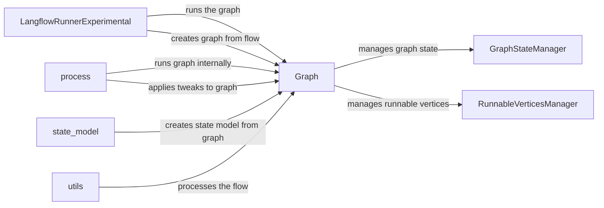

## Component Details

The Flow Execution component orchestrates the execution of a Langflow graph. It involves creating the graph from a flow definition, managing the graph's state, traversing the graph, executing nodes in the correct order, and handling data flow between them. It leverages the Data Abstraction Layer for data representation and conversion and integrates with the Tracing Service for debugging and monitoring.

### LangflowRunnerExperimental
This class is the entry point for running a Langflow flow. It takes a flow definition, creates a graph, manages the execution process, and persists flow-related information. It orchestrates the overall flow execution.
- **Related Classes/Methods**: `langflow.services.flow.flow_runner.LangflowRunnerExperimental`

### Graph
The Graph class represents the computational graph of the Langflow flow. It manages the nodes and edges, provides methods for adding components, building the graph, running the graph, and managing the graph's state. It also includes methods for topological sorting and cycle detection.
- **Related Classes/Methods**: `langflow.graph.graph.base.Graph`

### process
The `process` module contains functions for running the graph and applying tweaks to the graph. It is responsible for the actual execution of the graph, including running the graph internally and applying tweaks to the graph.
- **Related Classes/Methods**: `langflow.processing.process`

### GraphStateManager
The `GraphStateManager` class is responsible for managing the state of the graph. It handles the initialization of the graph state and provides methods for updating and retrieving the graph state.
- **Related Classes/Methods**: `langflow.graph.graph.state_manager.GraphStateManager`

### RunnableVerticesManager
The `RunnableVerticesManager` class is responsible for managing the runnable vertices in the graph. It keeps track of which vertices are runnable and provides methods for updating the run state of vertices and removing vertices from the set of runnable vertices.
- **Related Classes/Methods**: `langflow.graph.graph.runnable_vertices_manager.RunnableVerticesManager`

### state_model
The `state_model` module contains functions for creating a state model from the graph. It is responsible for creating the state model that is used to manage the state of the graph.
- **Related Classes/Methods**: `langflow.graph.graph.state_model`

### utils
The `utils` module contains utility functions for processing the flow. It is responsible for processing the flow and preparing it for execution.
- **Related Classes/Methods**: `langflow.graph.graph.utils`
