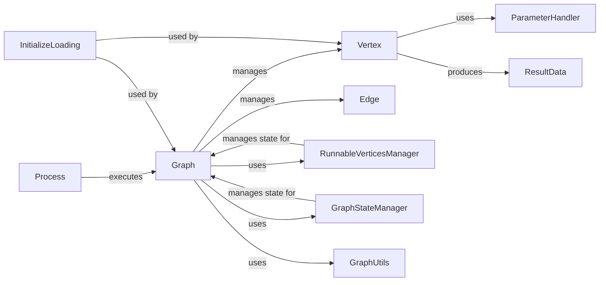

## Component Details

The Flow Graph Engine is the core subsystem responsible for representing AI flows as directed acyclic graphs (DAGs). It manages the lifecycle of graph components (vertices and edges), orchestrates their execution, handles state management, and provides utilities for graph operations like cycle detection and topological sorting. The engine integrates with various services for tracing, caching, and variable management, ensuring a robust and observable execution environment for AI workflows.

### Graph
The foundational class of the Flow Graph Engine, representing the AI flow as a graph, managing vertices and edges. It provides methods for graph construction, manipulation, initialization, execution orchestration, state management, tracing, logging, serialization, and cycle detection.

**Related Classes/Methods**:

- <a href="https://github.com/langflow-ai/langflow/blob/master/src/backend/base/langflow/graph/graph/base.py#L60-L2147" target="_blank" rel="noopener noreferrer">`langflow.graph.graph.base.Graph` (60:2147)</a>
- <a href="https://github.com/langflow-ai/langflow/blob/master/src/backend/base/langflow/graph/graph/base.py#L63-L151" target="_blank" rel="noopener noreferrer">`langflow.graph.graph.base.Graph.__init__` (63:151)</a>
- <a href="https://github.com/langflow-ai/langflow/blob/master/src/backend/base/langflow/graph/graph/base.py#L242-L256" target="_blank" rel="noopener noreferrer">`langflow.graph.graph.base.Graph.add_nodes_and_edges` (242:256)</a>
- <a href="https://github.com/langflow-ai/langflow/blob/master/src/backend/base/langflow/graph/graph/base.py#L492-L495" target="_blank" rel="noopener noreferrer">`langflow.graph.graph.base.Graph.initialize` (492:495)</a>
- <a href="https://github.com/langflow-ai/langflow/blob/master/src/backend/base/langflow/graph/graph/base.py#L1915-L1939" target="_blank" rel="noopener noreferrer">`langflow.graph.graph.base.Graph.prepare` (1915:1939)</a>
- <a href="https://github.com/langflow-ai/langflow/blob/master/src/backend/base/langflow/graph/graph/base.py#L816-L878" target="_blank" rel="noopener noreferrer">`langflow.graph.graph.base.Graph.arun` (816:878)</a>
- <a href="https://github.com/langflow-ai/langflow/blob/master/src/backend/base/langflow/graph/graph/base.py#L1315-L1351" target="_blank" rel="noopener noreferrer">`langflow.graph.graph.base.Graph.astep` (1315:1351)</a>
- <a href="https://github.com/langflow-ai/langflow/blob/master/src/backend/base/langflow/graph/graph/base.py#L1389-L1492" target="_blank" rel="noopener noreferrer">`langflow.graph.graph.base.Graph.build_vertex` (1389:1492)</a>
- <a href="https://github.com/langflow-ai/langflow/blob/master/src/backend/base/langflow/graph/graph/base.py#L508-L523" target="_blank" rel="noopener noreferrer">`langflow.graph.graph.base.Graph.update_state` (508:523)</a>
- <a href="https://github.com/langflow-ai/langflow/blob/master/src/backend/base/langflow/graph/graph/base.py#L578-L589" target="_blank" rel="noopener noreferrer">`langflow.graph.graph.base.Graph.append_state` (578:589)</a>
- <a href="https://github.com/langflow-ai/langflow/blob/master/src/backend/base/langflow/graph/graph/base.py#L1985-L2014" target="_blank" rel="noopener noreferrer">`langflow.graph.graph.base.Graph.sort_vertices` (1985:2014)</a>
- <a href="https://github.com/langflow-ai/langflow/blob/master/src/backend/base/langflow/graph/graph/base.py#L619-L627" target="_blank" rel="noopener noreferrer">`langflow.graph.graph.base.Graph.is_cyclic` (619:627)</a>
- <a href="https://github.com/langflow-ai/langflow/blob/master/src/backend/base/langflow/graph/graph/base.py#L1822-L1826" target="_blank" rel="noopener noreferrer">`langflow.graph.graph.base.Graph.cycle_vertices` (1822:1826)</a>

### Vertex
Represents a single node (component) in the flow graph. It holds information about the component, its parameters, and its execution state. It is responsible for parsing component data, building parameters, instantiating components, and managing input/output during execution. Specialized subclasses like ComponentVertex, CustomComponentVertex, InterfaceVertex, and StateVertex extend its functionality.

**Related Classes/Methods**:

- <a href="https://github.com/langflow-ai/langflow/blob/master/src/backend/base/langflow/graph/vertex/base.py#L46-L818" target="_blank" rel="noopener noreferrer">`langflow.graph.vertex.base.Vertex` (46:818)</a>
- <a href="https://github.com/langflow-ai/langflow/blob/master/src/backend/base/langflow/graph/vertex/base.py#L47-L110" target="_blank" rel="noopener noreferrer">`langflow.graph.vertex.base.Vertex.__init__` (47:110)</a>
- <a href="https://github.com/langflow-ai/langflow/blob/master/src/backend/base/langflow/graph/vertex/base.py#L325-L347" target="_blank" rel="noopener noreferrer">`langflow.graph.vertex.base.Vertex.build_params` (325:347)</a>
- <a href="https://github.com/langflow-ai/langflow/blob/master/src/backend/base/langflow/graph/vertex/base.py#L373-L378" target="_blank" rel="noopener noreferrer">`langflow.graph.vertex.base.Vertex.instantiate_component` (373:378)</a>
- <a href="https://github.com/langflow-ai/langflow/blob/master/src/backend/base/langflow/graph/vertex/base.py#L708-L767" target="_blank" rel="noopener noreferrer">`langflow.graph.vertex.base.Vertex.build` (708:767)</a>
- <a href="https://github.com/langflow-ai/langflow/blob/master/src/backend/base/langflow/graph/vertex/base.py#L515-L524" target="_blank" rel="noopener noreferrer">`langflow.graph.vertex.base.Vertex.get_result` (515:524)</a>
- <a href="https://github.com/langflow-ai/langflow/blob/master/src/backend/base/langflow/graph/vertex/base.py#L141-L148" target="_blank" rel="noopener noreferrer">`langflow.graph.vertex.base.Vertex.set_state` (141:148)</a>
- <a href="https://github.com/langflow-ai/langflow/blob/master/src/backend/base/langflow/graph/vertex/base.py#L150-L151" target="_blank" rel="noopener noreferrer">`langflow.graph.vertex.base.Vertex.is_active` (150:151)</a>
- <a href="https://github.com/langflow-ai/langflow/blob/master/src/backend/base/langflow/graph/vertex/base.py#L349-L371" target="_blank" rel="noopener noreferrer">`langflow.graph.vertex.base.Vertex.update_raw_params` (349:371)</a>

### Edge
Represents a connection between two vertices in the graph, defining the flow of data or control. It is responsible for defining the source and target of a connection and validating the connection handles. CycleEdge is a specialized subclass.

**Related Classes/Methods**:

- <a href="https://github.com/langflow-ai/langflow/blob/master/src/backend/base/langflow/graph/edge/base.py#L14-L222" target="_blank" rel="noopener noreferrer">`langflow.graph.edge.base.Edge` (14:222)</a>
- <a href="https://github.com/langflow-ai/langflow/blob/master/src/backend/base/langflow/graph/edge/base.py#L15-L71" target="_blank" rel="noopener noreferrer">`langflow.graph.edge.base.Edge.__init__` (15:71)</a>
- <a href="https://github.com/langflow-ai/langflow/blob/master/src/backend/base/langflow/graph/edge/base.py#L76-L80" target="_blank" rel="noopener noreferrer">`langflow.graph.edge.base.Edge.validate_handles` (76:80)</a>
- <a href="https://github.com/langflow-ai/langflow/blob/master/src/backend/base/langflow/graph/edge/base.py#L137-L143" target="_blank" rel="noopener noreferrer">`langflow.graph.edge.base.Edge.validate_edge` (137:143)</a>
- <a href="https://github.com/langflow-ai/langflow/blob/master/src/backend/base/langflow/graph/edge/base.py#L225-L276" target="_blank" rel="noopener noreferrer">`langflow.graph.edge.base.CycleEdge` (225:276)</a>
- <a href="https://github.com/langflow-ai/langflow/blob/master/src/backend/base/langflow/graph/edge/base.py#L234-L257" target="_blank" rel="noopener noreferrer">`langflow.graph.edge.base.CycleEdge.honor` (234:257)</a>
- <a href="https://github.com/langflow-ai/langflow/blob/master/src/backend/base/langflow/graph/edge/base.py#L259-L271" target="_blank" rel="noopener noreferrer">`langflow.graph.edge.base.CycleEdge.get_result_from_source` (259:271)</a>

### RunnableVerticesManager
Manages the state of vertices that are ready to be run, and helps in detecting cycles. It tracks runnable vertices, manages vertices involved in cycles, and updates the run state of vertices.

**Related Classes/Methods**:

- <a href="https://github.com/langflow-ai/langflow/blob/master/src/backend/base/langflow/graph/graph/runnable_vertices_manager.py#L4-L130" target="_blank" rel="noopener noreferrer">`langflow.graph.graph.runnable_vertices_manager.RunnableVerticesManager` (4:130)</a>
- <a href="https://github.com/langflow-ai/langflow/blob/master/src/backend/base/langflow/graph/graph/runnable_vertices_manager.py#L5-L11" target="_blank" rel="noopener noreferrer">`langflow.graph.graph.runnable_vertices_manager.RunnableVerticesManager.__init__` (5:11)</a>
- <a href="https://github.com/langflow-ai/langflow/blob/master/src/backend/base/langflow/graph/graph/runnable_vertices_manager.py#L129-L130" target="_blank" rel="noopener noreferrer">`langflow.graph.graph.runnable_vertices_manager.RunnableVerticesManager.add_to_cycle_vertices` (129:130)</a>
- <a href="https://github.com/langflow-ai/langflow/blob/master/src/backend/base/langflow/graph/graph/runnable_vertices_manager.py#L56-L65" target="_blank" rel="noopener noreferrer">`langflow.graph.graph.runnable_vertices_manager.RunnableVerticesManager.is_vertex_runnable` (56:65)</a>
- <a href="https://github.com/langflow-ai/langflow/blob/master/src/backend/base/langflow/graph/graph/runnable_vertices_manager.py#L122-L124" target="_blank" rel="noopener noreferrer">`langflow.graph.graph.runnable_vertices_manager.RunnableVerticesManager.remove_vertex_from_runnables` (122:124)</a>
- <a href="https://github.com/langflow-ai/langflow/blob/master/src/backend/base/langflow/graph/graph/runnable_vertices_manager.py#L51-L54" target="_blank" rel="noopener noreferrer">`langflow.graph.graph.runnable_vertices_manager.RunnableVerticesManager.update_run_state` (51:54)</a>

### GraphStateManager
Manages the overall state of the graph during execution. It is responsible for storing and retrieving the graph's state, and appending and updating state changes.

**Related Classes/Methods**:

- <a href="https://github.com/langflow-ai/langflow/blob/master/src/backend/base/langflow/graph/graph/state_manager.py#L15-L38" target="_blank" rel="noopener noreferrer">`langflow.graph.graph.state_manager.GraphStateManager` (15:38)</a>
- <a href="https://github.com/langflow-ai/langflow/blob/master/src/backend/base/langflow/graph/graph/state_manager.py#L16-L23" target="_blank" rel="noopener noreferrer">`langflow.graph.graph.state_manager.GraphStateManager.__init__` (16:23)</a>
- <a href="https://github.com/langflow-ai/langflow/blob/master/src/backend/base/langflow/graph/graph/state_manager.py#L31-L32" target="_blank" rel="noopener noreferrer">`langflow.graph.graph.state_manager.GraphStateManager.get_state` (31:32)</a>
- <a href="https://github.com/langflow-ai/langflow/blob/master/src/backend/base/langflow/graph/graph/state_manager.py#L28-L29" target="_blank" rel="noopener noreferrer">`langflow.graph.graph.state_manager.GraphStateManager.update_state` (28:29)</a>
- <a href="https://github.com/langflow-ai/langflow/blob/master/src/backend/base/langflow/graph/graph/state_manager.py#L25-L26" target="_blank" rel="noopener noreferrer">`langflow.graph.graph.state_manager.GraphStateManager.append_state` (25:26)</a>

### GraphUtils
A module containing utility functions supporting graph operations, such as topological sorting of vertices, cycle detection, logging transactions and vertex builds, and processing flow data.

**Related Classes/Methods**:

- <a href="https://github.com/langflow-ai/langflow/blob/master/src/backend/base/langflow/graph/graph/utils.py#L12-L30" target="_blank" rel="noopener noreferrer">`langflow.graph.graph.utils.find_start_component_id` (12:30)</a>
- <a href="https://github.com/langflow-ai/langflow/blob/master/src/backend/base/langflow/graph/graph/utils.py#L86-L112" target="_blank" rel="noopener noreferrer">`langflow.graph.graph.utils.process_flow` (86:112)</a>
- <a href="https://github.com/langflow-ai/langflow/blob/master/src/backend/base/langflow/graph/graph/utils.py#L447-L458" target="_blank" rel="noopener noreferrer">`langflow.graph.graph.utils.find_cycle_vertices` (447:458)</a>
- <a href="https://github.com/langflow-ai/langflow/blob/master/src/backend/base/langflow/graph/graph/utils.py#L776-L913" target="_blank" rel="noopener noreferrer">`langflow.graph.graph.utils.get_sorted_vertices` (776:913)</a>
- <a href="https://github.com/langflow-ai/langflow/blob/master/src/backend/base/langflow/graph/graph/utils.py#L331-L364" target="_blank" rel="noopener noreferrer">`langflow.graph.graph.utils.has_cycle` (331:364)</a>
- <a href="https://github.com/langflow-ai/langflow/blob/master/src/backend/base/langflow/graph/graph/utils.py#L461-L602" target="_blank" rel="noopener noreferrer">`langflow.graph.graph.utils.layered_topological_sort` (461:602)</a>

### ParameterHandler
Handles parameter processing for vertices. It processes parameters from edges and template fields, distinguishing between required, optional, and different types of parameters (Python base classes vs. LangChain objects).

**Related Classes/Methods**:

- <a href="https://github.com/langflow-ai/langflow/blob/master/src/backend/base/langflow/graph/vertex/param_handler.py#L24-L255" target="_blank" rel="noopener noreferrer">`langflow.graph.vertex.param_handler.ParameterHandler` (24:255)</a>
- <a href="https://github.com/langflow-ai/langflow/blob/master/src/backend/base/langflow/graph/vertex/param_handler.py#L27-L40" target="_blank" rel="noopener noreferrer">`langflow.graph.vertex.param_handler.ParameterHandler.__init__` (27:40)</a>
- <a href="https://github.com/langflow-ai/langflow/blob/master/src/backend/base/langflow/graph/vertex/param_handler.py#L42-L60" target="_blank" rel="noopener noreferrer">`langflow.graph.vertex.param_handler.ParameterHandler.process_edge_parameters` (42:60)</a>
- <a href="https://github.com/langflow-ai/langflow/blob/master/src/backend/base/langflow/graph/vertex/param_handler.py#L87-L119" target="_blank" rel="noopener noreferrer">`langflow.graph.vertex.param_handler.ParameterHandler.process_field_parameters` (87:119)</a>

### ResultData
A Pydantic model representing the results of a component's execution within the graph. It encapsulates the raw results, artifacts, outputs, logs, and messages, along with metadata like component display name and execution duration.

**Related Classes/Methods**:

- <a href="https://github.com/langflow-ai/langflow/blob/master/src/backend/base/langflow/graph/schema.py#L11-L47" target="_blank" rel="noopener noreferrer">`langflow.graph.schema.ResultData` (11:47)</a>
- <a href="https://github.com/langflow-ai/langflow/blob/master/src/backend/base/langflow/graph/schema.py#L73-L75" target="_blank" rel="noopener noreferrer">`langflow.graph.schema.RunOutputs` (73:75)</a>

### Process
A module containing functions for running and processing Langflow graphs. It handles the execution of the graph, applying tweaks, and managing inputs and outputs, including streaming capabilities.

**Related Classes/Methods**:

- <a href="https://github.com/langflow-ai/langflow/blob/master/src/backend/base/langflow/processing/process.py#L26-L62" target="_blank" rel="noopener noreferrer">`langflow.processing.process.run_graph_internal` (26:62)</a>
- <a href="https://github.com/langflow-ai/langflow/blob/master/src/backend/base/langflow/processing/process.py#L65-L121" target="_blank" rel="noopener noreferrer">`langflow.processing.process.run_graph` (65:121)</a>
- <a href="https://github.com/langflow-ai/langflow/blob/master/src/backend/base/langflow/processing/process.py#L169-L201" target="_blank" rel="noopener noreferrer">`langflow.processing.process.process_tweaks` (169:201)</a>
- <a href="https://github.com/langflow-ai/langflow/blob/master/src/backend/base/langflow/processing/process.py#L140-L160" target="_blank" rel="noopener noreferrer">`langflow.processing.process.apply_tweaks` (140:160)</a>

### InitializeLoading
A module handling the instantiation and initialization of components within the Langflow graph. It evaluates custom component code, retrieves parameters, and prepares components for execution, including handling environment variables.

**Related Classes/Methods**:

- <a href="https://github.com/langflow-ai/langflow/blob/master/src/backend/base/langflow/interface/initialize/loading.py#L23-L49" target="_blank" rel="noopener noreferrer">`langflow.interface.initialize.loading.instantiate_class` (23:49)</a>
- <a href="https://github.com/langflow-ai/langflow/blob/master/src/backend/base/langflow/interface/initialize/loading.py#L52-L70" target="_blank" rel="noopener noreferrer">`langflow.interface.initialize.loading.get_instance_results` (52:70)</a>
- <a href="https://github.com/langflow-ai/langflow/blob/master/src/backend/base/langflow/interface/initialize/loading.py#L73-L77" target="_blank" rel="noopener noreferrer">`langflow.interface.initialize.loading.get_params` (73:77)</a>
- <a href="https://github.com/langflow-ai/langflow/blob/master/src/backend/base/langflow/interface/initialize/loading.py#L150-L193" target="_blank" rel="noopener noreferrer">`langflow.interface.initialize.loading.build_custom_component` (150:193)</a>
- <a href="https://github.com/langflow-ai/langflow/blob/master/src/backend/base/langflow/interface/initialize/loading.py#L139-L147" target="_blank" rel="noopener noreferrer">`langflow.interface.initialize.loading.build_component` (139:147)</a>

### [FAQ](https://github.com/CodeBoarding/GeneratedOnBoardings/tree/main?tab=readme-ov-file#faq)